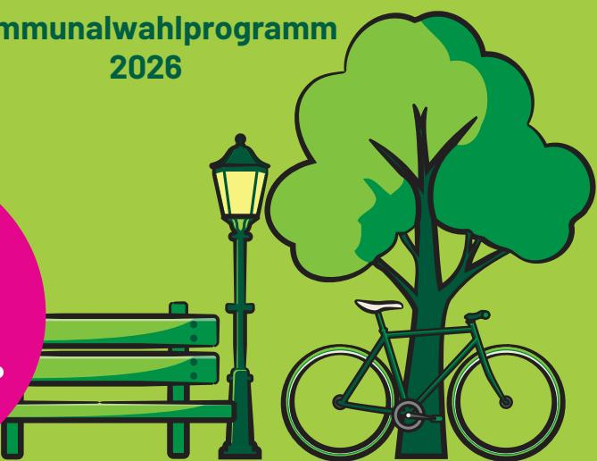
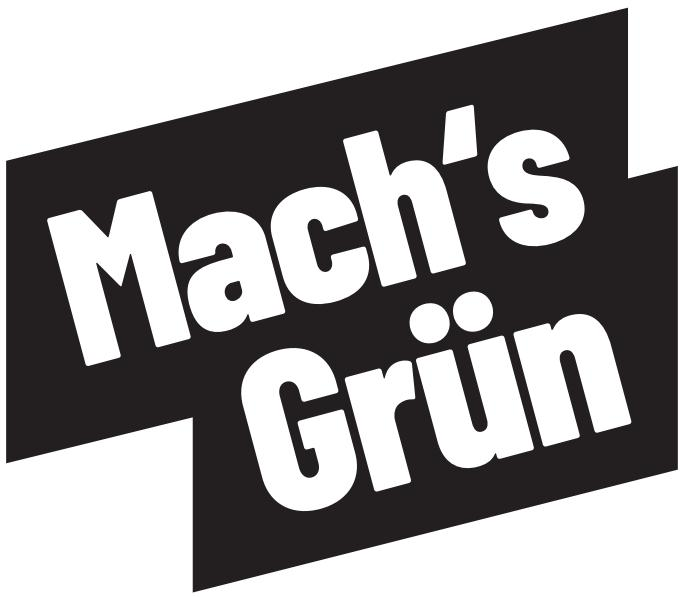

{0}------------------------------------------------

**Kommunalwahlprogramm** 

# **Braunschweig kann mehr!**

**MACH'S GRÜN**

**Am 13.9. Grün wählen!**

{1}------------------------------------------------

Kommunalwahlprogramm 2026 BÜNDNIS 90/DIE GRÜNEN Braunschweig

#### **Impressum**

BÜNDNIS 90/DIE GRÜNEN Kreisverband Braunschweig

Ägidienmarkt 13 38100 Braunschweig Tel.: (0531) 1 64 00 Mail: info@gruene-braunschweig.de www.gruene-braunschweig.de Layout: Jonas Maaßberg

{2}------------------------------------------------

# Vorwort von Michael Walther *Oberbürgermeisterkandidat*

Liebe Braunschweiger\*innen,

am 13. September wählen wir eine neue Oberbürgermeisterin oder einen Oberbürgermeister, 56 Ratsmitglieder und viele weitere Mitglieder für die zwölf Stadtbezirksräte. Damit wählen wir, wofür unsere Stadt steht, für wen sie da ist und wie die Zukunft Braunschweigs aussieht.

Wir merken alle: Die Welt verändert sich. Steigende Mieten, höhere Energiekosten, Druck auf Arbeitsplätze, Klimakrise und globale Krisen, all das spüren wir auch hier vor Ort. Und die Frage ist eben nicht, ob sich Braunschweig verändert, sondern wie. Wir müssen nicht alles anders machen, aber unsere Stadt mutig verändern. Das möchten wir Grüne mit Ihnen und Euch aktiv gestalten.

Ich bin Michael Walther, 52 Jahre alt und kandidiere als Oberbürgermeister für unsere Stadt. Ich bin in Braunschweig geboren und aufgewachsen: vom Westlichen Ringgebiet über die Weststadt bis nach Veltenhof habe ich unsere Stadt aus verschiedenen Blickwinkeln kennengelernt. Und ich habe in der Stadtverwaltung bereits in leitender Funktion gearbeitet. Ich weiß, was es braucht, um Braunschweig erfolgreich und mutig weiterzuentwickeln. Wir spielen hier nicht um den Klassenerhalt, uns geht es um den Aufstieg!

{3}------------------------------------------------

#### **Grüne geben Antworten auf die drängenden Themen der Zeit**

Gutes Leben braucht gute Jobs. Wir dürfen nicht Zuschauende beim Wandel der Automobilindustrie und der Zulieferbetriebe sein. Dafür gibt es viele Potenziale: Forschung, Wissenschaft, starke Start-Ups und viele Kreative. Lasst uns gemeinsam im Schulterschluss Braunschweig mutig zur Zukunftsstadt für Lösungen von morgen machen! So entstehen Arbeitsplätze für die Zukunft - in Digitalisierung, Mobilität und Klimaschutz. So kann Wandel gelingen. Wirtschaft und Klimaschutz gehören zusammen!

Wir wollen geordnet und konsequent raus aus Erdöl und Erdgas. Das Konzept der kommunalen Wärmeplanung wird deshalb von uns schnellstmöglich umgesetzt. Soziale Härten müssen abgefedert werden. Zur Energiewende gehört auch, auf unseren Dächern unseren eigenen Strom zu produzieren. Grünflächen erhalten und ausbauen heißt auch: Aktiver Hitzeschutz und mehr Lebensqualität in der ganzen Stadt. Für Aufenthaltsqualität überall in der Stadt.

Wir müssen die Mobilitätswende voranbringen. Wir gestalten den Umbau der autogerechten Stadt zur Stadt der mobilen Vielfalt, innerhalb und über die Stadtgrenze hinaus. Dazu gehören ein guter, verlässlicher und bezahlbarer ÖPNV, ein intelligentes Parkraummanagement und eine attraktive Fahrradinfrastruktur. Als Stadt der kurzen Wege fördern wir gute Fußwege. Und Mobilitätsplanung wird immer von Verkehrssicherheit geleitet: Wir stehen für die Vision Zero!

Egal, in welchem Stadtteil wir leben. Ob allein, mit Familie oder in einer WG: Wir brauchen passenden und bezahlbaren Wohnraum für alle Generationen.

Für den dringenden Bau von Ein- und Zweiraumwohnungen wollen wir die Neuversiegelung von Acker- und Grünflächen vermeiden.

Und wir führen den Kampf gegen alle Demokratiefeinde! Denn wir Grüne stehen für eine vielfältige, weltoffene und mutige Gesellschaft sowie eine aktive Erinnerungskultur. Auf dieser baut unsere starke Zivilgesellschaft in Braunschweig auf.

{4}------------------------------------------------

#### **Grüne sichern Unterstützung und Solidarität für alle, die Hilfe brauchen**

Es braucht eine Daseinsvorsorge, die diesen Namen verdient. Ein Kitaplatz ist kein Traumschloss, sondern selbstverständlich verfügbar. Kitas sind gute Bildungseinrichtungen. Schulen sind längst Lebensorte. Wir schaffen von Anfang an echte Chancengleichheit. Davon profitieren Kinder, Heranwachsende und Eltern.

Kinder und Jugendliche sollen an politischen Entscheidungen beteiligt werden. Das gehört für uns zur Demokratie. Deshalb wollen wir Beteiligungsprozesse und Projekte für junge Menschen weiter stärken. Wir bieten ihnen die Unterstützung, die sie brauchen: ob Sucht- und Drogenprobleme, psychische Belastungen, Gewalt oder soziale Isolation – sie haben ein Recht auf Beratung und Hilfe.

Damit Jung und Alt sich begegnen können, stärken wir Quartiersprojekte. Auch Themen wie Armut und Wohnungslosigkeit können über solche Projekte aufgefangen und an die richtigen Stellen vermittelt werden. Im Stadtteil soll es deutlich mehr Beratungs- und Hilfsangebote geben.

Unsere Gesellschaft wird älter. Deshalb brauchen wir neue Formen der Unterstützung vor Ort. Dafür müssen wir Angebote auch für die Menschen, die Versorgung und Pflege leisten, in den Stadtteilen aufbauen.

Und nicht zuletzt verteidigen wir unsere freiheitlich-demokratische Grundordnung und unsere Werte einer offenen und vielfältigen Gesellschaft. Gerade als schwuler Mann weiß ich, wie Ausgrenzung aussieht und wie wichtig die Solidarität der Zivilgesellschaft ist.

{5}------------------------------------------------

#### **Beteiligung sichert Teilhabe und Mitgestaltung**

Demokratie lebt von Austausch und Begegnung. Deshalb ist es uns ein besonderes Anliegen, Sport und Kultur in Braunschweig hervorzuheben. Es müssen Basisförderungen für unsere Kulturprojekte erhalten bleiben. Unsere Sportvereine brauchen gute Sportstätten. Insgesamt bieten wir niedrigschwellige Angebote an, damit Teilnahme und Teilhabe nicht vom Geldbeutel abhängen.

Mehr Beteiligung muss auch die Verwaltung ermöglichen! Bei Planungen und Konzepten ist die Meinung von Bürger\*innen gefragt - vor Ort und digital. Unsere Verwaltung macht einen guten Job. Es braucht trotzdem so wenig Bürokratie wie möglich und mehr Digitalisierung.

Ich trete für ein Braunschweig an, das uns Chancen und Teilhabe ermöglicht. Ich weiß, Braunschweig kann Zukunft. Für alle. Drei Themen stehen für mich im Mittelpunkt:

**Klima schützen und Lebensqualität sichern,** mit mehr Grün, einer konsequenten Energiewende und nachhaltiger Mobilität.

**Zusammenhalt stärken und Chancen schaffen,** mit passendem und bezahlbarem Wohnen, guter Bildung und einer starken Daseinsvorsorge.

**Demokratie verteidigen und Vielfalt leben,** für ein offenes Braunschweig, in dem Teilhabe möglich ist und niemand ausgegrenzt wird.

Weltoffen, mutig und gemeinsam. Dieses Kommunalwahlprogramm zeigt, was möglich ist: Ganz viel Grün!

Ihr und Euer

Michael Walther

{6}------------------------------------------------

# **Inhalt**

#### Vorwort von Michael Walther

| Mensch und Umwelt im Fokus            | 1  |
|---------------------------------------|----|
| Unsere Energie für Braunschweig       | 8  |
| Mobilität für alle                    | 13 |
| Bezahlbar wohnen und lebenswert bauen | 20 |
| Braunschweig Familienstadt            | 29 |
| Starke Schulen für Braunschweig       | 34 |
| Eine solidarische Stadtgesellschaft   | 39 |
| Demokratie stärken, Vielfalt leben    | 47 |
| Sport, Kultur und Ehrenamt            | 54 |
| Wirtschaft & Wissenschaft             | 58 |
| Handlungsfähiges Braunschweig         | 63 |
| Braunschweig krisenfest machen        | 73 |

#### Apendix

Kommunalwahlprogramm der Fraktion BÜNDNIS 90/DIE GRÜNEN im Regionalverband Großraum Braunschweig

{7}------------------------------------------------

Die Klimakrise ist auch in Braunschweig längst spürbar. Viele Menschen merken das direkt im Alltag, wenn die Sommer heißer werden, Böden austrocknen oder starker Regen zur Belastung wird. Dabei geht es beim Klimaschutz nicht um etwas Abstraktes. Es geht um uns, um unsere Gesundheit, unser Wohlbefinden und darum, wie gut wir hier auch in Zukunft leben können. Für uns ist klar: Eine lebenswerte Stadt und der Schutz unserer Umwelt gehören zusammen. Klimaschutz und Klimaanpassung sind kein Selbstzweck. Sie helfen ganz konkret dabei, den Alltag für alle besser zu machen. Gleichzeitig geht es darum, unsere natürlichen Lebensgrundlagen zu bewahren, die Artenvielfalt zu schützen und verantwortungsvoll mit unseren Ressourcen umzugehen.

Wir machen unsere Stadt widerstandsfähig, mit mehr Grün, nachhaltigem Wassermanagement und einer spürbar höheren Aufenthaltsqualität. So entwickeln wir Braunschweig Schritt für Schritt weiter zu einem Ort, an dem jede\*r auch morgen noch gut leben und sich wohlfühlen kann – im Einklang mit Natur, Umwelt und den Bedürfnissen der Menschen.

# Mensch und Umwelt im Fokus: Braunschweig wird fit für die Klimazukunft *Kapitel 1* **Natur und Umwelt.**

{8}------------------------------------------------

#### **Das Prinzip der "Schwammstadt":**

Wir machen Braunschweig zum Wasserspeicher. Regenwasser soll versickern und gespeichert werden, statt ungenutzt abzufließen. Bei Neubauten und Sanierungen fordern wir verbindliche Standards für grüne Dächer, wasserdurchlässige Beläge und Regenwasserrückhalt - als Schutz vor Starkregenfolgen und zur Kühlung der Stadt.

#### **Hitzeschutz als Querschnittsaufgabe:**

Wir bereiten Braunschweig auf Hitzeperioden vor. Durch mehr Bäume, begrünte Fassaden, Trinkbrunnen und Wasserflächen schaffen wir Kühlung dort, wo Menschen zusammenkommen - in der Innenstadt, an Haltestellen und vor sozialen Einrichtungen. Diese Maßnahmen bündeln wir in einem stadtweiten Hitzeschutzkonzept.

#### **Gesunde und regionale Ernährung fördern:**

Wochenmärkte, Stadtteilgärten, Foodsharing, Ernährungsbildung und Initiativen gegen Lebensmittelverschwendung wollen wir stärken. In städtischen Einrichtungen wollen wir den Anteil regionaler, saisonaler, biologischer und klimafreundlicher Lebensmittel erhöhen.

#### **Grüne Lungen in der Innenstadt:**

Wir reduzieren versiegelte Flächen konsequent. Am Schlossplatz und am Bohlweg setzen wir auf eine mutige Begrünung und Entsiegelung. Unter Berücksichtigung von Denkmalschutz und Veranstaltungsnutzung schaffen wir Schattenoasen und Grüninseln, die das Stadtklima verbessern und zum Verweilen einladen.

#### **Pocket-Parks und Tiny-Forests:**

Auch kleine Flächen bewirken Großes. Wir verwandeln graue Restflächen in lebendige kleine Parks oder kleine Wälder. Begrünte Innenhöfe und bepflanzte Baumscheiben verbessern das Mikroklima und die Wohnqualität direkt in den Quartieren. Sie steigern so die Attraktivität der Viertel und der Innenstadt insbesondere für Familien und Senior\*innen.

#### **1. Mehr Grün, Wasser und Schatten für ein besseres Stadtklima**

Wir wollen unsere Stadt so gestalten, dass sie gut mit den Folgen des Klimawandels umgehen kann. Dafür setzen wir auf Lösungen, die das Stadtklima verbessern und die Lebensqualität spürbar erhöhen. Grünflächen, Wasser und eine kluge Planung spielen dabei eine zentrale Rolle.

{9}------------------------------------------------

- mit konkreten Maßnahmen, die vor Ort wirken und die Menschen mitnehmen.

#### **Biologische Vielfalt - Lebensräume vernetzen und stärken:**

Unser Ziel ist es, Braunschweig als Refugium für Tiere und Pflanzen zu sichern. Wir schaffen zusammenhängende Lebensräume statt isolierter Inselflächen. Wir sorgen für den Ausbau des Biotopverbunds durch den Ankauf von Flächen sowie durch das Schaffen grüner Korridore und naturnaher Randstreifen. Gleichzeitig entwickeln wir Parks und Grünanlagen als ökologische Vorbilder und setzen uns für eine naturnahe Pflege ein.

#### **Naturnahe Gewässer:**

Die fortschreitende Renaturierung von Gewässern im Stadtgebiet wollen wir weiter unterstützen. Sie leistet einen wichtigen Beitrag zum Artenschutz. Gleichzeitig erhöhen sich Erholungswert und Aufenthaltsqualität für alle Braunschweiger\*innen.

#### **Braunschweiger Wälder schützen und erweitern:**

Wir wollen, dass städtische Wälder ökologisch und klimaresilient bewirtschaftet und Wildnisflächen gesichert werden. Zudem prüfen wir, wie Waldflächen im städtischen Eigentum erhalten, erweitert und besser mit Biotopen

#### **Nachhaltigkeit vernetzen:**

Das Nachhaltigkeitszentrum (NHZ) ist der Motor für lokale Klimaprojekte. Das vielfältige Engagement des NHZ für Themen wie Nachhaltigkeit, Energieberatung sowie die Information über Umwelt-, Klimaschutz und Ernährung in unserer Stadt wollen wir langfristig sichern und setzen uns für die dauerhafte Finanzierung dieser wichtigen Einrichtung ein.

#### **Städtische Gesellschaften klimaneutral ausrichten:**

Auch die städtischen Gesellschaften müssen ihren Beitrag zu einem klimaneutralen Braunschweig leisten. Wir wollen unseren kommunalen Einfluss nutzen, um Klimaschutz, Energieeffizienz und nachhaltige Investitionen konsequent voranzubringen.Das gilt insbesondere für BS Energy als zentralen Akteur der Energie- und Wärmewende in Braunschweig.

#### **2. Umwelt, Artenvielfalt und Lebensqualität: Unsere Naturgüter schützen**

Der Schutz unserer natürlichen Lebensgrundlagen ist eine zentrale Aufgabe der kommunalen Politik. Wir bewahren die biologische Vielfalt, schonen Ressourcen und machen Natur für alle Braunschweiger\*innen erlebbar

{10}------------------------------------------------

dass die Stadt Braunschweig Gartenbesitzer\*innen entsprechender Gärten berät und die Umwandlung vorantreibt.

#### **Ausgleichsflächen wirksam sichern:**

Ausgleichsflächen dürfen nicht nur auf dem Papier bestehen. Wir wollen Pflege, ökologische Qualität und dauerhafte Funktion von Ausgleichsflächen dokumentieren, kontrollieren und langfristig sichern.

#### **Pestizidfreie Stadt:**

Die Stadt Braunschweig und ihre Gesellschaften sollen auf chemisch-synthetische Pestizide verzichten und ökologische Pflegekonzepte für Grünflächen, Sportflächen und Verkehrsflächen weiterentwickeln.

#### **3. Natur erlebbar machen: Naherholung und Umweltbildung**

Naturschutz wird dann wirksam, wenn Menschen ihn verstehen und vor Ort erleben können. Deshalb stärken wir Angebote der Umweltbildung und schaffen mehr Möglichkeiten, Natur im Alltag zugänglich zu machen.

#### **Zentren der Umweltbildung:**

Wir fördern Einrichtungen der Umweltbildung wie das Haus Entenfang und verknüpfen Renaturierungsprojekte mit Naherholung.

und Naherholung verbunden werden können.

#### **Baumbestand sichern und ausbauen:**

Wir entwickeln Maßnahmen für einen starken Baumschutz, um die grüne Überschirmung unserer Stadt zu bewahren. Wir wollen die Beratung zum Baumschutz und das Programm "Unser Baumreich(es) Braunschweig" weiter ausbauen. Bei Bauprojekten setzen wir uns für eine positive Baumbilanz ein.

#### **Baumschutzsatzung:**

Wir setzen uns für eine Baumschutzsatzung zum Schutz großer und alter Bäume ein, wie sie in vielen Städten und Landkreisen bereits gilt. Sie soll Bäume auch auf privaten Flächen vor ungerechtfertigter Fällung schützen und sicherstellen, dass bei genehmigten Fällungen Augleichsoder Ersatzpflanzungen erfolgen.

#### **Erhalt von Streuobstwiesen:**

Wir sichern wertvolle Biotope wie Streuobstwiesen und setzen uns für eine langfristige Pflege ein. Zudem setzen wir uns für Neupflanzungen, auch von Obstbäumen, auf städtischen Grünflächen ein.

#### **Schottergärten umwandeln:**

Die ohnehin verbotenen Schottergärten lehnen wir ab. Wir wollen,

{11}------------------------------------------------

kommunale Abfallwirtschaft muss - als Kreislauf - unkompliziert sein. Die regionale Wiederverwendung und -aufbereitung gewerblicher Stoffströme fördern wir durch geeignete Maßnahmen in den Quartieren.

#### **Teilen statt Kaufen:**

Wir unterstützen die Einführung und Förderung von Tauschbörsen für wiederverwendbare Güter (wie Technikartikel, Baumaterialien u.s.w.), um gebrauchten Gütern ein zweites Leben zu schenken.

#### **Teilen statt Kaufen:**

Wir fördern den Ausbau von Repair-Cafés, in denen Alltagsgegenstände gemeinsam repariert werden, sowie von Büchertauschregalen im öffentlichen Raum und Pflanzentauschbörsen für Samen und Setzlinge. Darüber hinaus setzen wir uns für den Aufbau von kommunalen Leihstellen für Werkzeug und Technik ein. All diese Angebote stärken den Zusammenhalt in der Nachbarschaft und schonen Ressourcen.

#### **Mehrweg statt Einweg:**

Wir fördern Mehrwegsysteme sowie die systematische Umsetzung - auch bestehender Vorgaben Um Verpackungsmüll zu reduzieren, setzen wir uns für die Einführung einer Verpackungssteuer ein.

#### **Stadtteilgärten fördern:**

Wir unterstützen integrative Gartenprojekte und fördern das Engagement für lokale Ernährung und Gemeinschaft - unabhängig davon, ob bereits klare Trägerschaften bestehen oder sich neue Initiativen auf den Weg machen.

#### **Starke Partnerschaften:**

Wir sichern die zukunftsfähige Förderung der Naturschutzverbände und arbeiten eng mit Expert\*innen vor Ort zusammen.

#### **4. Kreislaufwirtschaft - Ressourcen klug nutzen**

Ressourcen sind begrenzt, deshalb wollen wir ihren Verbrauch deutlich reduzieren und vorhandene Materialien besser nutzen reduzieren und vorhandene Materialien besser nutzen. Mit einer starken Kreislaufwirtschaft im Sinne der "circular cities" setzen wir auf Wiederverwendung, Reparatur und Recycling – und verankern diese Prinzipien auch direkt in den Stadtteilen, damit sie im Alltag leicht nutzbar sind.

#### **Recycling leicht gemacht:**

Wir setzen uns für mehr Abgabestellen für Elektroschrott und unkommerzielle Kleiderspenden innerhalb der Quartiere ein. Das Zuführen von Materialien und Produkten in eine weitere Verwendung oder "Entsorgung" in die

{12}------------------------------------------------

#### **Ehrenamtliche**

#### **Tierschutzbeauftragte:**

Wir wollen, dass - ähnlich zu den "Naturschutzbeauftragten" ehrenamtliche Tierschutzbeauftragte eingesetzt werden. Wir stehen zum Verfassungsrang des Tierschutzes und wollen dazu mit der Verwaltung umfassende Tierschutzkonzepte entwickeln und umsetzen.

#### **Stadttaubenkonzept:**

Wir setzen uns für eine Verstetigung des Stadttaubenkonzepts ein. Dabei soll die Zahl der Stadttauben sanft reduziert werden und den hier bereits ansässigen Tieren ein tierschutzgerechtes Leben ermöglicht werden.

#### **Solidarität im Tierschutz:**

Wir stehen fest an der Seite der Tierschutzvereine und bündeln Förderungen, um eine wirksame Versorgung von schutzbedürftigen Tieren sicherzustellen und gleichzeitig die Arbeit der Vereine zum Gemeinwohl anzuerkennen.

#### **5. Nachhaltige Landnutzung**

Flächen sind eine begrenzte Ressource und stehen unter vielfältigem Nutzungsdruck. Wir setzen uns dafür ein, sie verantwortungsvoll zu nutzen und Natur, Landwirtschaft und Stadtentwicklung in Einklang zu bringen.

#### **Ökolandbau fördern:**

Wir stehen hinter den Zielen des "Niedersächsischen Weges" und fordern einen konsequenten Ausbau des Ökolandbaus. Wir wollen, dass landwirtschaftliche Flächen im Besitz der Stadt ökologisch bewirtschaftet werden. Pachtverträge sollen dafür schrittweise in ökologische Bewirtschaftung überführt oder neu an entsprechend wirtschaftende Betriebe vergeben werden.

#### **Kluger Flächenschutz:**

Wir priorisieren Entsiegelung und den Schutz hochwertiger Böden. Bei Zielkonflikten mit dem Wohnungsbau setzen wir auf transparente und kluge Abwägungsprozesse gemeinsam mit den betroffenen Gruppen.

#### **6. Tierschutz**

Tiere sind Teil unserer Stadt und verdienen Schutz und Respekt. Wir setzen uns für einen verantwortungsvollen Umgang mit Haus- und Wildtieren ein und stärken den Tier- und Artenschutz vor Ort.

{13}------------------------------------------------

{14}------------------------------------------------

Braunschweig steht vor der großen Aufgabe, die Energiewende vor Ort sozial gerecht und wirtschaftlich vernünftig zu gestalten. Unser Ziel ist es, die Stadt schnellstmöglich auf den Pfad der Klimaneutralität zu führen. Das spart uns Braunschweiger\*innen auf lange Sicht Kosten und macht uns unabhängiger von Preisschwankungen fossiler Importe. Dabei setzen wir auf Transparenz für alle Bürger\*innen und Unternehmer\*innen, die Vorbildfunktion der Verwaltung und eine kluge Nutzung lokaler Ressourcen.

# Unsere Energie für Braunschweig: Sicher, lokal und klimaneutral

## *Kapitel 2*

**Wärme, Energie, Sanierungen.**

{15}------------------------------------------------

dargestellt werden, in welcher Reihenfolge und in welchen Stadtteilen die Gasverteilnetze perspektivisch unwirtschaftlich werden und daher abzulösen sind.

#### **Zukunftstechnologien vor Ort nutzen:**

Wir wollen moderne Lösungen für die Energieversorgung direkt in den Stadtteilen voranbringen. Dabei geht es nicht nur um große Industrieanlagen, sondern um konkrete, alltagstaugliche Lösungen für die Wärme vor Ort. Wir setzen auf Technologien wie Großwärmepumpen, Geothermie und die Nutzung von Abwärme aus Betrieben für ganze Quartiere. Denn Energiepolitik endet nicht an der Steckdose. Strom, Wärme und Industrie müssen zusammen gedacht werden.

#### **Bezahlbarkeit sichern:**

Die Wärmewende ist ein Gemeinschaftsprojekt, das nur gelingt, wenn sie sozial ausgewogen gestaltet wird. Wir setzen uns dafür ein, dass Klimaschutz bezahlbar und preiswert bleibt und alle Menschen die Möglichkeit haben, daran teilzuhaben.

#### **Soziale Wärmewende & Schutz vor Energiearmut:**

Wir haben vor, den Gasausstieg durch eine vorausschauende

#### **1. Die Wärmewende: Planungssicherheit für Ihr Zuhause**

Die kommunale Wärmeplanung ist das Herzstück einer verlässlichen Energiepolitik. Wir möchten allen Eigentümer\*innen und Mieter\*innen Planungssicherheit beim Umstieg auf zukunftsfähige Energieversorgung geben.

#### **Verlässliche Wärmeplanung:**

Wir setzen uns dafür ein, dass die Stadtverwaltung für alle Stadtteile verlässliche Konzepte zur Wärmeversorgung vorlegt. Unser Ziel ist es, die kommunale Wärmeplanung zügig und konsequent umzusetzen. Neben der Fernwärme, die wir nachhaltiger gestalten müssen, fördern wir dezentrale Lösungen. Die Umsetzung soll in enger Abstimmung mit Energieunternehmen erfolgen, damit Planungssicherheit für Investitionen in Heizungen und Sanierungen entsteht.

#### **Gasnetz-Transformation:**

Wir setzen uns für die Erstellung eines klaren Konzepts zum geordneten Ausstieg aus dem Gasnetz ein, damit die Netzkosten nicht zur Kostenfalle werden. Ziel ist es, rechtzeitig Alternativen für alle Quartiere zu schaffen. Für die schrittweise Stilllegung der Gasverteilnetze soll den Bürger\*innen transparent

{16}------------------------------------------------

Wärme oder Windkraft oder Beteiligungen daran. Andere Kommunen zeigen, dass das funktioniert und langfristig für stabile Preise sorgt. Eigene Energieerzeugung macht unabhängiger, schafft Einnahmen für die Stadt und hilft, die Wärmewende bezahlbar zu gestalten.

#### **2. Braunschweig unter Strom: Solarausbau und dezentrale Energie**

Braunschweig und die Region sollen durch die Energiewende enger zusammenwachsen. Die Sonne ist eine unserer wichtigsten verfügbaren Energiequellen, ihr Potenzial wollen wir in Braunschweig deutlich stärker nutzen. Dächer, Fassaden und Freiflächen bieten große Chancen für saubere Energie, die wir konsequent erschließen wollen. Das Integrierte Klimaschutzkonzept (IKSK) muss dabei endlich entschlossen umgesetzt werden.

#### **Braunschweigs Dächer zu Kraftwerken machen:**

Wir setzen uns dafür ein, den Ausbau von Photovoltaik auf allen geeigneten städtischen Liegenschaften deutlich zu beschleunigen. Dabei wollen wir die Energiegenossenschaft Braunschweiger Land eG gezielt einbinden, stärken und weiter ausbauen.

Wärmeplanung sozial verträglich zu gestalten. Unser Ziel ist es, Bürger\*innen vor unrentablen fossilen Fehlinvestitionen und künftigen Kostenfallen zu schützen. Wir wollen städtische Förderungen so ausweiten, dass der Zugang zu erneuerbaren Energien und günstigeren Tarifen direkt dort ermöglicht wird, wo Energiearmut droht. So stellen wir sicher, dass alle Braunschweiger\*innen von der Energiewende finanziell profitieren. Dennoch entstehende soziale Härten wollen wir angemessen abfedern.

#### **Fachkräfte gewinnen und qualifizieren:**

Die Wärmewende braucht ausreichend Fachkräfte und ein starkes Handwerk vor Ort. Deshalb setzen wir auf eine enge Zusammenarbeit mit der Handwerkskammer und wollen Zukunftstechnologien rund um erneuerbare Energien und Green Tech stärker erlebbar machen. So wecken wir Interesse, gewinnen Nachwuchs und stärken die Ausbildung im Handwerk gezielt.

#### **Stadt als Energieproduzentin stärken:**

Wir wollen, dass Braunschweig selbst stärker Energie erzeugt, zum Beispiel durch eigene Anlagen für erneuerbare Energien wie Solar,

{17}------------------------------------------------

die Menschen in den betroffenen Stadtteilen einbezogen werden – etwa bei der Verwendung der Akzeptanzabgabe.

#### **Balkon-Kraftwerke:**

Balkon-Photovoltaik-Anlagen (PV) ermöglichen auch Mieter\*innen einen einfachen Einstieg in die eigene Stromerzeugung. Wir wollen bestehende Förderungen überprüfen und gezielt weiterentwickeln, damit möglichst viele Haushalte von günstigem Strom profitieren können.

#### **3. Energetische Gebäudesanierung und modernes Management**

Städtische Gebäude sollen Vorbilder für Klimaschutz, gute Nutzung und verantwortungsvollen Umgang mit öffentlichen Mitteln sein. Dafür brauchen wir schnelle Effizienzmaßnahmen, langfristige Sanierungen und ein Gebäudemanagement, das Zustand, Energieverbrauch und Modernisierungsbedarf verlässlich im Blick hat.

#### **Energieverschwendung stoppen:**

Wir setzen uns dafür ein, sofort umsetzbare Effizienzmaßnahmen in öffentlichen Gebäuden zu identifizieren und umzusetzen.

#### **Wohlfühlklima für Bildung:**

Unser Ziel ist es, Schulen, Sportanlagen und andere städtische

Sie wurde gemeinsam von Stadt, Unternehmen und weiteren Partnern gegründet, um den Ausbau erneuerbarer Energien – insbesondere von Photovoltaik – voranzutreiben. So können Projekte schneller umgesetzt, Bürger\*innen beteiligt und die Energiewende vor Ort konkret vorangebracht werden.

#### **Dezentrale**

#### **Energiegemeinschaften:**

Unser Ziel ist es, Nachbarschaften und Bewohner\*innen von Mehrfamilienhäusern dabei zu unterstützen, Energiegemeinschaften zu bilden. Dafür wollen wir prüfen, wie die Stadt gezielt unterstützen kann – etwa durch bessere Beratung oder passende Förderangebote. So sollen Strommodelle für Mieter\*innen und gemeinschaftliche Eigenversorgung einfacher werden und sich stärker verbreiten.

#### **Freiflächen-PV und Windkraft:**

Wir setzen uns für schnellere Verfahren und aktive Planung bei PV-Anlagen in Kombination mit Batteriespeichern auf städtischen Flächen ein. Die kombinierte Nutzung landwirtschaftlicher Flächen mit Photovoltaik soll erleichtert werden. Gleichzeitig wollen wir die ausgewiesenen Windkraftflächen konsequent nutzen. Wichtig ist uns, dass die Wertschöpfung vor Ort bleibt und

{18}------------------------------------------------

Einrichtungen umfassend energetisch zu sanieren. Das spart nicht nur CO2 und Kosten, sondern sorgt auch für ein besseres Lernumfeld für unsere Kinder.

#### **Modernes Gebäudemanagement:**

Wir wollen das Gebäudemanagement der Stadt transparenter und verlässlicher machen. Zuständigkeiten müssen klar sein, Modernisierungen schneller umgesetzt und Gebäude regelmäßig auf ihren Zustand, Energieverbrauch und Sanierungsbedarf geprüft werden. Smart Meter können dabei helfen, Energieverbräuche sichtbar zu machen und Einsparpotenziale gezielt zu nutzen.

{19}------------------------------------------------

Eine gute Mobilität entscheidet darüber, wie lebenswert unsere Stadt ist. Unser Ziel ist ein Verkehrssystem, das Menschen sicher und verlässlich ans Ziel bringt, das Klima schützt und allen die Teilnahme am städtischen Leben ermöglicht – unabhängig von Alter, Einkommen oder Wohnort.

Wir wollen, dass viele Menschen auch weite Wege in der Stadt oder in die Stadt bequem und möglichst im Umweltverbund zurücklegen können. Dafür setzen wir auf eine klare Stärkung der Fuß-, Rad- und ÖPNV-Nutzung, auf Verkehrssicherheit und auf eine faire Aufteilung des öffentlichen Raums. Im von uns Grünen mitgetragenen Mobilitätsentwicklungsplan sind viele effektive Maßnahmen für die Stärkung des Fuß- und Radverkehrs, des ÖPNVs sowie die Neuordnung des motorisierten Individualverkehrs (MIV) im Sinne der Mobilitätswende enthalten. Wir setzen uns dafür ein, dass diese Maßnahmen schnellstmöglich umgesetzt werden.

# Mobilität für alle – sicher & klimafreundlich

## *Kapitel 3*

#### **Verkehr und Mobilitätswende.**

{20}------------------------------------------------

Suchzeiten nach Parkplätzen und entspannt somit mögliche Ballungen von Verkehrsaufkommen zu Stoßzeiten.

#### **Entlastung durch vielfältige Leihsysteme:**

Wir reservieren weitere Flächen für Carsharing-Angebote stadtweit, so dass ein eigenes Auto seltener notwendig ist - das spart Geld und schafft Platz. Das Bikesharing mit dem VeloLeo war eine erfolgreiche grüne Initiative, die wir auf weitere ÖPNV-Umsteigepunkte ausweiten wollen. Für E-Scooter wollen wir flächendeckend klar definierte Abstellstationen einrichten.

#### **2. Verkehrswende vor Ort: ÖPNV stärken**

Die Verkehrswende ist ein zentraler Baustein auf dem Weg zur Klimaneutralität. Wir wollen klimafreundliche Mobilität so gestalten, dass sie für alle gut nutzbar und im Alltag naheliegend ist.

#### **Umweltverbund stärken:**

Stark frequentierte Haltestellen sollen sichere Fahrradabstellanlagen erhalten. Das Park+Ride-Angebot wird dabei ebenfalls durch kurze Wege und sichere Parkplätze attraktiver gestaltet. Ein leistungsfähiger öffentlicher Nahverkehr ist das Rückgrat unserer Mobilitätsstrategie. Wir setzen auf den massiven

#### **1. Verkehr in der Innenstadt neu ordnen: gut erreichbar und besser organisiert**

Die Braunschweiger Innenstadt soll für alle gut erreichbar bleiben, unabhängig vom gewählten Verkehrsmittel. Gleichzeitig wollen wir den Verkehr so steuern, dass es weniger Stau, weniger Lärm und mehr Platz für Menschen gibt. Eine kluge Organisation von Verkehr und Parken sowie gute Alternativen zum eigenen Auto sind dafür entscheidend.

#### **Modernes Parkraummanagement:**

Wir wollen die innenstadtnahen Wohnquartiere entlasten. Dies soll ermöglicht werden durch mehr Zonen für das Anwohnendenparken und Kurzzeitparkplätze für Handwerk, Liefer- und Servicedienste sowie Ladestationen für E-Fahrzeuge und E-Bikes. Für ein besseres Parkraum- und Anreisemangement bei Veranstaltungen, insbesondere bei kulturellen und religiösen Festen, soll die Stadt vermehrt das Gespräch mit den Veranstalter\*innen suchen, damit diese für alle Menschen gleichermaßen erreichbar sind.

#### **Der Weg zu freien Parkplätzen:**

Ein digitales, modernes Parkleitsystem leitet gezielt zu freien Parkplätzen, auch in den Parkhäusern. Dieses reduziert

{21}------------------------------------------------

Wo immer möglich, setzen wir auf eigene Trassen mit begrünten Gleisbetten, um das Stadtklima durch zusätzliche Grünflächen zu verbessern.

#### **Vorrang für Busse, Bahnen und Einsatzfahrzeuge:**

An Ampeln sollen Stadtbahnen, Busse und Einsatzfahrzeuge konsequent Vorrang erhalten, damit sie schneller und zuverlässiger vorankommen. Wo es sinnvoll ist, wollen wir zusätzlich Busspuren einrichten, um Staus zu vermeiden und den ÖPNV zu beschleunigen.

# **Erhalt und die Stärkung der**

**Regiobusse und -bahnen:**  Wir setzen uns für verlässliche und attraktive Verbindungen in die Region ein. Als Oberzentrum übernimmt Braunschweig dabei Verantwortung und leistet seinen Beitrag im Regionalverbund, um das Angebot zu sichern und auszubauen.

#### **On-Demand-Verkehre und Nachtbusse:**

Flexible Angebote wie On-Demand-Verkehre und Nachtbusse wollen wir dort einsetzen, wo sie den bestehenden ÖPNV sinnvoll ergänzen. Dabei arbeiten wir eng mit der BSVG zusammen und prüfen, welche Lösungen vor Ort am besten funktionieren.

Ausbau des Stadtbahnnetzes und technologische Innovationen, um den Umstieg auf Bus und Bahn dauerhaft attraktiv, verlässlich und zukunftssicher zu gestalten.

#### **Soziale Tarifstrukturen:**

Bezahlbare Mobilität ist für uns ein zentraler Teil der Verkehrswende. Wir setzen uns für kostengünstige Tickets für Schüler\*innen, Auszubildende und Studierende sowie für attraktive Angebote für Familien und Senior\*innen ein. Gleichzeitig wollen wir Sozialtickets stärken und weiterentwickeln, damit auch Menschen mit geringem Einkommen zuverlässig und bezahlbar mobil sein können.

#### **Verlässliche Finanzierung des ÖPNV:**

Wir setzen uns für den Ausbau der ÖPNV-Linien und dichtere Takte ein. Dafür braucht es eine verlässliche Finanzierung, die gemeinsam von Kommune, Land und Bund getragen wird. Wir wollen, dass Braunschweig hier aktiv auf eine bessere Ausstattung hinwirkt, damit Angebote dauerhaft ausgebaut und gesichert werden können.

#### **Ausbau des Stadtbahnnetzes:**

Entsprechend dem Konzept Stadt.Bahn.Plus muss die Planung und der Bau unserer Stadtbahn deutlich beschleunigt werden.

{22}------------------------------------------------

Menschen mit Behinderungen und diejenigen, die täglich Sorgearbeit leisten und oft mehrere Wege miteinander verbinden. Deshalb richten wir unsere Verkehrsplanung konsequent an ihrem Alltag aus: mit klaren Regeln, angepassten Geschwindigkeiten und einer Infrastruktur, die Orientierung bietet und Unfälle vermeidet. So schaffen wir eine Stadt, in der sich alle sicher und selbstständig bewegen können. Unser Ziel ist die Vision Zero: Ein Braunschweig ohne Verkehrstote und Schwerverletzte.

#### **Bauliche Maßnahmen zur Unfallprävention:**

Wir setzen auf Infrastruktur, die Unfälle aktiv verhindert. Dazu gehören eine klare Trennung von Rad-, Fuß- und Autoverkehr, sichere Querungshilfen, übersichtliche Kreuzungen sowie angepasste Ampelschaltungen, auch mit längeren Grünphasen, wo sie für mehr Sicherheit sorgen. Durchgehend geschützte Radwege wollen wir weiter ausbauen.

#### **Tempo 30 für mehr Sicherheit:**

Wir nutzen die erweiterten Spielräume im Straßenverkehrsrecht konsequent, um Tempo 30 zur Regel zu machen – insbesondere vor Kitas, Schulen, Spielplätzen,

#### **Günstig mobil mit dem ÖPNV:**

Wir setzen uns für die Einführung attraktiver ÖPNV-Tickets ein, die Familien, Alleinerziehende und andere Sorgegemeinschaften gleichermaßen berücksichtigen. Unser Ziel ist es, Bus und Bahn zu einer echten und preisgünstigen Alternative zum eigenen Auto zu machen. Langfristig streben wir einen kostenlosen ÖPNV für alle jungen Menschen in Schule, Ausbildung, Studium oder Freiwilligendienst an.

#### **Familien- und klimafreundliche Mobilität stärken:**

Wir wollen bestehende Förderprogramme für Fahrradanhänger und Lastenräder fortführen und weiterentwickeln. Davon profitieren insbesondere Familien, Alleinerziehende und andere Sorgegemeinschaften, die im Alltag flexibel und bezahlbar mobil sein müssen. Gleichzeitig schaffen wir mehr geeignete Abstellmöglichkeiten für Lastenräder, damit sie im Alltag praktisch und sicher genutzt werden können.

#### **3. Sicherheit im Verkehr – Schutz für alle Verkehrsteilnehmenden**

Sichere Wege sind die Grundlage für eine lebenswerte Stadt. Verkehrssicherheit hat für uns oberste Priorität – besonders für Kinder, ältere Menschen,

{23}------------------------------------------------

Unser Ziel ist der Ausbau zu einer attraktiven Fahrradstadt mit einem durchgängigen, sicheren und komfortablen Netz, das Menschen jeden Alters Spaß am Umstieg macht.

#### **Modernisierung bestehender Infrastruktur:**

Wir investieren konsequent in die Sanierung vorhandener Radwege, um Gefahrenquellen zu entschärfen. Dabei setzen wir auf ausreichende Breiten für Überholvorgänge und Zweirichtungsverkehr, glatte Beläge sowie eine intuitive und sichere Verkehrsführung an Kreuzungen.

#### **Lückenloses Netz und Hauptradrouten:**

Wir entwickeln ein Gesamtkonzept aus Radrouten, die die Stadtteile untereinander und mit der Innenstadt verbinden. Diese Wege sollen nach Möglichkeit kreuzungsarm und baulich vom Autoverkehr getrennt realisiert werden, um höchste Sicherheit zu garantieren.

#### **Regionale Radschnellwege:**

Für Berufspendler\*innen schaffen wir schnelle Verbindungen in die Nachbargemeinden Salzgitter und Wolfenbüttel sowie perspektivisch nach Wolfsburg und Vechelde. Diese Wege ermöglichen auch mit schnellen Pedelecs eine echte und zügige Alternative zum Auto.

Senioreneinrichtungen und entlang wichtiger Wege. Bestehende Lücken wollen wir schließen, um ein zusammenhängendes und verständliches Tempo-30-Netz zu schaffen. So erhöhen wir die Sicherheit für alle Verkehrsteilnehmenden und verbessern die Aufenthaltsqualität im öffentlichen Raum.

#### **Lärmschutz und Sicherheit in der Nacht:**

Wo möglich, setzen wir uns für Tempo 30 zwischen 22 und 6 Uhr auch auf Hauptverkehrsstraßen ein. Das senkt das Unfallrisiko und schützt Anwohnende wirksam vor gesundheitsschädlichem Lärm.

#### **Sichere Nutzung von E-Scootern:**

Die Nutzung von E-Scootern soll klar geregelt und sicher gestaltet werden. Neben festen Abstellflächen braucht es eine bessere Durchsetzung bestehender Regeln und klare Kommunikation, damit Konflikte im Straßenraum reduziert und die Sicherheit für alle erhöht wird.

#### **4. Radverkehr weiter konsequent fördern – Braunschweig wird Fahrradstadt**

Neben dem ÖPNV ist das Fahrrad für uns eine zentrale Säule der Mobilität. Bereits 26 % der täglichen Wege werden in Braunschweig mit dem Rad zurückgelegt.

{24}------------------------------------------------

#### **Verbindliche Mindeststandards für Gehwege:**

Wir setzen uns für eine barrierefreie Infrastruktur mit ausreichend breiten Gehwegen, ebenen Belägen und übersichtlichen Kreuzungen ein. Durch Hochbordsteine soll das Parken auf Gehwegen verhindert werden, gleichzeitig achten wir auf durchgehend barrierefreie Übergänge. Stadtweite taktile Leitsysteme verbessern die Orientierung und den Komfort für alle.

#### **Sitzgelegenheiten im öffentlichen Raum:**

Gerade für ältere Menschen oder Personen mit eingeschränkter Mobilität sind regelmäßige Sitzmöglichkeiten wichtig. Wir wollen mehr Bänke entlang wichtiger Wege und an Haltestellen schaffen, damit auch längere Strecken gut bewältigt werden können.

#### **Beleuchtung und Begrünung für Fußwege:**

Wir sorgen in der ganzen Stadt für die konsequent gezielte Beleuchtung von Fußwegen, um Gefahrenstellen auch bei Nacht sichtbar zu machen. Wir wollen Fußwege nach Möglichkeit mit Bäumen beschatten, um auch im Sommer Mobilität für alle zu sichern.

#### **Vollendung des Ringgleises:**

Wir forcieren den vollständigen Ausbau dieser einzigartigen Verbindung. Insbesondere der Lückenschluss im Süden über die Echobrücke soll zukünftig eine durchgehende Fahrt von der Gartenstadt bis in den Bebelhof ermöglichen und das Ringgleis als Freizeit- und Alltagsweg vollenden.

#### **Zentrale Fahrradparkhäuser und Service:**

Wir setzen uns für moderne Fahrradparkhäuser in der Innenstadt, am Hauptbahnhof, den Bahnhöfen und den Bahnhaltepunkten ein – sicher, rund um die Uhr erreichbar und ausgestattet mit Ladestationen sowie an größeren Fahrradparkhäusern mit Werkstätten. Bestehende Abstellplätze werten wir durch Überdachungen, Anlehnbügel und Schließfächer spürbar auf.

#### **5. Zu Fuß durchs Quartier – Sicher und barrierefrei unterwegs**

Kurze Wege in den Quartieren oder zum nächsten Verkehrsmittel werden heute schon überwiegend zu Fuß zurückgelegt. Wir wollen das Zufußgehen zur komfortabelsten Wahl machen, indem wir verbindliche Qualitätsstandards einführen und die Aufenthaltsqualität in unseren Stadtteilen spürbar steigern.

{25}------------------------------------------------

Ausgewählte Fußwege mit hoher Verbindungswirkung möchten wir nach Aachener Vorbild aufwerten. Diese sind breiter, glatter, grüner und sicherer gestaltet und daher für alle Menschen komfortabel.

{26}------------------------------------------------

Wir gestalten Braunschweig als Stadt der kurzen Wege, in der vielfältige Lebensentwürfe Platz finden. Vom genossenschaftlichen Wohnen bis hin zu barrierefreien Mehrgenerationenhäusern setzen wir auf Gemeinschaft und soziale Durchmischung. Durch eine vorausschauende Flächennutzung und professionelle Beratung sorgen wir dafür, dass Wohnraum nachhaltig entsteht und erhalten bleibt.

# Bezahlbar wohnen und lebenswert bauen

## *Kapitel 4*

# **Öffentlicher Raum, Wohnen, Bauen.**

{27}------------------------------------------------

#### **Für die Menschen bauen:**

Wir wollen Braunschweiger\*innen bezahlbaren Wohnraum zur Verfügung stellen und gleichzeitig sorgsam mit Flächen und Ressourcen umgehen. Dafür setzen wir auf den öffentlich geförderten Wohnungsbau. Die von uns durchgesetzte Erhöhung der Quote für bezahlbaren Wohnraum von 30% muss konsequent im ganzen Stadtgebiet angewendet werden. Um preiswerter und schneller zu bauen, setzen wir auf Modulbauweise sowie serielles Bauen. Außerdem fördern wir die Verwendung nachhaltiger, wiederverwendbarer Baustoffe.

#### **Die Ni-Wo als kommunaler Anker:**

Wir stärken die Nibelungen Wohnbau (Ni- Wo) konsequent in ihrer Rolle als städtische Wohnungsgesellschaft. Sie ist unser wichtigstes Instrument zur Schaffung bezahlbaren, barrierefreien oder -armen und altersgerechten Wohnraums. Wir fordern eine verantwortliche Verwaltung der Bestände und aktiven Neubau.

#### **Kommunale Wohnraumförderung stärken:**

Wir wollen die kommunale Wohnraumförderung verlässlich ausbauen und stärker für Umbau, Aufstockung, Umnutzung

#### **1. Wohnen muss bezahlbar bleiben**

Wenn Mieten zur Existenzbedrohung werden, schwindet der soziale Rückhalt. Wohnraum ist kein Renditeobjekt, sondern ein grundlegendes Menschenrecht und elementare Voraussetzung für gesellschaftliche Teilhabe.

#### **Mieten stabil halten:**

Wir werden den qualifizierten Mietspiegel alle zwei Jahre fortschreiben. Er schafft Transparenz auf dem Wohnungsmarkt, bietet Rechtssicherheit für Mieter\*innen und Vermieter\*innen und hilft dabei, überhöhte Mieten wirksam zu begrenzen. Grundlage sollen aktuelle, wissenschaftlich erhobene Daten sein. Ergänzend setzen wir uns dafür ein, dass bestehende Instrumente wie Mietpreisbremse und abgesenkte Kappungsgrenzen wirksam angewendet und für Mieter\*innen verständlich zugänglich gemacht werden. Um eine gut sichtbare Anlaufstelle gegen Mietwucher zu schaffen, wollen wir die Mietberatung stärken. Mieter\*innen sollen unkompliziert prüfen lassen können, ob Mieterhöhungen, Neuvertragsmieten oder Modernisierungsumlagen rechtmäßig sind. Die Stadt soll dabei mit Mieterverein, Verbraucherberatung und sozialen Trägern eng zusammenarbeiten.

{28}------------------------------------------------

zusammen leben. Aufgrund der demographischen Entwicklung muss barrierefreies Wohnen bei der Baugebietsentwicklung stärker in den Vordergrund treten.

#### **Leerstände beleben:**

Wir setzen uns für den Erlass einer Zweckentfremdungssatzung ein, die das Verhängen von Bußgeldern bei Dauerleerstand oder nicht genehmigter Umwandlung in Ferienwohnungen ermöglicht. Wohnraum darf nicht dauerhaft dem Wohnungsmarkt entzogen werden. Perspektivisch soll auch die Einführung einer kommunalen Leerstandssteuer geprüft werden. Gleichzeitig wollen wir Eigentümer\*innen durch Beratung und Unterstützung dabei begleiten, Leerstände wieder nutzbar zu machen. Nicht mehr benötigte Gewerbeflächen in der Innenstadt sollen verstärkt in bezahlbaren Wohnraum umgewandelt werden. Dazu soll die Stadt Leerstände systematisch erfassen und gezielt Strategien zur Reaktivierung entwickeln.

#### **2.Grund und Boden sichern Neuversiegelung vermeiden:**

Freiflächen und landwirtschaftlich genutzte Flächen haben einen hohen Wert für die Klimaresilienz und Versorgungssicherheit. Deswegen wollen wir diese erhalten, statt sie zu bebauen.

und gemeinwohlorientierte Wohnprojekte nutzbar machen. So schaffen und sichern wir dauerhaft bezahlbaren Wohnraum in Braunschweig.

#### **Wohnraum für Ausbildung, Studium und Fachkräfte:**

Braunschweig braucht bezahlbare Wohnungen für Auszubildende, Studierende, Berufseinsteiger\*innen und Beschäftigte sozialer, pflegerischer, pädagogischer und technischer Berufen. Wir wollen Wohnheime, Azubiwohnen, Studierendenwohnen und gemeinwohlorientierte Wohnprojekte gemeinsam mit Hochschulen, Klinikum, städtischen Gesellschaften und weiteren Partner\*innen voranbringen.

#### **Gemeinsames Wohnen stärken:**

Wir setzen uns dafür ein, sowohl im Bestand als auch im Neubau Raum für die Umsetzung vielfältiger gemeinschaftlicher Wohnprojekte zur Verfügung zu stellen. Dazu gehört auch genossenschaftliches Bauen.

#### **Mehrgenerationenwohnen bei der Stadtplanung berücksichtigen:**

Wir unterstützen eine Planung unserer städtischen Lebensräume, bei der die Belange der Menschen berücksichtigt werden, die mit verschiedenen Generationen

{29}------------------------------------------------

Gewerbe- und Industrieparks zu schaffen, müssen bestehende Gewerbeflächen und Brachflächen gezielt umgenutzt und weiterentwickelt werden.

Ein zukunftsfester Flächennutzungsplan: Bei der Neuaufstellung des Flächennutzungsplans setzen wir uns für eine flächensparende, klimafreundliche und soziale Stadtentwicklung ein. Vorrang sollen die Nutzung innerörtlicher Potenziale, die Stärkung bestehender Infrastruktur sowie der Schutz von Natur- und Freiflächen haben.

#### **3. Lebensqualität und öffentlicher Raum**

Der öffentliche Raum ist unser gemeinsames Wohnzimmer. Wir wollen versiegelte Flächen in grüne Oasen verwandeln und lebendige Treffpunkte schaffen, die durch Verkehrsberuhigung und barrierefreie Angebote eine hohe Aufenthaltsqualität für alle Generationen bieten. So entstehen Quartiere, in denen man sich gerne begegnet und sicher bewegt.

#### **Quartiersentwicklung:**

Wir steigern die Lebensqualität direkt vor der Haustür durch die Schaffung grüner Oasen, attraktiver Freizeitflächen und eine konsequente Verkehrsberuhigung.

Neue Bauprojekte sollen nur noch auf bereits versiegelten Flächen umgesetzt werden. Für uns gilt stets der Grundsatz: Innen- vor Außenentwicklung!

#### **Entwicklung nur entlang vorhandener Infrastruktur:**

Wir wollen die Stadt kompakt weiterbauen. Neue Quartiere müssen von Anfang an gut angebunden und alltagstauglich sein: mit einem starken ÖPNV, zukunftsfähiger Energieversorgung, modernen Kitas und Familienzentren, Nahversorgung, Grünflächen und sozialen Angeboten. Damit neue Quartiere funktionieren, muss die notwendige Infrastruktur da sein, wenn die ersten Bewohner\*innen einziehen.

#### **Braunschweiger Baulandmodell konsequent umsetzen:**

Die Stadt muss gezielt Grundstücke aufkaufen, um auf eigenem Grund und Boden entwickeln und bauen zu können. Mit einer klugen Flächenvorratspolitik machen wir uns unabhängig von privaten Investoren. Zudem prüfen wir den Einsatz der Grundsteuer C, um Spekulation mit baureifen Grundstücken entgegenzuwirken.

#### **Gewerbeflächen sparsam ausweisen:**

Statt immer größer werdende

{30}------------------------------------------------

speichern Regenwasser, fördern die Artenvielfalt und helfen dabei, Gebäude im Sommer vor Überhitzung zu schützen. Deshalb wollen wir Dach- und Fassadenbegrünung bei Neubauten, Sanierungen und im Bestand stärker fördern und bei städtischen Gebäuden mit gutem Beispiel vorangehen.

#### **Saubere und gepflegte öffentliche Räume:**

Wir wollen ein kommunales Konzept gegen Vermüllung, mehr und besser platzierte Abfallbehälter und Aschenbecher, angepasste Reinigungsintervalle nach Wochenenden und Veranstaltungen, konsequente Mehrwegstandards sowie niedrigschwellige Angebote gegen wilden Sperrmüll. Öffentliche Räume sollen sauber, einladend und für alle gut nutzbar sein.

#### **Öffentliche Räume für alle gestalten:**

Öffentliche Plätze, Wege und Aufenthaltsorte sollen einladend, barrierefrei und für alle Menschen nutzbar sein. Verdrängende oder ausschließende Gestaltung im öffentlichen Raum lehnen wir ab. Stattdessen setzen wir auf eine soziale und inklusive Stadtgestaltung, die Begegnung ermöglicht und niemanden ausgrenzt.

#### **Entsiegeln für kühlere Quartiere:**

Versiegelte Flächen heizen unsere Stadt auf und verschärfen die Folgen von Starkregen. Deshalb wollen wir Flächen entsiegeln, Bäume pflanzen und mobiles Grün dort einsetzen, wo schnelle Abkühlung gebraucht wird. Dabei müssen auch Frischluftschneisen erhalten und bei der Stadtplanung konsequent berücksichtigt werden. Braunschweig ist vom Land verpflichtet ein Entsiegelungskataster zu erstellen, um zu erfassen, welche Flächen im Stadtgebiet entsiegelt werden können. Die Stadt soll geeignete Flächen systematisch prüfen, priorisieren und daraus konkrete Maßnahmen für Begrünung, Baumpflanzungen, Regenwasserversickerung, Hitzeschutz und neue Aufenthaltsorte ableiten. Das Kataster soll fortlaufend ergänzt und als Grundlage für eine Entsiegelungsoffensive genutzt werden. Unser Ziel ist klar: Braunschweig soll in der Bilanz mehr entsiegeln als neu versiegeln. Dabei setzen wir auf naturnahe und klimaangepasste Pflege statt auf sterile Ordnungspolitik.

#### **Dach- und Fassadenbegrünung fördern:**

Begrünte Dächer und Fassaden verbessern das Stadtklima,

{31}------------------------------------------------

besonders Kinder, ältere Menschen und Menschen mit Vorerkrankungen. Deshalb wollen wir den öffentlichen Raum so gestalten, dass er auch im Sommer gut nutzbar bleibt: mit mehr Schatten, Trinkbrunnen, Sitzgelegenheiten, kühlen Aufenthaltsorten und gut erreichbaren Grünflächen. Hitzeschutz muss bei der Planung von Plätzen, Wegen, Haltestellen, Spielplätzen und sozialen Einrichtungen von Anfang an mitgedacht werden.

#### **Sommerstraßen:**

Sommerstraßen sind zeitlich begrenzte Abschnitte, bei denen Straßenräume in den Sommermonaten für Aufenthalt, Begegnung, Spiel und nachbarschaftliches Leben geöffnet werden. Im östlichen Ringgebiet, wo Anwohnende gute Erfahrungen mit solchen Projekten gemacht haben und eine Verstetigung wünschen, unterstützen wir die Fortführung und Weiterentwicklung. Außerdem wollen wir weitere Sommerstraßen in geeigneten Quartieren erproben. Dabei wollen wir Initiativen stützen und gemeinsam Lösungen finden, die Aufenthaltsqualität, Barrierefreiheit, Verkehrssicherheit und Erreichbarkeit miteinander verbinden.

#### **Gute Spiel- und Jugendplätze:**

Wir wollen den Sanierungsstau bei Spiel- und Jugendplätzen abbauen und setzen uns für Pop-Up-Spielplätze in unterversorgten Quartieren ein. Dort wo sie gut angenommen werden, verstetigen wir das Spielplatzangebot.

#### **Fahrradabstellplätze mitdenken:**

Wir setzen uns dafür ein, bei der Planung von Wohnraum und im öffentlichen Raum sichere, barrierearme und gut zugängliche Abstellplätze für Fahrräder, Lastenräder, Kinderanhänger und Mobilitätshilfen von Anfang an mitzudenken. Gute Fahrradabstellanlagen entlasten Gehwege, schützen vor Diebstahl und erleichtern Familien, älteren Menschen und Menschen mit Behinderung eine klimafreundliche Mobilität im Alltag.

#### **Kostenfreie Toiletten:**

Wir setzen uns für mehr kostenfreie Toiletten im öffentlichen Raum ein, die gut erkennbar ausgeschildert sind. Dabei sollen insbesondere hoch frequentierte Orte, an denen sich Kinder und Senior\*innen aufhalten, berücksichtigt werden.

#### **Fit für den Sommer:**

Heiße Tage werden auch in Braunschweig häufiger und belasten

{32}------------------------------------------------

Auch konsumfreie Aufenthaltsorte und öffentliche Begegnungsräume gehören für uns zu einer lebendigen Innenstadt.

#### **Leerstand kreativ nutzen:**

Wir wollen Leerstände für Bildungseinrichtungen, Co-Working-Spaces, Start-ups und Kulturprojekte öffnen. Durch unbürokratische Pop-up-Konzepte fördern wir die Zwischennutzung für junge Unternehmen und Vereine. Auch die Umwandlung von Büroflächen in bezahlbaren Wohnraum wollen wir vorantreiben.

#### **Kreislaufwirtschaft und Reparatur stärken:**

Eine nachhaltige Stadt nutzt Ressourcen verantwortungsvoll und vermeidet die zu frühe Zuführung von Materialien und Produkten in die Abfallwirtschaft. Deshalb wollen wir Repair-Cafés, offene Werkstätten, Leih- und Tauschangebote sowie Projekte der Kreislaufwirtschaft stärker unterstützen. Leerstände können dabei auch Raum für gemeinwohlorientierte Werkstätten, soziale Innovationen und nachhaltige Nutzungen bieten. So schaffen wir Orte der Begegnung, fördern nachhaltigen Konsum und stärken lokale Initiativen.

#### **Sicherheit durch Prävention und gute Stadtgestaltung:**

Wir setzen auf Prävention statt auf pauschale Überwachung. Gute Beleuchtung, übersichtliche Wege, saubere und belebte Orte, Streetwork,

Awareness-Konzepte, Zivilcourage-Trainings und eine enge Zusammenarbeit von Stadt, Polizei, sozialen Trägern, Gastronomie und Clubkultur stärken das Sicherheitsgefühl und verhindern Konflikte frühzeitig.

#### **4. Eine Innenstadt für Menschen: Lebendig, grün und familienfreundlich**

Die Innenstadt ist das Herz Braunschweigs. Unser Ziel ist es, diesen einladenden Begegnungsund Erlebnisraum für alle Generationen weiterzuentwickeln, in dem Wirtschaft, Aufenthaltsqualität und Klimaschutz Hand in Hand gehen.

#### **Begegnung und Lebensqualität:**

Wir setzen uns für eine menschenfreundliche Innenstadtentwicklung ein. Dazu gehören mehr Bäume, Pocket-Parks und Spiel- sowie Aufenthaltsflächen, die die Innenstadt kühlen und attraktiver machen. Unser Ziel ist eine barrierefreie Innenstadt mit kostenlosen Toiletten für alle, mehr Wickel- und Stillmöglichkeiten sowie Schließfächern und Leihbuggys.

{33}------------------------------------------------

Umbau, Aufstockung und Umnutzung statt Abriss. So sparen wir Ressourcen, vermeiden zusätzliche Emissionen und erhalten gewachsene Quartiere.

#### **Energieeffizienten und bezahlbaren Wohnraum schaffen:**

Energieeffizienz und bezahlbarer Wohnungsbau sind kein Widerspruch. Die richtigen Investitionen senken langfristig den Energieverbrauch und die damit verbundenen Kosten. Dabei legen wir besonderes Augenmerk auf eine sozialgerechte Gestaltung unter Berücksichtigung der Mietpreisstabilität.

#### **Schulen, Kitas und andere städtische Gebäude zu Vorbildern machen:**

Öffentliche Gebäude sollen hohen energetischen und ökologischen Standards entsprechen und zugleich eine hervorragende Arbeits- und Lernumgebung bieten. Braunschweigs CO2-Budget darf durch weitere Neubauten nicht unverhältnismäßig belastet werden. Wir setzen uns dafür ein, dass Gebäude nachhaltig, flächeneffzient und ökologisch errichtet werden - sowohl beim Thema Energie als auch bei den Baustoffen. Dabei wollen wir verstärkt auf ressourcenschonende und klimaarme Baustoffe wie

#### **Sicherheit und Feiern mit Rücksicht:**

Wir wollen Alternativen zu unkontrolliertem Böllern zu Silvester schaffen, indem stattdessen eine zentrale professionelle Veranstaltung für alle Braunschweiger\*innen geschaffen wird. Bei Großveranstaltungen müssen Awareness-Konzepte zum Standard werden, zum Schutz vor Diskriminierung, Belästigung und Gewalt. Auch stille Stunden und Familienzonen sollen mitgedacht werden, um altersgerechte Angebote und Rückzugsräume zu schaffen.

#### **5. Nachhaltiges Bauen**

Der Weg zu einem klimaneutralen Braunschweig erfordert nachhaltiges Bauen und Sanieren. Dafür setzen wir auf ökologische, soziale und wirtschaftlich tragfähige Bauweisen sowie einen verantwortungsvollen Umgang mit dem Gebäudebestand. Wir setzen auf Sanierung und Umnutzung, auf flächensparende und ökologisch wertvolle Neubauten und die Wiederverwendung von Baumaterialien. So sparen wir Ressourcen, vermeiden zusätzliche Emissionen und erhalten gewachsene Quartiere.

#### **Umbau und Sanierung:**

Wo Gebäude erhalten werden können, setzen wir auf Sanierung,

{34}------------------------------------------------

recycelte Materialien oder emissionsarmen Stahl setzen.

#### **Eigentümer\*innen durch gute Beratung mitnehmen:**

Um die energetischen Potentiale im privaten Gebäudebestand zu heben, setzen wir uns für eine Stärkung des Beratungsangebots für Eigentümer\*innen und Eigentumsgemeinschaften von Bestandsbauten ein. Energetische Sanierung statt Neubau, Photovoltaikanlagen und Modernisierung der Heizungsanlagen sollen durch gute Beratung erleichtert werden.

{35}------------------------------------------------

Braunschweig soll eine Stadt sein, in der Kinder und Jugendliche nicht nur leben, sondern ihre Umgebung aktiv mitgestalten können. Wir wollen eine familienfreundliche Stadtgesellschaft, die soziale Teilhabe unabhängig vom Geldbeutel ermöglicht und Räume schafft, in denen sich junge Menschen frei entfalten können.

Kinder stehen für uns im Mittelpunkt. Jedes Kind ist unterschiedlich, aber gleichermaßen wertvoll und muss umfassend gefördert werden. Die Lebenslagen von Kindern und Jugendlichen sind heute so divers wie nie.

Kinder wachsen oftmals in multiplen Problemlagen auf. Kinderschutz in allen Bereichen ist gefragter als jemals zuvor. Für uns hat deshalb Kinder- und Jugendpolitik eine herausragende Bedeutung.

# Braunschweig Familienstadt: Zukunftschancen von Anfang an

## *Kapitel 5*

#### **Jugend, Familie, Teilhabe.**

{36}------------------------------------------------

#### **Fachkräftemangel bekämpfen – Verlässliche Betreuung sichern:**

Wir begegnen dem Personalmangel durch den gezielten Ausbau dualer Ausbildungsplätze. Unser Ziel ist eine absolut verlässliche Kinderbetreuung über den gesamten Zeitraum. Hierfür müssen alle kommunalen Spielräume voll ausgeschöpft werden, damit zeitweise Schließungen, verkürzte Betreuungszeiten und Notdienste die absolute Ausnahme bleiben.

#### **Kitas sind Bildungseinrichtungen:**

Wir müssen die Sprachbildung im Kita-Alltag stärken, die Sprachförderung durch spezielle Programme ausbauen und die Kompetenzen der Kinder fördern, die laut Niedersächsischem Orientierungsplan für Bildung und Erziehung erforderlich sind. So stellen wir sicher, dass alle Kinder zu Beginn der Schulzeit gut vorbereitet sind und die bestmöglichen Startbedingungen haben.

#### **Gesunde und bezahlbare Ernährung:**

Jedes Kind soll ein gesundes Mittagessen erhalten, das für alle bezahlbar ist. Unser Ziel ist, dass ein Mittagessen in einer Kita oder Einrichtung nicht teurer angeboten wird, als die Herstellung zu Hause kostet.

#### **1. Bildung und Betreuung: Verlässlich, modern und nah am Wohnort**

Eine gute Betreuung ist der Grundstein für Chancengerechtigkeit. Wir wollen dabei eine hohe Qualität und gleichzeitig auch Verlässlichkeit in der Betreuung erreichen.

#### **Kinderbetreuung - Standorte erhalten, Qualität stärken:**

Trotz vorübergehend sinkender Kinderzahlen halten wir an allen Einrichtungen fest. Jedem Kind muss ein Platz in einer Einrichtung oder in der Tagespflege möglichst wohnortnah zur Verfügung stehen. Die aktuelle Situation wollen wir gezielt dazu nutzen, um die Qualität der Betreuung zu erhöhen.

#### **Kindertagespflege stärken - Wertschätzung und Verlässlichkeit:**

Wir setzen uns insbesondere bei der U3-Betreuung für faire Bedingungen ein. Das bedeutet für uns: eine angemessene Vergütung, ein unbürokratischer, wertschätzender Umgang mit den Tagespflegepersonen sowie ein geregelter Kita-Übergang erst zum neuen Kita-Jahr, um Stabilität für Kinder und Einrichtungen zu garantieren.

{37}------------------------------------------------

Jugendbeteiligungsformate zusammengreifen und gemeinsam die Perspektiven in die Stadtpolitik einbringen.

#### **Kontinuierliche Beteiligung:**

 Bei der Gestaltung von Spiel- und Jugendplätzen setzen wir auf eine kontinuierliche Beteiligung von Kindern und Jugendlichen. Sie wissen am besten, ob eine Kletterwand, ein Parcour-Element oder ein BMX-Platz gebraucht wird.

#### **Kinderrechten Raum geben:**

Wir orientieren uns an den Kinderrechten der Vereinten Nationen. Wir wollen unser Vorgehen an den Maßstäben der Kinderrechte orientieren und mit einem Ort der Kinderrechte ein deutliches Zeichen setzen.

#### **3. Hilfen zur Erziehung, Präventionsarbeit und Kinderschutz**

Gerade in Zeiten knapper Kassen darf es keinen Rückzug aus der sozialen Verantwortung geben – wir stehen für eine verlässliche und schützende Begleitung junger Menschen in Braunschweig.

#### **Präventive Arbeit ausbauen:**

Angesichts zunehmender Herausforderungen wie Sucht- und Drogenproblemen, psychischen Belastungen, Gewalt und sozialer Isolation stärken wir die Prävention

Langfristig wollen wir ein kostenfreies Mittagessen für alle Kinder.

#### **2. Kinderrechte und echte Mitwirkung**

Kinder und Jugendliche sind Expert\*innen in eigener Sache. Wir wollen, dass Braunschweig offiziell als "Kinderfreundliche Kommune" zertifiziert wird und ihre Rechte fest im städtischen Handeln verankert werden.

#### **Starke demokratische Teilhabe:**

Wir setzen uns für den dauerhaften Erhalt und die Weiterführung des Jugendbüros inkl. des städtischen Fachpersonals und des Jugendparlaments ein. Die Immobilie am Standort in der Friedrich-Wilhelm-Straße 3 können wir uns bei passenden Konditionen als langfristigen Standort vorstellen. Junge Menschen müssen die Möglichkeit haben, politische Prozesse direkt zu beeinflussen. Deshalb machen wir ihre Beteiligung zur verbindlichen Voraussetzung für alle Entscheidungen, die Ihre Interessen betreffen. Dazu gehört auch, dass das Jugendparlament in den Fachausschüssen im Rat der Stadt vertreten ist.

Wir streben eine integrierte Beteiligungslandschaft in Braunschweig an, in der verschiedene

{38}------------------------------------------------

#### **4. Freiräume und soziale Teilhabe**

Junge Menschen brauchen Orte, an denen sie sich ohne Konsumzwang aufhalten können. Gleichzeitig müssen wir Familien finanziell entlasten.

#### **Modernisierung von Spiel- und Begegnungsorten:**

Wir setzen uns für die konsequente Sanierung und Modernisierung von Spiel- und Jugendplätzen ein. Dabei fördern wir auch Generationenspielplätze, die Jung und Alt zusammenbringen und die Teilhabe von Menschen mit Behinderungen ermöglichen.

#### **Jugendkultur fördern:**

Wir machen uns für die priorisierte Sanierung des Jugendzentrums B58 stark. Wir setzen uns für höhere Finanzmittel und eine erneute Prüfung eines potenziellen Neubaus ein, um dieses wichtige kulturelle Zentrum zu erhalten. Die Modernisierung oder der Neubau dieses wichtigen kulturellen Zentrums darf nicht an den notwendigen Finanzmitteln scheitern und Jahr für Jahr verschoben werden.

#### **Freiräume für junge Menschen:**

Bei der Stadtentwicklung setzen wir uns dafür ein, unreglementierte Räume für Jugendliche mitzudenken. Junge Menschen brauchen Plätze in allen Bereichen

in allen Feldern der Jugendhilfe. Wir bauen frühzeitige Unterstützungsangebote aus, insbesondere in den Bereichen Suchthilfe, mentale Gesundheit und Gewaltprävention. Unser Ziel ist es, den gesellschaftlich gravierenden Auswirkungen und hohen Folgekosten frühzeitig entgegenzuwirken und jungen Menschen stabile Zukunftsperspektiven zu bieten.

#### **Netzwerke und Trägervielfalt sichern:**

Wir setzen auf den Ausbau des Netzwerks Kinderschutz und der "Frühen Hilfen" im Jugendamt. Dabei ist der Erhalt unserer vielfältigen Trägerlandschaft unverzichtbar, um eine breite Unterstützung und ein differenziertes Angebot für Familien dauerhaft vorzuhalten.

#### **Schutzräume und Qualität garantieren:**

Wir fordern zusätzliche Kapazitäten für die Inobhutnahme sowie den Ausbau ambulanter und stationärer Maßnahmen. Trotz der Finanznot Braunschweigs darf die Qualität der Jugendhilfe nicht zum "Steinbruch" werden – Verlässlichkeit im Kinderschutz hat für uns oberste Priorität.

{39}------------------------------------------------

auch Eintritte in öffentliche Einrichtungen, wie Museen und Schwimmbäder Berücksichtigung finden.

#### **Bezahlbarer Alltag für Familien und Sorgegemeinschaften:**

Wir wollen, dass der Alltag für Familien, Alleinerziehende und andere Sorgegemeinschaften verlässlich und bezahlbar bleibt. Dazu gehören gute Betreuung und Bildung ebenso wie bezahlbare Mobilität, Energie und Freizeitangebote. Wir setzen uns für kurze Wege, gut erreichbare Infrastruktur und gezielte Entlastungen ein. Angebote wie die Jugendferiencard wollen wir einführen und weitere Ermäßigungen stärken und ausbauen, damit Teilhabe im Alltag für alle möglich ist.

der Stadt, an denen sie einfach "sein" dürfen. Außerdem wollen wir selbstverwaltete Jugendräume und Projekte in Jugendzentren stärken und insbesondere die Mitbestimmung in der (offenen) Kinder- und Jugendarbeit ausbauen.

#### **Urlaub und Freizeit ermöglichen:**

Wir setzen uns für eine stärkere Subventionierung von Ferienfreizeiten ein, damit auch Kinder aus einkommensschwachen Familien teilnehmen können. Daher unterstützen wir weitere Sanierungen am Jugendzeltplatz Lenste.

#### **5. Soziale Gerechtigkeit und Mobilität**

Gute Politik für Familien bedeutet auch, finanzielle Barrieren abzubauen und den Alltag bezahlbar zu machen.

#### **Kampf gegen Kinderarmut:**

Wir setzen uns für die konsequente Umsetzung und die Aktualisierung des "Handlungskonzepts Kinderarmut" ein. Angesichts der Zunahme der Kinder- und Familienarmut und der daraus resultierenden Folgen, brauchen wir ein Konzept, das bei allen für Kinder und Familien wichtigen Entscheidungen auch die Armutssensibilität prüft und Zugänge ermöglicht. Dabei sollen

{40}------------------------------------------------

Schulen sind mehr als Unterrichtsorte. Sie sind Lebensräume, soziale Ankerpunkte in den Stadtteilen und zentrale Infrastruktur unserer Stadt. Als Kommune tragen wir Verantwortung für Gebäude,

Ganztagsbetreuung, Verpflegung, Schulwege, Ausstattung und soziale Unterstützungssysteme. Unser Ziel ist es, alle Braunschweiger Schulen zu modernen, klimafreundlichen und sozial gerechten Lernorten weiterzuentwickeln, mit klarer kommunaler Verantwortung und gesicherter Finanzierung.

# Starke Schulen für Braunschweig *Kapitel 6*

#### **Ganztag, Bildung, Chancengleichheit.**

{41}------------------------------------------------

gesellschaftliche Teilhabe fördert. Zudem fördern wir die Zusammenarbeit zwischen Kindertagesstätten und Grundschulen, um Übergänge individuell und unterstützend zu gestalten.

#### **2. Gesund aufwachsen: Beste Bildung durch starke Schulen und gesundes Essen**

Unsere Schulen sollten gesunde, aktive und inspirierende Orte des Lernens sein, die über hochwertige Verpflegung und gesichertes Schulschwimmen durch wohnortnahe Wasserflächen verfügen. Wir brauchen einen bewegten Alltag für ein gesundes Aufwachsen aller Kinder.

#### **Gesunde Schulverpflegung für alle:**

Auf Grundlage der Qualitätsstandards der Deutschen Gesellschaft für Ernährung e.V. (DGE) wollen wir den Anteil biologischer und klimafreundlicher Speisen steigern. Ziel ist es, allen jungen Menschen aller Schulformen ein kostenfreies, einkommensunabhängiges Mittagessen anzubieten, damit gesundes Essen keine Frage des Geldbeutels ist.

#### **Sauberes Trinkwasser an allen Schulen:**

Wir fördern die Installation von Trinkwasserstationen. Gerade in Zeiten zunehmender Hitzeperioden

#### **1. Verlässlicher und vielfältiger Ganztag für alle Kinder**

Mit dem bundesweiten Rechtsanspruch auf Ganztagsbetreuung wächst die kommunale Verantwortung. Für uns ist klar: Es geht nicht nur um Plätze, sondern um Qualität, Stabilität und Chancengerechtigkeit.

#### **Ganztagsausbau an allen Grundschulen zügig umsetzen:**

Das Braunschweiger Modell der Nachmittagsbetreuung ist ein Erfolgsmodell. Wir wollen den Rechtsanspruch auf die ganztägige Betreuung so umsetzen, dass wir schnellstmöglich alle Grundschulen in kooperative Ganztagsschulen nach dem Braunschweiger Modell umwandeln. Solange Bundes- und Landesmittel diesen Qualitätsstandard noch nicht vollständig absichern, muss die Stadt Braunschweig die notwendige Gegenfinanzierung sicherstellen.

#### **Ganztag als kommunales Teilhabekonzept:**

Wir gestalten den Ganztag so, dass für alle Kinder die bestmöglichen Entwicklungs- und Teilhabechancen entstehen. Dazu stärken wir die Zusammenarbeit zwischen Jugendhilfeträgern und Grundschulen mit Sportvereinen sowie anderen Vereinen und Initiativen, damit die Qualität der Schulbetreuung vielseitige

{42}------------------------------------------------

#### **Schulstraßen konsequent ausbauen:**

Wir weiten das Modell der Schulstraßen an Grundschulen durch temporäre Durchfahrtsverbote aus, um die Sicherheit und Selbstständigkeit der Kinder direkt vor dem Schulgebäude zu erhöhen.

#### **Fahrradfreundliche Schulstandorte gestalten:**

Wir setzen uns für eine Bedarfsanalyse der Fahrradstellplätze an allen Braunschweiger Schulen ein und fordern, die Anzahl der Fahrradabstellplätze an Braunschweigs Schulen in diesem Zuge bedarfsgerecht anzupassen - dabei setzen wir vermehrt auf überdachte Stellplätze. Zudem setzen wir uns dafür ein, unsere Schulen besser mit dem städtischen Radverkehrsnetz zu verknüpfen, um klimafreundliche Mobilität von klein auf sicher und attraktiv zu machen.

#### **Gefahrenstellen im Quartier entschärfen:**

Durch die systematische Evaluation von Schulwegen identifizieren wir Barrieren an Kreuzungen und Gehwegen, damit gezielt Gefahrenstellen beseitigt werden und Kinder ihre täglichen Wege im Stadtteil ohne Stress und Gefahren selbständig bewältigen können.

sichern wir den kostenfreien Zugang zu Trinkwasser.

#### **Schulortnahes Schulschwimmen und -sport sicherstellen:**

 Durch die Priorisierung des Schulsports in Bädern und Sporthallen im unmittelbaren Umfeld der Schulen, die feste Einbindung des Bades Gliesmarode und optimierte Transportlösungen garantieren wir jedem Kind das sichere Erlernen der Schwimmfähigkeit ohne lange Wege.

#### **Aktiver Schulalltag und Bewegungsfreundlichkeit:**

Wir wollen unsere Schulhöfe als multifunktionale Sportflächen gestalten und Vereine fest in den Ganztag integrieren, um die körperliche Entwicklung sowie den sozialen Zusammenhalt durch vielfältige, verlässliche Angebote nachhaltig zu stärken.

#### **3. Selbstständige Mobilität und geschützte Schulwege**

Unsere Schulen sollen sichere Ankerpunkte sein, deren Zuwege konsequent auf die Bedürfnisse von Kindern ausgerichtet sind durch Verkehrsberuhigung und die klare Priorisierung schwächerer Verkehrsteilnehmer\*innen.

{43}------------------------------------------------

#### **Schulgebäude nachhaltig modernisieren:**

Wir treiben energetische Sanierungen sowie den Hitzeschutz voran, um gesunde, klimaresiliente Lernumgebungen zu schaffen, die den Anforderungen der kommenden Jahre gerecht werden. Wir streben die Entsiegelung und Begrünung von Schulhöfen an, um den Hitzeschutz auch außerhalb des Schulgebäudes sicherzustellen.

#### **Professionelle Schul-IT garantieren:**

Wir professionalisieren die Schul-IT durch eine zentrale kommunale Struktur für Wartung und Support, um die Lehrkräfte konsequent von IT-Problemen zu entlasten. Ziel ist ein störungsfreier digitaler Alltag mit moderner Hardware – von Smartboards bis hin zu mobilen Endgeräten, damit die pädagogische Arbeit wieder im Mittelpunkt steht. Dabei setzen wir auf nachhaltige und datensichere Lösungen.

#### **Bedarfsgerechte Schulentwicklungsplanung:**

Wir richten die Schulentwicklungsplanung konsequent an den tatsächlichen Bedarfen aus, um ein wohnortnahes und vielfältiges Bildungsangebot aller Schulformen in allen Stadtteilen sicherzustellen.

#### **ÖPNV-Taktung an Schulbedarfe anpassen:**

Wir fordern eine engere Verzahnung der Fahrpläne mit den Unterrichtszeiten im Ganztag. Durch häufigere Taktungen und optimierte Linienführungen sollen Schüler\*innen verlässlich und stressfrei zur Schule kommen. Damit niemand mehr zu spät in der Schule ankommt, weil im Bus kein Einstieg mehr möglich ist.

#### **4. Klimafreundliche Gebäude und digitale Schule**

Als Schulträgerin trägt die Stadt Braunschweig Verantwortung für Gebäude, Ausstattung, technische Infrastruktur und organisatorische Rahmenbedingungen. Wir investieren in moderne, nachhaltige und funktionale Schulstandorte, damit ein moderner Schulalltag realisiert werden kann.

#### **Multifunktionale Lernräume:**

Wir modernisieren bestehende Raumkonzepte und schaffen flexible bedarfsorientierte Lernund Aufenthaltsbereiche. Darüber hinaus sollen geeignete Räumlichkeiten in Schulen auch von Vereinen, Musikschulen und im Quartier, z.B. als Tagungs- und Übungsräume, unkompliziert und kostengünstig genutzt werden.

{44}------------------------------------------------

zu entlasten. Durch verlässliche Schulbegleitung sowie verbesserte räumliche und organisatorische Bedingungen sichern wir echte Inklusion und faire Startchancen für jedes Kind.

#### **Demokratie und Wertebildung:**

Wir stärken die Demokratiebildung durch lokale außerschulische Lernorte und sichern bestehende Angebote wie das Jugendbüro, queere Bildungsund Antidiskriminierungsarbeit an Schule sowie die Wiedereinführung des Nachhaltigkeitspreises. So fördern wir gesellschaftliches Engagement und ein respektvolles Miteinander direkt im Schulalltag. Zudem verstetigen wir kommunal unterstützte Demokratiebildungsprojekte an Braunschweiger Schulen und sichern diese dauerhaft durch die Förderung freier Träger ab.

#### **Berufseinstieg ohne Warteschleifen:**

Für einen lückenlosen Übergang in den Beruf vereinfachen wir die Kooperation zwischen Schulen, Betrieben und Beratungsstellen. Eine automatische Erfassung und Weitervermittlung Jugendlicher schließt Informationslücken und verhindert einen Leerlauf nach dem Schulabschluss.

Dazu gehört auch, ausreichend IGS-Plätze zu schaffen und auf die hohe Nachfrage nach integrierten Schulformen angemessen zu reagieren.

#### **Finanzierung sichern:**

Durch regelmäßige Inflationsanpassungen der Schulbudgets und die konsequente Umsetzung der Lernmittelfreiheit garantieren wir, dass eine moderne Ausstattung und hochwertige Bildungsmaterialien völlig unabhängig vom Einkommen der Eltern zur Verfügung stehen.

#### **5. Soziale Unterstützung und Demokratie vor Ort stärken**

Kinder starten mit unterschiedlichen Voraussetzungen ins Schulleben. Wir tragen Verantwortung dafür, soziale Benachteiligungen durch gezielte Unterstützungssysteme vor Ort abzufedern und allen Kindern faire Entwicklungsbedingungen zu ermöglichen.

#### **Chancengleichheit und Inklusion:**

Wir bauen die Schulsozialarbeit bedarfsgerecht aus, vorrangig an Grundschulen mit besonderem Unterstützungsbedarf. Ergänzend schaffen wir kommunale Stellen für Schulpsycholog\*innen, um Kinder und Jugendliche bei psychischen Belastungen frühzeitig zu unterstützen und Schulen gezielt

{45}------------------------------------------------

Kommunalpolitik ist das Fundament des Sozialstaats: In Braunschweig fangen wir auf, was woanders wegzubrechen droht, und investieren gezielt in soziale Strukturen, die Halt geben. Soziale Gerechtigkeit darf kein Spielball bundespolitischer Weichenstellungen sein. Gerade wenn die Signale aus Berlin für den sozialen Sektor Unsicherheit bedeuten, müssen wir als Kommune umso entschlossener gegensteuern. Wir setzen dabei auf das Grüne Prinzip der "Sorgenden Stadt": ein Braunschweig, das niemanden zurücklässt, Vielfalt als Stärke begreift und insbesondere vulnerable Gruppen schützt.

# Eine solidarische Stadtgesellschaft

## *Kapitel 7*

#### **Gerechtigkeit, Demografischer Wandel, Schutz.**

{46}------------------------------------------------

Essen hier Schritt für Schritt subventionieren. Flankierend unterstützen wir die Arbeit der Braunschweiger Tafel und weiterer Initiativen, wie unter anderem Futter Teresa und Foodsharingprojekten, die direkte Lebensmittelhilfe leisten.

#### **Handlungskonzept Armut in allen Lebensphasen:**

Wir wollen ein Handlungskonzept für Armut in allen Alters- und Lebenslagen entwickeln und dazu auf das bestehende Handlungskonzept für Kinderarmut aufbauen. Wir fordern eine ganzheitliche Strategie, die Bildungsbiografien von Anfang an stützt und Armut aktiv entgegenwirkt. Dabei nehmen wir besonders Ältere, Alleinerziehende sowie die spezifische Armutsgefährdung von Frauen in den Blick, die durch unbezahlte Care-Arbeit und Teilzeitfallen oft direkt in die Altersarmut rutschen.

#### **Teilhabe ermöglichen:**

Wir setzen uns für den Erhalt und die Weiterentwicklung von Angeboten ein, die Mobilität, Kultur und Sport auch für Menschen mit geringem Einkommen zugänglich machen. Vergünstigungen und Unterstützungen müssen unbürokratisch, diskret und ohne stigmatisierende Nachweis-Odysseen zugänglich sein.

#### **1. Teilhabe und Gerechtigkeit: Armut konsequent überwinden**

Armut ist in Braunschweig ein wachsendes Querschnittsthema, das alle Lebensbereiche durchdringt. Sie trifft vor allem Kinder, Alleinerziehende und Senior\*innen – und hierbei insbesondere Frauen. Wir wollen Armut nicht nur lindern, sondern ihre Ursachen systematisch bekämpfen und die Würde der Betroffenen schützen.

#### **Niedrigschwellige Unterstützung:**

Wir führen für alle städtischen Maßnahmen einen verbindlichen Armuts-Check ein. So prüfen wir, wie sich Entscheidungen auf arme Menschen auswirken (Armutsverträglichkeitsprüfung). Gleichzeitig gestalten wir die Verwaltung armutssensibel: Bürokratie abbauen, Hilfe einfach und ohne Hürden anbieten – ohne komplizierte Anträge oder das Gefühl, betteln zu müssen.

#### **Ernährungssicherheit als Grundrecht:**

In einer wohlhabenden Stadt darf niemand aus Geldmangel auf Essen verzichten müssen. Unser langfristiges Ziel ist ein gesundes, kostenloses Mittagessen für jedes Kind egal ob in Kitas und Schulen sowie für Senior\*innen in städtischen Einrichtungen. Als Zwischenschritt müssen wir das

{47}------------------------------------------------

Gemeinsam mit Partnern wie dem CURA, dem Tagestreff IGLU, dem Bündnis Notruf Wohnungsmarkt und der Stiftung Wohnen und Beraten fördern wir den direkten Zugang zu Wohnraum. Durch Angebote wie Probewohnen und eine intensive, freiwillige sozialpädagogische Begleitung schaffen wir echte Perspektiven und sichern den langfristigen Verbleib in der Wohnung.

#### **Präsenz zeigen durch Streetwork und aufsuchende Arbeit:**

Niemand darf durch das Raster fallen. Wir setzen auf Streetwork und aufsuchende Sozialarbeit, um Menschen dort zu erreichen, wo sie sind.

#### **Menschenwürdige Unterbringung:**

Städtische Notunterkünfte, insbesondere der Standort "An der Horst", müssen dringend saniert und so ausgestattet werden, dass die Würde der Bewohner\*innen gewahrt bleibt. Unser Ziel sind Einzelzimmer in jeder Unterkunft.

#### **3.Demografischer Wandel - Altenhilfe und Pflege neu denken**

Unsere Gesellschaft wird älter, während die klassische Pflege zunehmend an ihre Belastungsund Kapazitätsgrenzen stößt. Schon heute werden rund 70 % der Pflege im privaten Bereich geleistet

#### **2. Wohnungslosigkeit begegnen und Quartiere stärken**

Wenn Wohnen unsicher wird, gerät das ganze Leben ins Wanken. Ein Zuhause bedeutet Schutz, Stabilität und die Möglichkeit, am gesellschaftlichen Leben teilzuhaben. Deshalb wollen wir Wohnraum sichern, Wohnungslosigkeit wirksam bekämpfen und Quartiere stärken, in denen Menschen Unterstützung finden und nicht allein gelassen werden.

#### **Solidarische Quartiere:**

Gegen Vereinsamung und für mehr Zusammenhalt fördern wir konsumfreie Nachbarschaftszentren und setzen uns für den Ausbau der Nachbarschaftszentren in allen Braunschweiger Quartieren ein. Zusätzlich setzen wir auf ein aktives Quartiersmanagement. Wir wollen die nachbarschaftliche Selbsthilfe in den Stadtteilen aktivieren und Räume schaffen, die allen offenstehen – unabhängig vom Geldbeutel.

#### **Wege aus der Wohnungslosigkeit:**

Wir wollen Obdachlosigkeit überwinden, statt sie nur zu verwalten. Deshalb setzen wir konsequent auf Wohnraum gerade für schwer vermittelbare Gruppen und auf direkte Begleitung und Hilfestellung bei im Kontext von Wohnungslosigkeit auftauchenden Problemlagen.

{48}------------------------------------------------

mangels in stationären Einrichtungen fördern wir alternative Wohnkonzepte. Wir setzen uns für den Ausbau von Wohnpflegegemeinschaften ein, in denen Selbstbestimmung und professionelle Hilfe Hand in Hand gehen.

#### **Gerontopsychiatrische Beratung und Demenzhilfe:**

Die Zahl der Demenzerkrankungen steigt. Wir fordern den Ausbau spezialisierter gerontopsychiatrischer Beratungsstellen und eine demenzsensible Stadtgestaltung. Braunschweig muss eine Stadt werden, in der Menschen mit Demenz und ihre Familien Teil der Gemeinschaft bleiben und nicht an den Rand gedrängt werden.

#### **4. Frauen, queere Menschen und Kinder stärken und vor Gewalt schützen**

Gewalt gegen Frauen und Kinder ist in unserer Gesellschaft immer noch bittere Realität. Jede dritte Frau erlebt mindestens einmal in ihrem Leben physische oder sexualisierte Gewalt. Gleichzeitig wird wertvolle Care-Arbeit weiterhin überwiegend unbezahlt von Frauen geleistet, was oft direkt in die Altersarmut führt. Echte Gleichstellung ist noch lange nicht erreicht, weder im privaten noch im beruflichen Kontext.

– oft unbezahlt und unter enormer Belastung, besonders von Frauen. Wir Grüne begreifen Pflege als gesamtgesellschaftliche Aufgabe und wollen Strukturen, die ein würdevolles Altern im vertrauten Wohnumfeld ermöglichen.

#### **Unterstützung für pflegende Angehörige:**

Wer Angehörige pflegt, darf nicht allein gelassen werden. Wir fordern ein "Kompetenzzentrum für pflegende Angehörige", das als zentrale Anlaufstelle Unterstützung im Dschungel der Bürokratie bietet und Entlastungsangebote koordiniert. Unser Ziel ist es, die häusliche Care-Arbeit sichtbar zu machen und strukturell zu entlasten.

#### **Ambulante "Kümmerer-Strukturen" in den Quartieren:**

Wir wollen ambulante Hilfen massiv stärken und quartiersbezogene Netzwerke ausbauen. Dazu gehört die Stärkung der Nachbarschaftshilfen, auch mit neuen kreativen Möglichkeiten wie z.B. der Unterstützung von Hausgemeinschaften. Mit aufsuchender Beratung für Ältere stellen wir sicher, dass Hilfe rechtzeitig dort ankommt, wo sie gebraucht wird, bevor Krisensituationen entstehen.

#### **Neue Wohn- und Pflegeformen:** Angesichts des Fachkräfte-

{49}------------------------------------------------

Aufklärung und im Opferschutz einnehmen.

#### **Verlässliche Finanzierung für Prävention und Beratung:**

Soziale Infrastruktur braucht Planungssicherheit. Wir fordern die dauerhafte finanzielle Absicherung bewährter Projekte: Das Beratungsangebot "Klarissa" für Menschen in der Sexarbeit sowie wegweisende Präventionsprojekte wie StoP und "Rosenweg 76" müssen als feste Bestandteile unseres sozialen Netzes anerkannt und verstetigt werden. Prävention spart Leid und langfristig auch Kosten.

## **Sicher unterwegs: Stadt lebendig gestalten und**

**Nachtleben stärken:** Freiheit bedeutet auch, sich zu jeder Tagesund Nachtzeit selbstbestimmt und unbeschwert in unserer Stadt bewegen zu können. Wir wissen, dass Raumerfahrungen subjektiv sind und unübersichtliche oder mangelhaft gestaltete Orte Unwohlsein auslösen können. Solche Räume wollen wir konsequent städtebaulich aufwerten: Durch eine intelligente, bedarfsgerechte Beleuchtung von Wegen und Parks sowie das bewusste Schaffen von freien Sichtachsen. Damit stärken wir die nachbarschaftliche Präsenz, ohne auf Überwachung zu setzen und

#### **Istanbul-Konvention konsequent umsetzen:**

Wir fordern den bedarfsgerechten Ausbau von Frauenhäusern und Zufluchtsorten, damit jede Frau, die vor Gewalt flieht, in Braunschweig sofort Schutz findet.

#### **Schutz in allen Lebensbereichen:**

Wir stärken die Beratungsstellen bei häuslicher und sexualisierter Gewalt und legen in der Beratung ein besonderes Augenmerk auf den Ausbau von Angeboten für den digitalen Raum (Cyber-Stalking).

#### **Aktiver Schutz vor weiblicher Genitalverstümmelung (FGM/C):**

Wir schauen nicht weg: Der Schutz von Mädchen und Frauen vor weiblicher Genitalverstümmelung (FGM/C) muss in Braunschweig konsequent umgesetzt werden. Wir begrüßen die fachliche Vorarbeit des Gleichstellungsreferats und fordern nun deren politische Umsetzung: Im kommenden Doppelhaushalt muss die Einrichtung einer spezialisierten Fachstelle verankert werden, um betroffene Mädchen und Frauen nachhaltig zu schützen. Durch gezielte Präventions- und Informationsarbeit sowie aufsuchende Sozialarbeit in den Communitys sollen gefährdete Mädchen geschützt und Betroffene unterstützt werden. Braunschweig soll hier eine Vorreiterrolle in der

{50}------------------------------------------------

überwiegend nach Männern benannt. Wir setzen uns dafür ein, dass bei der Namensgebung von Straßen und der Errichtung von Denkmälern Frauen und ihre Leistungen stärker berücksichtigt werden – für ein Stadtbild, das unsere Gesellschaft vielfältig abbildet.

#### **5. Gesundheit und Wohlbefinden - Gut versorgt ein Leben lang**

Gesundheit ist die Grundvoraussetzung für ein selbstbestimmtes Leben und soziale Teilhabe. In einer Zeit, in der das soziale Sicherungssystem Risse zeigt, muss die Stadt Braunschweig als verlässlicher Anker fungieren. Ob beim Start ins Leben, in psychischen Krisen oder im Umgang mit den Folgen des Klimawandels – wir kämpfen für eine Gesundheitsstadt, die den Menschen in den Mittelpunkt stellt, Barrieren abbaut und medizinische Exzellenz für alle zugänglich macht.

#### **Klinikum unter öffentlicher Einflussnahme:**

Der kommunale Einfluss auf das SKBS ist der Garant für eine krisenfeste und resiliente Stadt. Medizinische Gewinne müssen in die Infrastruktur fließen, statt als Profit an Private ausgeschüttet zu werden. Wir halten konsequent an der kommunalen Einflussnahme fest, um die Versorgungssicherheit

beleben das Quartiersleben für alle Generationen. Zudem unterstützen wir Gastronomie- und Clubbetreibende dabei, "Safer Spaces" zu etablieren und Awareness-Konzepte umzusetzen. Unser Ziel ist ein Braunschweig, in dem sich alle Menschen – und insbesondere vulnerable Gruppen – zu jeder Zeit sicher und willkommen fühlen.

#### **Gleichstellung in der Stadtverwaltung voranbringen:**

Die Stadtverwaltung muss beim Thema Gleichstellung vorangehen. Wir setzen uns für gleiche Bezahlung, mehr Frauen in Führungspositionen und Arbeitsbedingungen ein, die die Vereinbarkeit von Familie und Beruf stärken.

#### **Stadtentwicklung für alle Lebensrealitäten:**

Aktuell ist Verkehrs- und Stadtplanung oft auf Erwerbs- und Konsumwege mit dem Auto ausgerichtet. Das benachteiligt besonders Menschen mit Sorgeverantwortung, Haushalte ohne Auto – und damit vor allem Frauen. Wir setzen uns für eine gendersensible Planung ein, die die Bedürfnisse aller Nutzer\*innengruppen berücksichtigt.

#### **Sichtbarkeit im Stadtbild:**

Noch immer sind Straßen, Plätze und Denkmäler in unserer Stadt

{51}------------------------------------------------

medizinische sowie soziale Versorgung sicherzustellen. Unser Ziel ist es, allen Kindern in Braunschweig unabhängig von ihrer Herkunft – den bestmöglichen Start ins Leben zu ermöglichen.

#### **Psychische Gesundheit stärken:**

Psychische Belastungen nehmen in allen Altersgruppen zu, doch gerade junge Menschen leiden unter wachsender Perspektivlosigkeit und einer unzureichenden Versorgungslage. Wir fordern den Ausbau niedrigschwelliger Beratungsangebote und eine bessere Vernetzung der Hilfesysteme, wie z.B. kommunale Schulpsycholog\*innen, damit Krisen nicht zur dauerhaften Belastung werden.

#### **Gesundheitsschutz im Klimawandel:**

Klimaanpassung ist Gesundheitsschutz. Wir fordern die konsequente Umsetzung eines kommunalen Hitzeaktionsplans. Dazu gehören die Schaffung kühler Orte im Stadtgebiet und der Ausbau öffentlicher Wasserspender, um insbesondere vulnerable Gruppen vor den gesundheitlichen Folgen der Erderwärmung zu schützen.

#### **Gesunde Ernährung für alle:**

Gesunde Ernährung darf keine Frage des Geldbeutels sein. Ernährungsarmut ist eine reale Gefahr

zu garantieren. Gleichzeitig ist es unser Ziel, die Belastung für den städtischen Haushalt nachhaltig zu reduzieren. Wir unterstützen daher den Sanierungskurs der Geschäftsführung und die Suche nach Synergie- und Konsolidierungspotenzialen. Wir setzen auf verstärkte regionale Kooperationen mit anderen Kliniken, insbesondere im Rahmen der neuen Krankenhausfinanzierung. Unser Anspruch bleibt: Medizin auf Spitzenniveau in allen Fachrichtungen – besonders in nicht profitablen, aber lebensnotwendigen Bereichen wie der Kinderklinik, Geburtsmedizin oder Geriatrie. Hierzu fordern wir eine stärkere finanzielle Beteiligung des Landes am Zwei-Standorte-Konzept bzw. der Zentralklinik.

#### **Startchancen und Begleitung von Anfang an:**

Ein gesundes Aufwachsen beginnt vor der Geburt. Wir setzen uns für eine wohnortnahe, bedürfnisorientierte Beratung ein, die Schwangere sowie Familien in allen Phasen der Elternschaft bei sozialen und medizinischen Fragen frühzeitig unterstützt. Daher setzen wir uns für eine starke Hebammenzentrale und den Ausbau der Frühen Hilfen ein. Ein besonderes Augenmerk legen wir dabei auf die Beratung von Schwangeren mit Migrationsbiografie, um Sprachbarrieren abzubauen und eine lückenlose

{52}------------------------------------------------

Rechtlich gesehen handelt es sich bei vielen dieser Förderungen um sogenannte "freiwillige Leistungen" – also Ausgaben, zu denen die Kommune nicht gesetzlich durch Bund oder Land verpflichtet ist. Doch für uns ist klar: Diese Leistungen sind für das Funktionieren und den Zusammenhalt unserer Stadtgesellschaft unverzichtbar. Das gilt für die soziale Arbeit ebenso wie für die vielfältige Kulturlandschaft und den Breitensport.

#### **Daseinsvorsorge anerkennen und Vielfalt erhalten:**

Wir wehren uns entschieden gegen Kürzungen im Bereich der "freiwilligen Leistungen". Wer hier den Rotstift ansetzt, spart am Fundament unseres Zusammenlebens. Wir wollen die Braunschweiger Trägerlandschaft in ihrer Vielfalt stützen und finanziell absichern.

#### **Dynamisierung der Zuschüsse:**

Um die soziale Arbeit zukunftsfest zu machen, fordern wir eine konsequente Dynamisierung der Zuschüsse. Nur wenn Förderungen verlässlich an steigende Tarif-, Energie- und Sachkosten angepasst werden, bleibt die Qualität der Arbeit erhalten.

für die Gesundheit und die soziale Teilhabe. Wir wollen in Kooperationen mit bestehenden Initiativen wie dem dem Ernährungsrat Braunschweig und Braunschweiger Land (ERBSL) und SoLaWi ein Modellprojekt zur gesunden Ernährung initiieren, das den Zugang zu hochwertigen Lebensmitteln erleichtert und die Ernährungskompetenz vor Ort stärkt.

#### **Moderne Suchtpolitik:**

Suchtpolitik ist für uns in erster Linie Gesundheitsschutz. Wir setzen auf Unterstützung statt Stigmatisierung und stärken eine Drogen- und Suchtberatung, die Menschen in schwierigen Lebenslagen nicht allein lässt. Unser Fokus liegt auf niederschwelligen Angeboten und auf einer sachlichen, ideologiefreien Aufklärungsarbeit, die den Schutz von Kindern und Jugendlichen konsequent in den Mittelpunkt stellt.

#### **6. Soziale Infrastruktur: Freie Träger sicher finanzieren**

Das soziale Netz Braunschweigs wird maßgeblich von einer vielfältigen Struktur freier Träger getragen. Organisationen wie die AWO, die Caritas, die Diakonie, das DRK oder der Paritätische übernehmen zentrale Aufgaben der Daseinsvorsorge.

{53}------------------------------------------------

Unsere Demokratie ist das lebendige Versprechen, dass wir gemeinsam über unsere Zukunft entscheiden. Doch dieses Versprechen steht unter Druck. Wir spüren, wie verschiedene Akteure versuchen, das Vertrauen in unser Miteinander zu untergraben. Wir Grüne sehen uns als Teil einer starken und resilienten und vielfältigen Stadtgesellschaft, die Haltung zeigt und ein Zuhause für Menschen aus über 170 Nationen bildet. Diese Vielfalt prägt unsere Identität und gehört für uns untrennbar zu unserer lebendigen Demokratie. Daher setzen wir uns für vielfältiges Braunschweig ein, in dem alle ohne Angst verschieden sein können. Integration ist daher keine bloße Verwaltungsaufgabe, sondern Grundlage für ein solidarisches Zusammenleben.

# Demokratie stärken, Vielfalt leben – Braunschweig weltoffen

## *Kapitel 8*

**Haltung, Teilhabe, Inklusion.**

{54}------------------------------------------------

#### **Demokratiearbeit dauerhaft sichern:**

Wir setzen uns dafür ein, dass das Programm "Demokratie leben!" weiterhin durch den Bund finanziert und die Finanzierung der mobilen Beratung gegen Rechtsextremismus durch das Land gesichert wird. Diese Strukturen sind unverzichtbar, um antidemokratischen Tendenzen dort zu begegnen, wo sie entstehen und die Zivilgesellschaft vor Ort zu stärken.

#### **Keine Zusammenarbeit mit Verfassungsfeind\*innen und Antidemokrat\*innen:**

Für uns gibt es keine Normalisierung von Antidemokrat\*innen. Wir lehnen jegliche Kooperation mit rechtsextremen oder anderen antidemokratischen Parteien im Rat strikt ab. Zudem stellen wir sicher, dass Vereine, die solches Gedankengut verbreiten, keine städtische Förderung erhalten. Steuergelder dürfen niemals zur Untergrabung unserer demokratischen Werte verwendet werden.

#### **Antidiskriminierung und religiöse Vielfalt:**

Wir stehen für ein Braunschweig, in dem jeder Mensch ohne Angst verschieden sein kann. Wir fordern den Ausbau einer möglichst unabhängigen Antidiskriminierungsstelle sowie

#### **1. Haltung zeigen: Für eine wehrhafte Demokratie und Resilienz**

Eine wehrhafte Demokratie braucht keine bloße Verwaltung, sondern eine aktive Förderung der Zivilgesellschaft und eine klare Kante gegen jede Form von Verfassungsfeindlichkeit. Wir wollen ein Braunschweig, das Haltung zeigt und dem Rechtsruck entschlossen die Stirn bietet.

#### **Demokratiebildung von Anfang an:**

Wir wollen Demokratie als Form der Selbstwirksamkeit erfahrbar machen. Wir setzen uns bereits in der frühkindlichen Bildung für Projekte ein, die vermitteln, wie Partizipation funktioniert und wie man die eigene Umgebung mitgestalten kann – etwa durch kindgerechte, planspielähnliche Beteiligungsformate in Kitas und anderen Bildungseinrichtungen. So lernen Kinder früh, dass ihre Stimme zählt und sie die Welt um sich herum beeinflussen können.

#### **Prävention gegen Rechtsextremismus:**

Wir setzen auf eine starke Brandmauer gegen Rechts. Deshalb unterstützen wir konsequent den durch uns miteingebrachten Aktionsplan gegen Rechtsextremismus und fordern dessen zügige Umsetzung.

{55}------------------------------------------------

#### **Lebendige Erinnerungskultur:**

Wir fordern den Erhalt und Ausbau städtischer Gedenkstätten. Eine aktive Aufarbeitung der Faschismusverbrechen und die Würdigung des Widerstands sind für uns die notwendige Basis, um die demokratische Resilienz unserer Stadtgesellschaft für die Zukunft zu festigen.

#### **2. Braunschweig als Stadt des Willkommens**

Braunschweig ist eine Stadt, in der heute fast jede\*r dritte Einwohner\*in eine Migrationsgeschichte hat – bei den Kindern und Jugendlichen ist es die Hälfte. Wir begreifen diese Vielfalt als unsere Stärke. Ganze Branchen und die Identität unserer Region wurden und werden maßgeblich durch Einwanderung geprägt – von der Geschichte der "Gastarbeiter\*innen" in der produzierenden Industrie bis hin zu den Fachkräften von heute. Als "Sicherer Hafen" bekennen wir uns zudem ausdrücklich zu unserer humanitären Verantwortung für Menschen auf der Flucht. Dabei ist eine erfolgreiche Integration für uns keine bloße Verwaltungsaufgabe, sondern eine wesentliche Säule für den Wohlstand und den sozialen Zusammenhalt.

Schulungen für die Verwaltung zum rassismuskritischen Arbeiten. Wir setzen uns für den interreligiösen Dialog ein und stellen uns jeder Form von Antisemitismus und antimuslimischem Rassismus entschlossen entgegen.

#### **Dialog mit Polizei und Stadtgesellschaft stärken:**

Wir wollen den Austausch zwischen Polizei, Verwaltung, zivilgesellschaftlichen Initiativen und besonders von Diskriminierung betroffenen Gruppen verbessern. Regelmäßige Gesprächsformate, feste Ansprechpersonen und gemeinsame Präventionsarbeit wie zum Beispiel die Veranstaltungsreihe "Queere Sicherheit" - können helfen, Vertrauen aufzubauen, Vorurteile abzubauen und Konflikte frühzeitig zu erkennen.

#### **Solidarität mit zivilgesellschaftlichem Engagement:**

Wir solidarisieren uns mit gewaltfreien Strukturen wie den "Omas gegen Rechts" oder dem "Nexus". Wir wehren uns entschieden gegen deren Kriminalisierung unter dem Vorwand eines falsch verstandenen Neutralitätsgebots. Wer sich für Demokratie und gegen Faschismus einsetzt, verdient den Schutz und die Unterstützung der Stadt.

{56}------------------------------------------------

gesellschaftlichem Ankommens. Wir setzen uns für den uneingeschränkten Zugang zu Sprachkursen ab dem ersten Tag in Braunschweig ein.

#### **Haltung statt Stigmatisierung:**

Unser Bekenntnis zum "Sicheren Hafen" ist gelebte Praxis. Wir stehen fest zur bestehenden Schiffspatenschaft und wehren uns entschieden dagegen, Politik auf dem Rücken von Geflüchteten zu machen. Wir lehnen diskriminierende Instrumente auf kommunaler Ebene, wie die Einführung der Bezahlkarte oder Arbeitspflichten für Geflüchtete, strikt ab. Wir setzen auf Unterstützung statt auf Stigmatisierung.

#### **Gewaltschutz für Geflüchtete:**

Die Würde des Menschen ist unantastbar. Wir fordern ein verbindliches Gewaltschutzkonzept für alle kommunalen Unterkünfte, um vulnerable und insbesondere mehrfach marginalisierte Gruppen zu schützen.

#### **Internationale Solidarität und vielfältige Stadtgesellschaft:**

Wir stehen zu unserer Verantwortung in einer vernetzten Welt. Unsere Solidarität gilt allen Menschen, die vor Krieg, Verfolgung und Klimafolgen fliehen. Wir setzen die partnerschaftliche Zusammenarbeit mit Vereinen wie Poldeh,

#### **Vom Integrations- zum Inklusionsplan:**

Wir wollen den veralteten Integrationsplan unter direkter Mitwirkung von Einwohner\*innen mit (familiärer) Migrationsgeschichte zu einem echten Inklusionsplan weiterentwickeln. Dabei stärken wir die politische Teilhabe konsequent und entwickeln den Ausschuss für Vielfalt und Integration zu einer neuen Form mit echter Gestaltungskraft weiter. Unser Ziel ist es sicherzustellen, dass Betroffene zu echten Akteur\*innen der Stadtpolitik werden.

#### **Gelebte Partizipation und Selbstverwaltung:**

Gelungene Integration geht für uns untrennbar mit Teilhabe einher. Wir setzen uns daher für die Wiederbelebung des Hauses der Kulturen / Hauses der Vielfalt als Herzstück des interkulturellen Lebens ein. Auch unter der temporären Trägerschaft der Volkshochschule muss sichergestellt bleiben, dass dieser Ort ein Raum der echten Beteiligung ist, den migrantische Verbände maßgeblich prägen. Mittelfristig wollen wir das Haus wieder in die migrantische Selbstorganisation überführen.

#### **Fortbildung als Schlüssel:**

Sprache ist die Grundvoraussetzung für Selbstbestimmung und

{57}------------------------------------------------

#### **Sichere Finanzierung von Hilfeund Unterstützungsstrukturen:**

Unser Ziel ist es, eine dauerhafte Finanzierung für die "Trans\*- Beratungsstelle" (tra\*BS) und der weiteren queeren Beratungs- und Unterstützungsangebote sicherzustellen. Dazu zählen neben dem VSE, unter anderem die Braunschweiger AIDS-Hilfe und die Koordinationsstelle LSBTIQ\* der Stadt Braunschweig.

#### **Zusammenhalt sichtbar machen:**

Wir setzen uns für das ganzjährige Hissen der Regenbogenflagge am Rathaus ein und unterstützen den CSD in Braunschweig. Bei der Benennung von Straßen und dem Aufstellen von Denkmälern unterstützen wir die Berücksichtigung queerer Personen. Wir befürworten, dass in Braunschweig Stolpersteine zur Erinnerung an die Verfolgung queerer Menschen durch die Nationalsozialisten verlegt werden.

#### **Queere Perspektiven mitdenken:**

Queere Perspektiven müssen in kommunalen Planungs- und Beteiligungsprozessen dauerhaft mitgedacht werden. Dafür wollen wir bestehende Strukturen, wie die LSBTIQ\*-Stelle der Stadt Braunschweig und die Beteiligung im Ausschuss für Vielfalt und Integration, sichern und stärken. Verwaltungsverfahren - wie

der Freien Ukraine und vielen weiteren Organisationen fort, die wertvolle Brücken in ihre Herkunftsregionen schlagen. Da sie unverzichtbare Beratungs- und Unterstützungsleistungen erbringen, wollen wir diese Arbeit finanziell langfristig absichern. Gleichzeitig stärken wir wichtige lokale Strukturen wie Refugium, frauenBUNT und interkulturelle Gärten, die das Fundament für ein solidarisches Miteinander in Braunschweig bilden.

#### **3. Queeres Leben stärken – sichtbar, sicher, solidarisch**

Menschen unterschiedlicher sexueller Orientierung und geschlechtlicher Identität sind ein selbstverständlicher Teil unserer Stadtgesellschaft. Eine vielfältige und gerechte Entwicklung in Braunschweig erfordert den konsequenten Schutz vor Gewalt sowie vor Diskriminierung – in vielfachen und sich überschneidenden Formen. Wir setzen uns zudem für die strukturelle Förderung von Sichtbarkeit und Akzeptanz sowie die aktive Unterstützung queerer Beratungs-, Kultur- und Communitystrukturen als festen Bestandteil kommunaler Vielfaltspolitik ein.

{58}------------------------------------------------

Querungen, taktile Leitsysteme, inklusive Spiel- und Sportflächen, sowie digitale Barrierefreiheit städtischer Angebote ein. Zudem müssen Toiletten für alle Menschen zugänglich und kostenlos sein. Um die langfristige Instandhaltung der Anlagen zu sichern und Vandalismus präventiv entgegenzuwirken, ist bei der baulichen Umsetzung auf eine vandalismussichere Ausstattung sowie ein verlässliches Reinigungs- und Wartungskonzept für alle Nutzer\*innen zu achten.

#### **Teilhabe in Bildung, Arbeit und Kultur stärken:**

Wir wollen inklusive Bildungsangebote ausbauen, Übergänge in Ausbildung und Arbeitsmarkt fördern sowie inklusive Kulturund Freizeitangebote unterstützen. Bei allen städtischen Veranstaltungen muss Barrierefreiheit konsequent in der Planung an mitgedacht werden. Ziel ist ein ganzheitliches Verständnis von Inklusion, das weit über physische Zugänglichkeit hinausgeht und sensorische, neurodivergente (z.B. die stille Stunde) sowie soziokulturelle Bedürfnisse – wie Arbeitszeiten, Care-Arbeit oder religiöse Bindungen – in die Planung integriert.

beispielsweise die Auswahl des Geschlechts bei Formularen -, städtische Veranstaltungen und Öffentlichkeitsarbeit sollen diskriminierungssensibel und inklusiv gestaltet werden. Außerdem setzen wir uns dafür ein, dass die Stadt ihre Zusammenarbeit mit bestehenden Ansprechstellen, Beratungsangeboten und Bildungsträgern fortführt und queere Perspektiven dort sichtbar bleiben, wo kommunales Handeln Menschen direkt betrifft.

#### **4. Inklusives Braunschweig - Barrierefreiheit als Standard**

Menschen mit Beeinträchtigung sind ein selbstverständlicher Teil unserer Stadtgesellschaft – eine gerechte und vielfältige Entwicklung in Braunschweig gelingt nur, wenn Inklusion konsequent als Querschnittsaufgabe verstanden wird und Barrierefreiheit, Teilhabe und Selbstbestimmung strukturell in allen kommunalen Bereichen verankert sind. Unser Ziel ist ein Braunschweig, in dem Vielfalt gelebt wird und niemand aufgrund körperlicher oder psychischer Beeinträchtigungen ausgeschlossen wird.

#### **Barrierefreiheit konsequent umsetzen:**

Wir setzen uns für verbindliche Standards bei Neu- und Umbauten, barrierefreie Haltestellen und

{59}------------------------------------------------

#### **Selbstbestimmung und Mitwirkung sichern:**

Wir haben uns zum Ziel gesetzt, den Behindertenbeirat strukturell zu stärken, Beteiligungsverfahren und Wahlen barrierefrei zu organisieren und Betroffene frühzeitig in Planungsprozesse einzubeziehen.

#### **Kommunalen Aktionsplan (KAP) konsequent umsetzen:**

Wir setzen uns dafür ein, dass Inklusion als dauerhafter Auftrag in der Stadtverwaltung verankert bleibt und die Maßnahmen des KAP zügig und wirksam umgesetzt werden, um bestehende Barrieren systematisch abzubauen.

#### **Barrierefreie Stadtentwicklung:**

Bei jedem städtischen Bauvorhaben sowie bei allen digitalen Angeboten der Stadt muss konsequent von Anfang an auf eine barrierefreie bzw. barrierearme Gestaltung geachtet werden.

{60}------------------------------------------------

Ein lebendiges Braunschweig braucht Orte der Begegnung, an denen alle Menschen teilhaben können. Wir setzen uns für eine Stadt ein, die ihre kulturelle Vielfalt pflegt, sportliche Aktivität fördert und soziale Barrieren konsequent abbaut – für ein starkes Miteinander und eine lebendige Demokratie.

# Sport, Kultur und Ehrenamt: Unser Einsatz für Braunschweig

## *Kapitel 9*

**Verantwortung, Starke Vereine, Engagement unterstützen.**

{61}------------------------------------------------

Umgebung zu ermöglichen.

#### **Erinnerungskultur und Aufarbeitung:**

Wir fordern die aktive Aufarbeitung der Rolle Braunschweigs in der Kolonial- und NS-Zeit. Erinnerungskultur, Geschichtsverständnis und postkoloniale Strukturen der Gegenwart sollen sichtbar werden durch Kooperationen mit Museen, neuen Bildungsangeboten und Stadtführungen. Zudem möchten wir die Verknüpfung von Demokratiebildung und Kulturarbeit weiter fördern.

#### **Bürokratieabbau und Förderkulisse:**

Die Kulturförderrichtlinien müssen überarbeitet werden und so mehr Menschen ermöglichen, von städtischen Mitteln zu profitieren. Durch gezielten Bürokratieabbau, Digitalisierung und die Vereinfachung der Verfahren kann so mehr Menschen kulturelle Teilhabe ermöglicht werden.

#### **Kreative Nutzung von Leerständen:**

Unser Ziel ist es, Leerstände in der Innenstadt und den Quartieren für Ateliers, Proberäume oder kleine Bühnen zu öffnen.

#### **1. Kultur und Kreativität: Vielfalt sichern und Freiräume schaffen**

Braunschweigs Kulturszene ist so vielfältig wie seine Bürger\*innen. Wir setzen uns dafür ein, diese Vielfalt durch verlässliche Förderung und neue Räume zu sichern.

#### **Verantwortungsbewusste Kulturpolitik:**

Wir setzen uns für den Erhalt der Basisförderung für vielfältige Kulturangebote ein. Kostenintensive Großprojekte stehen für uns nicht im Vordergrund. Bei den Planungen zum "Haus der Musik" steht für uns die kulturelle Bildungsarbeit und die angemessene und langfristige Unterbringung der Musikschule an erster Stelle. Zudem müssen bestehende Aufgaben, wie die anteilige städtische Sanierung des Staatstheaters, Vorrang haben.

#### **Teilhabe und Verortung:**

Teilhabe darf keine Frage des Einkommens oder der Herkunft sein. Wir setzen uns für inklusive Kulturorte und -angebote ein, die alle Menschen mit einbeziehen und zur Partizipation einladen. Wir machen uns stark dafür, alle Kultureinrichtungen barrierefrei zu gestalten. Die Quartiersstrukturen wollen wir fördern, um auf die Menschen vor Ort einzugehen und Kultur in der unmittelbaren

{62}------------------------------------------------

#### **Kostenfreie und öffentlich zugängliche Sportstätten:**

Wir fördern Sport unabhängig von Geldbeutel und festen zeitlichen Verbindlichkeiten. Wir setzen uns für neue, frei zugängliche Angebote wie Basketball-, Parkour- oder Calisthenicsplätze ohne zeitliche Beschränkungen im öffentlichen Raum ein.

#### **Starke Vereine und Integration:**

Wir wollen die breite Sportvereinslandschaft im engen Dialog mit den Vereinen zukunftsfähig aufstellen. Wir setzen uns dafür ein, Sportvereine als Orte der Vielfalt zu stärken. Durch gebündelte Unterstützungsangebote und eine bessere Vernetzung der Vereine untereinander wollen wir die soziale Integrationskraft des Sports voll ausschöpfen.

#### **Sport im Alltag und in der Schule:**

 Wir setzen uns dafür ein, dass Sportvereine fest in die Ganztagsprogramme aller Schulen integriert werden. Damit ermöglichen wir Kindern einen einfachen Zugang zu Bewegung und sichern ein vielfältiges Sportangebot auch an kleinen Schulen.

#### **Prävention und Schutz:**

 Wir setzen uns weiterhin konsequent dafür ein, dass Präventionsmaßnahmen vor Gewalt im Sport ausgeweitet werden. Sport soll

#### **2. Sport und Bewegung: Aktiv und vernetzt in der Stadt**

Sport ist eine tragende Säule unseres Zusammenhalts - das gilt sowohl für unsere Sportvereine als auch für den selbstorganisierten Sport. Unser Ziel ist es, die sportliche Infrastruktur modern und für alle zugänglich zu gestalten.

#### **Moderne Sportstätten:**

Wir machen uns stark für eine Sanierungsoffensive für Sportplätze, Hallen und Umkleiden. Wir stehen zu unserem Mehrzweckstadion für Profifußball und Leichtathletik. Modernisierung oder Neubau stehen wir offen gegenüber und setzen auf einen engen Dialog mit Eintracht Braunschweig und anderen Nutzungsgruppen. Wir wollen den Sporthallenausbau beschleunigen und durch die Einführung digitaler Schließsysteme und smarter Zugriffsrechte die Nutzung der Gebäude effizienter und flexibler gestalten.

#### **Multifunktionale Sport- und Familienzentren:**

Wir bauen vielseitige Sportareale und Familiensportzentren aus, die Angebote für alle Generationen bündeln. Dazu muss auch das Bad Gliesmarode als moderne Institution für Familien und Vereine gehören.

{63}------------------------------------------------

insbesondere für Familien, Kinder und Jugendliche.

#### **Ehrenamt stärker anerkennen:**

Wir möchten zusätzliche Vorteile für ehrenamtliches Engagement etablieren und beispielsweise die Ehrenamtskarte attraktiver gestalten. Wir setzen uns für die kostenlose ÖPNV-Nutzung an Wochenenden ein und fordern eine Verbesserung von Schulungs- und Fortbildungsangeboten.

#### **Engagement unterstützen und vernetzen:**

Wir wollen die Rahmenbedingungen für das Ehrenamt verbessern und bürokratische Hürden abbauen. Dazu gehört auch die gezielte Stärkung von Initiativen, die Ehrenamtliche beraten, vermitteln und miteinander vernetzen.

ein sicherer Raum für alle sein, weshalb wir Konzepte zum Schutz vor allen Formen der Gewalt gezielt fördern und in der Vereinslandschaft noch fester verankern wollen.

#### **3. Gesellschaftliche Teilhabe und ehrenamtlichen Engagement**

Alle Menschen sollen die Möglichkeit haben, am Leben in unserer Stadt teilzunehmen, unabhängig vom Geldbeutel, von Herkunft oder Lebenssituation. Dafür wollen wir Zugänge zu Sport, Kultur und Bildung erleichtern. Gleichzeitig lebt Braunschweig vom Engagement vieler Menschen, die sich in Vereinen, Initiativen, Nachbarschaften und sozialen Projekten einbringen. Dieses Ehrenamt hält unsere Stadt zusammen. Damit es lebendi bleibt, braucht es gute Rahmenbedingungen, weniger Bürokratie und sichtbare Anerkennung durch die Stadt.

#### **Finanzielle Hürden senken:**

Unser Ziel ist es, die Nutzung von Leistungen aus Bildung und Teilhabe (BuT-Quote) zu erhöhen, damit mehr Menschen mit geringem Einkommen Zugang zu Sport, Kultur und Bildung erhalten. Zudem setzen wir uns für kostenfreie oder ermäßigte Zugänge zu städtischen Kultur-, Sport- und Freizeitangeboten ein,

{64}------------------------------------------------

Braunschweig ist ein starker Wirtschaftsstandort mit engagierten Unternehmen, exzellenter Forschung und hoher Lebensqualität. Wir wollen diese Stärken nutzen, um unsere Stadt als klimaresilienten, sozial verantwortlichen und wirtschaftlich erfolgreichen Standort weiterzuentwickeln. Dabei setzen wir auf Kooperation, Digitalisierung und eine konsequente Nutzung bestehender Flächen statt neuer Versiegelung. Wir stärken die Zusammenarbeit mit der Region, um wirtschaftliche Entwicklung gemeinsam und effizient zu gestalten. Dazu gehört auch eine leistungsfähige und klimafreundliche Energie- und Infrastrukturversorgung, die Innovation und Transformation ermöglicht.

# Wirtschaft & Wissenschaft: Stark. Nachhaltig. Zukunftsorientiert.

## *Kapitel 10*

**Forschung, Vernetzung, International.**

{65}------------------------------------------------

Aufenthalt ermöglicht werden.

#### **Reallabore und Pilotprojekte ermöglichen:**

Braunschweig soll seine starke Wissenschaftslandschaft noch besser für die Stadt nutzbar machen. Wir wollen Reallabore und Pilotprojekte im öffentlichen Raum fördern, damit innovative Lösungen gemeinsam mit Hochschulen, Forschungseinrichtungen, Wirtschaft und Stadtgesellschaft entwickelt und praktisch erprobt werden können.

#### **2. Stadt der Gründer\*innen und des Mittelstands**

Braunschweig soll der Ort sein, an dem mutige Ideen Wirklichkeit werden. Wir fördern eine Kultur des Machens. Dabei stärken wir insbesondere kleine und mittlere Unternehmen sowie das Handwerk als Rückgrat unserer lokalen Wirtschaft und unterstützen sie bei der sozial-ökologischen Transformation. Wir setzen uns für schnelle, transparente und verlässliche Genehmigungsverfahren ein, die Gründungen und wirtschaftliche Entwicklung erleichtern. Bei der Vergabe öffentlicher Aufträge achten wir auf Nachhaltigkeit und faire Arbeitsbedingungen und berücksichtigen nach Möglichkeit regionale Unternehmen.

#### **1. Braunschweig als Weltklasse-Wissenschaftsstandort stärken**

Mit der TU, der HBK, der Ostfalia und vielen Spitzenforschungseinrichtungen, wie unter anderem DLR, DSMZ, Fraunhofer, GEI, HZI, JKI, PTB, Thünen, ist Braunschweig ein Juwel der Forschung. Wir wollen diesen Schatz für die lokale Wirtschaft und die Menschen heben.

#### **Forschung als Wirtschaftsmotor:**

Wir setzen uns dafür ein, Braunschweig als Zentrum für GreenTech zu positionieren. Durch den Transfer zwischen Wissenschaft und Wirtschaft – etwa durch Austauschformate zwischen Forschungseinrichtungen und lokalen Unternehmen – wollen wir nachhaltige Innovation gezielt in Richtung Klimaschutz und nachhaltiger Wirtschaftsentwicklung lenken.

#### **Anziehungskraft für Talente:**

Unser Ziel ist es, Braunschweig als erstklassigen Standort für internationale Wissenschaftler\*innen und Studierende zu positionieren. Wir unterstützen Kooperationen, die Spitzenforschung und regionale Wirtschaft enger verzahnen. Für internationale Wissenschaftler\*innen und Studierende soll in Zusammenarbeit mit der Ausländerbehörde ein sicherer und langfristiger

{66}------------------------------------------------

#### **4. Nachhaltige Gewerbeflächen und Kreislaufwirtschaft**

Wirtschaftliche Entwicklung braucht klare Leitplanken – wir setzen auf flächensparendes Wachstum und die Nutzung bestehender Potenziale. Neue Flächenversiegelung vermeiden wir – stattdessen entwickeln wir bestehende Gewerbeflächen gezielt weiter.

#### **Zirkuläres Wirtschaften:**

Wir setzen uns für den Aufbau einer lokalen Kreislaufwirtschaft unter Einbezug der bestehenden Unternehmenslandschaft und Neugründungen ein. Durch passgenaue Transformationsberatungen sollen Betriebe zu den Themenbereichen Ressourceneffizienz, klimaneutrale Produktion und gemeinwohlorientierte Geschäftsmodelle unterstützt werden.

#### **Flächeneffizienz:**

Wir setzen konsequent auf die Nutzung, Umnutzung und Nachverdichtung bestehender Gewerbeflächen. Die Aktivierung von Leerständen und Brachflächen hat für uns Vorrang. Neue Flächenversiegelung für Gewerbegebiete wollen wir möglichst vermeiden. Stattdessen stärken wir eine flächensparende Entwicklung, die Klima, Ressourcen und Lebensqualität gleichermaßen berücksichtigt.

#### **Start-up-Ökosystem ausbauen:**

Wir setzen uns für die Stärkung der Gründungszentren und den Ausbau von Coworking-Spaces sowie bezahlbare Laborflächen ein.

#### **Vernetzung und Sichtbarkeit:**

Unser Ziel sind öffentliche Events wie Start-Up-Festivals, die Gründer\*innen mit Bürger\*innen und dem Mittelstand zusammenbringen. Ein besonderes Augenmerk legen wir auf die Förderung von Gründer\*innen (Female Founders) und kommunale Programme für GreenTech und gemeinwohlorientierte Start-Ups.

#### **3. Fachkräfte sichern – Potenziale heben -Willkommenskultur stärken**

Jeder Mensch in Braunschweig soll die Chance haben, seine Fähigkeiten einzubringen und sich weiterzuentwickeln – egal ob als Braunschweiger\*in hier aufgewachsen oder neu hinzugezogen. Wir setzen uns dafür ein, dass alle Menschen faire Arbeitsbedingungen, gute Bezahlung und echte Mitsprache erfahren. Denn eine starke Stadt lebt von den Menschen, die hier arbeiten, lernen und ihr Wissen teilen. Wir unterstützen eine gezielte Fachkräftezuwanderung durch klare Informationen und Unterstützung für Betriebe und Willkommensstrukturen für internationale Fachkräfte.

{67}------------------------------------------------

Wirtschaftsverkehr ein, der die Erreichbarkeit der Betriebe sichert und gleichzeitig die Lebensqualität in der Kernstadt und den Quartieren schützt.

#### **Innovation und emissionsarme Logistik auf der "Letzten Meile":**

Wir fordern Pilotprojekte für zukunftsweisende Konzepte wie Mikrodepots in der Kernstadt und autonome Lieferlösungen. Zudem stärken wir den Einsatz von Lastenrädern in Wirtschaft und Dienstleistung überall dort, wo dies als klimafreundliche Alternative möglich ist.

#### **Gemeinsame Lösungen:**

 In enger Zusammenarbeit mit Handwerk, Handel, Liefer- und Pflegediensten erarbeiten wir Lösungen, die sowohl betriebliche Herausforderungen meistern als auch dem Klimaschutz dienen.

#### **Verlässliche Erreichbarkeit für Handwerk und Wirtschaft:**

Wir stellen sicher, dass Betriebe, Handwerk und Dienstleistungsunternehmen auch in verdichteten Stadtbereichen gut erreichbar bleiben. Dafür schaffen wir gezielte Lieferzonen und Kurzzeitparkmöglichkeiten und vereinfachen Sondergenehmigungen für Handwerker\*innen, Hebammen und andere Servicedienste. Klare Regeln und moderne

#### **5.Urbane Wirtschaft und Stadtleben**

Eine vielfältige Stadt braucht Gastronomie, Märkte, Kulturorte, Veranstaltungen und einen nachhaltigen Tourismus als wichtigen Teil der lokalen Wirtschaft. Wir setzen uns dafür ein, diese Strukturen zu sichern und weiterzuentwickeln. Dazu gehört auch eine lebendige Mischung aus Einzelhandel, Dienstleistungen und kulturellen Angeboten.

#### **Gastronomie, Märkte und Veranstaltungen:**

Wir wollen Genehmigungsprozesse vereinfachen, für Gastronomien mehr Außenflächen auf Parkplätzen als temporäre Sondernutzungen schaffen, nachhaltige Veranstaltungskonzepte fördern und Lärmkonflikte fair moderieren. Gleichzeitig entwickeln wir Standards für Barrierefreiheit, Mehrweg und Awareness bei Veranstaltungen weiter.

#### **6. Lieferverkehre intelligent steuern – Effiziente Logistik für eine lebenswerte Stadt**

Ein wirtschaftlich starkes Braunschweig braucht eine klimafreundliche und stadtverträgliche Logistik. Wir setzen uns für einen effizienten, emissionsarmen und stadtverträglichen

{68}------------------------------------------------

Logistikstandorte wie Paketstationen sichern dabei die Erreichbarkeit für die Unternehmen und reduzieren gleichzeitig die Belastung für die Stadt.

#### **7. Europa und internationale Zusammenarbeit**

Braunschweig ist Teil eines starken europäischen Netzwerks. Wir wollen die internationalen Beziehungen unserer Stadt gezielt für wirtschaftlichen Austausch, Fachkräftegewinnung und nachhaltige Entwicklung nutzen.

#### **Städtepartnerschaften weiterentwickeln:**

Wir wollen bestehende Städtepartnerschaften stärken und gezielt für Jugendbegegnung, Kultur, Klimaschutz, Demokratiebildung und zivilgesellschaftlichen Austausch nutzen.

#### **Europäische Zusammenarbeit ausbauen:**

Die Stadt soll EU-Fördermittel gezielter einwerben und internationale Kooperationen für Klimaanpassung, Mobilität und Innovation weiterentwickeln.

{69}------------------------------------------------

Eine Stadt kann nur dann gerecht, klimaneutral und lebenswert werden, wenn sie handlungsfähig bleibt. Kommunalpolitik entscheidet sich nicht nur an guten Ideen, sondern daran, ob Kitas, Schulen, soziale Einrichtungen, Kultur, Sport, Mobilität, Klimaschutz und Verwaltung verlässlich finanziert, geplant und umgesetzt werden können. Für uns ist klar: Ein funktionierendes Braunschweig ist die Grundlage für Vertrauen in Demokratie.

Doch die finanzielle Lage der Kommunen ist angespannt. Immer mehr Aufgaben werden vor Ort erledigt, ohne dass Bund und Land dauerhaft ausreichend Geld dafür bereitstellen. Das betrifft etwa Kinder- und Jugendhilfe, Ganztag, Eingliederungshilfe, Pflege, Wohngeld, Integration, Personal und Infrastruktur. Wenn Kommunen damit allein gelassen werden, drohen Kürzungsdebatten, Investitionsstau und Überlastung in der Verwaltung. Wir wollen deshalb beides: vor Ort verantwortungsvoll haushalten und zugleich klar einfordern, dass Land, aber insbesondere der Bund die Kommunen endlich strukturell besser finanzieren.

Eine handlungsfähige Stadt braucht aber nicht nur Geld. Sie braucht eine moderne Verwaltung, gute Arbeitsbedingungen, klare Zuständigkeiten, digitale Angebote, Datenschutz, transparente Entscheidungen und echte Beteiligung. Digitalisierung und Künstliche Intelligenz können dabei helfen, Verfahren zu vereinfachen und Beschäftigte zu entlasten. Sie dürfen aber nicht zum Selbstzweck werden und niemanden ausschließen. Verwaltung muss für die Menschen da sein – verständlich, erreichbar, diskriminierungsfrei und lösungsorientiert.

# Handlungsfähiges Braunschweig: Starke Finanzen, Verwaltung, Digitales und Beteiligung

## *Kapitel 11*

#### **Investieren, Modern, Digital.**

{70}------------------------------------------------

bezahlbares Wohnen, Klimaschutz, Mobilität, Digitalisierung und Verwaltung investiert. Notwendige Sanierungen und Modernisierungen dürfen nicht auf kommende Generationen abgewälzt werden.

#### **Haushalt ehrlich priorisieren:**

Finanzielle Spielräume sind begrenzt. Deshalb wollen wir Haushaltsentscheidungen transparenter machen, Prioritäten klar benennen und offen darstellen, welche Folgen Einsparungen hätten. Bürger\*innen sollen besser nachvollziehen können, wofür die Stadt Geld ausgibt, welche Investitionen geplant sind und welche Aufgaben durch Bund oder Land verursacht, aber kommunal bezahlt werden müssen.

#### **Doppelhaushalt beweglich gestalten:**

Wir unterstützen Doppelhaushalte, also Haushaltsplanungen für zwei Jahre, wenn sie Planungssicherheit schaffen, um dadurch Träger\*innen im zweiten Haushaltsjahr schneller handlungsfähig machen. Gleichzeitig müssen politische und verwaltungsinterne Deckungsreserven ausreichend hoch sein, damit Rat und Verwaltung auch im zweiten Jahr auf neue Bedarfe, Krisen, Preissteigerungen oder Förderchancen reagieren können.

#### **1. Solide Finanzen: investieren, priorisieren, öffentliches Eigentum sichern**

Unsere Leitlinie ist ein nachhaltiger, generationengerechter Haushalt. Wir wollen sorgsam mit öffentlichen Mitteln umgehen und zugleich notwendige Zukunftsinvestitionen ermöglichen. Sanierungen aufzuschieben, die soziale Infrastruktur auszudünnen oder Klimaschutz zu vertagen, ist keine Sparsamkeit, sondern verschiebt Kosten in die Zukunft. Pauschale Kürzungen nach dem Rasenmäherprinzip lehnen wir ab.

Solide Finanzen bedeuten für uns aber nicht nur, Ausgaben zu begrenzen. Eine handlungsfähige Stadt braucht auch verlässliche und gerechte Einnahmen. Deshalb wollen wir kommunale Einnahmemöglichkeiten verantwortungsvoll nutzen, Gebühren sozial ausgewogen und sachgerecht weiterentwickeln und dort, wo Bund und Land über die entscheidenden Stellschrauben verfügen, klar für eine bessere kommunale Finanzausstattung eintreten.

#### **Zukunftsinvestitionen schützen:**

Wir setzen uns dafür ein, dass Braunschweig auch unter angespannter Haushaltslage weiter in Kitas, Schulen, soziale Einrichtungen, Kultur, Sport,

{71}------------------------------------------------

Räume – auch als Grundlage für eine starke lokale Wirtschaft. Wir wollen deshalb prüfen, wie der Gewerbesteuerhebesatz moderat und planbar auf ein Niveau vergleichbarer Kommunen angepasst werden kann. Eine solche Anpassung muss wirtschaftlich verantwortbar, transparent begründet und mit einer verlässlichen Standortpolitik verbunden sein.

#### **Bettensteuer einführen:**

Viele Kommunen nutzen bereits eine Übernachtungssteuer, um Einnahmen für die städtische Infrastruktur, Kultur, Tourismus, Veranstaltungen, Sauberkeit und Aufenthaltsqualität zu erzielen. Auch Braunschweig soll eine rechtssichere und praktikable Bettensteuer einführen. Wer von einer attraktiven Stadt profitiert, leistet damit einen angemessenen Beitrag dazu, dass sie attraktiv bleibt.

#### **Gebührenordnung sachgerecht anpassen:**

Gebühren müssen regelmäßig überprüft und dort angepasst werden, wo Aufwand, Kosten oder Nutzung öffentlicher Leistungen deutlich gestiegen sind. Dabei sollen soziale Härten vermieden und gemeinnützige, soziale, kulturelle und ehrenamtliche Aktivitäten nicht unangemessen

Ein Doppelhaushalt darf nicht bedeuten, dass Gestaltung im zweiten Jahr blockiert wird.

#### **Keine pauschalen Kürzungen bei Personal und Infrastruktur:**

Eine überlastete Verwaltung wird nicht leistungsfähiger, wenn man dringend benötigte Stellen streicht. Wir setzen auf gezielte Aufgabenkritik, schlankere Prozesse und Digitalisierung, aber nicht auf pauschale Personalkürzungen, die am Ende Verfahren verlängern und Beschäftigte zusätzlich belasten.

#### **Einnahmeseite verantwortungsvoll stärken:**

Stabile Finanzen entstehen nicht allein durch Sparen. Wir wollen deshalb auch die Einnahmeseite des städtischen Haushalts in den Blick nehmen. Dazu gehören eine gerechte Steuerpolitik, angemessene Gebühren, eine wirksame Bewirtschaftung des öffentlichen Raums und die konsequente Nutzung kommunaler Handlungsspielräume. Dabei achten wir darauf, Menschen mit geringem Einkommen nicht zusätzlich zu belasten.

#### **Gewerbesteuer moderat und standortverträglich anpassen:**

Braunschweig braucht eine leistungsfähige Infrastruktur, gute Bildung, verlässliche Verwaltung und attraktive öffentliche

{72}------------------------------------------------

Handlungsfähigkeit der Stadt durch starke Stadtgesellschaften, kommunalen Wohnungsbestand und Einfluss auf Energie, Wasser, Mobilität und soziale Daseinsvorsorge sichern.

#### **Rekommunalisierung prüfen und kommunalen Einfluss ausbauen:**

Bei zentraler Infrastruktur wie Energie, Wasser, Wohnen, Mobilität und öffentlicher Daseinsvorsorge wollen wir kommunalen Einfluss stärken. Rekommunalisierungen oder höhere kommunale Beteiligungen sollen dort geprüft werden, wo sie langfristig mehr Gemeinwohlorientierung, Transparenz, Versorgungssicherheit, Klimaschutz oder finanzielle Stabilität schaffen. Kurzfristige Haushaltseffekte dürfen nicht über langfristige Steuerungsfähigkeit gestellt werden.

#### **Kommunale Pflichtaufgaben auskömmlich finanzieren:**

Wir fordern von Bund und Land: Wer Aufgaben bestellt, muss sie auch bezahlen. Das Konnexitätsprinzip muss gestärkt werden. Kosten für bundes- und landesrechtlich geprägte Pflichtaufgaben – etwa in Jugendhilfe, Pflege, Eingliederungshilfe, Ganztag oder Integration – dürfen nicht dauerhaft zulasten der kommunalen Handlungsfähigkeit gehen.

belastet werden. Unser Ziel ist eine Gebührenordnung, die transparent, nachvollziehbar, sozial ausgewogen und kostengerecht ist.

#### **Parkraummanagement ausweiten und fair bepreisen:**

Öffentlicher Raum ist wertvoll und begrenzt. Wir wollen das Parkraummanagement ausweiten, Anwohnendenparken in belasteten Quartieren weiterentwickeln und Parkgebühren angemessen gestalten. Wer den öffentlichen Raum dauerhaft für private Fahrzeuge nutzt, soll einen fairen Beitrag leisten. Die Einnahmen sollen dazu beitragen, Quartiere zu entlasten, Fuß- und Radverkehr, ÖPNV, Barrierefreiheit, Stadtgrün und Aufenthaltsqualität zu stärken.

#### **Fördermittel strategisch und unbürokratisch nutzen:**

Braunschweig soll Fördermittel von Land, Bund und EU systematischer einwerben. Dafür braucht es klare Zuständigkeiten und Unterstützung für Fachbereiche, freie Träger und städtische Gesellschaften.

#### **Stärkung öffentlichen Eigentums und kommunaler Infrastruktur:**

Öffentliches Eigentum ist ein zentraler Hebel für soziale, ökologische und demokratische Stadtpolitik. Wir lehnen weitere Privatisierungen der kommunalen Infrastruktur ab und wollen die

{73}------------------------------------------------

#### **Fachübergreifend arbeiten:**

Viele kommunale Aufgaben passen nicht in einzelne Ämter. Klimaschutz, Kinderarmut, Wohnen, Schulbau, Mobilität, Digitalisierung und Gleichstellung brauchen Zusammenarbeit über Fachgrenzen hinweg. Wir wollen dezernats- und fachbereichsübergreifende Projektarbeit stärken, Doppelarbeit reduzieren und Verantwortung dort ermöglichen, wo die fachliche Kompetenz liegt.

#### **Nachhaltige und faire Beschaffung stärken:**

Die Stadt Braunschweig hat als große Auftraggeberin erheblichen Einfluss darauf, wie ressourcenschonend und sozial eingekauft wird. Wir wollen kommunale Beschaffung stärker an ökologischen, sozialen und regionalen Kriterien ausrichten. Dazu gehören langlebige und ressourcenschonende Produkte, faire Lieferketten, klimafreundliche Materialien sowie die schrittweise Umstellung der städtischen Fahrzeugflotte auf emissionsarme Antriebe. Wir lassen eine Anerkennung als Gemeinwohl-Gemeinde gemäß Gemeinwohl Ökonomie-Kriterien prüfen und wollen die Landesförderung zur Umstellung von kommunalen Gesellschaften auf Gemeinwohlökonomie nutzten.

Für gerechte Vermögens- und Erbschaftsbesteuerung zugunsten der Kommunen eintreten: Große Vermögen müssen stärker zur Finanzierung des Gemeinwesens beitragen. Wir unterstützen Initiativen für eine Wiedereinsetzung der Vermögensteuer und eine gerechtere Erbschaftsteuer. Da Braunschweig dies nicht allein entscheiden kann, setzen wir uns gegenüber Land und Bund dafür ein, dass zusätzliche Einnahmen aus Vermögens- und Erbschaftsbesteuerung direkt und verlässlich den Kommunen zugutekommen – perspektivisch auch durch Modelle, die kommunale Erhebungs- oder Beteiligungsrechte stärken.

#### **2. Verwaltung, die ermöglicht: Gutes Personal, klare Verfahren, Gleichstellung**

Eine moderne Verwaltung ist kein Selbstzweck. Sie entscheidet darüber, ob Menschen Unterstützung bekommen, ob Bau- und Sanierungsprojekte vorankommen, ob soziale Träger verlässlich arbeiten können, ob Vereine entlastet werden und ob politische Beschlüsse tatsächlich umgesetzt werden. Wir wollen eine Verwaltung, die möglich macht, was politisch beschlossen und rechtlich zulässig ist.

{74}------------------------------------------------

Strukturen, verlässliche Vertretungslösungen und eine lebensphasenorientierte Personalpolitik als Vorbild umsetzen.

#### **Frauen und Vielfalt in der Verwaltung fördern:**

Gleichstellung muss auch innerhalb der Stadtverwaltung konkret werden. Wir setzen uns für mehr Frauen in Führungspositionen und eine vielfältigere Stadtverwaltung, transparente Beförderungswege, diskriminierungsfreie Auswahlverfahren, gleiche Bezahlung, gute Vereinbarkeit und wirksame Maßnahmen gegen sexuelle Belästigung, Rassismus und andere Formen von Diskriminierung ein. Dazu müssen aktuelle Personalgewinnungsstrategien und Bewerbungsverfahren genauso auf den Prüfstand, wie Angebote zur Vernetzung, Stärkung und Qualifikation.

#### **Armutssensible und diskriminierungsfreie Verwaltung:**

Verwaltung muss für alle Menschen zugänglich sein. Formulare, Bescheide und Verfahren sollen verständlicher werden. Mehrsprachige Informationen, einfache Sprache, barrierefreie Zugänge und geschulte Mitarbeitende helfen, Hürden abzubauen. Niemand soll auf Hilfe verzichten, weil Verfahren abschreckend oder unverständlich sind.

#### **Ausbildungsoffensive für die Stadtverwaltung:**

Die Stadt braucht ausreichend qualifiziertes Personal, um ihre Aufgaben erfüllen zu können. Deshalb soll sie als Vorbild-Arbeitgeberin vorangehen: Mit mehr Ausbildungsplätzen, dualen Studiengängen, Quereinstiegsmöglichkeiten, guter Einarbeitung, Fortbildung und verlässlichem Wissenstransfer. In Kooperation mit Hochschulen, berufsbildenden Schulen, Betrieben und städtischen Gesellschaften wollen wir Ausbildungsverbünde und duale Studienangebote ausbauen.

#### **Gute Arbeit in einer starken Stadtverwaltung:**

Die Stadt und ihre Gesellschaften müssen als gutes Beispiel für Arbeitgebende vorangehen: Mit fairer Bezahlung, Tarifbindung, Mitbestimmung, guter Führung, gesunden Arbeitsbedingungen, moderner Personalentwicklung und diskriminierungsfreien Bewerbungsverfahren. Digitalisierung und KI sollen Beschäftigte entlasten und Routineaufgaben reduzieren, nicht zu Druck, Kontrolle oder Entwertung von Arbeit führen.

#### **Arbeit und Leben vereinen:**

Die Stadtverwaltung soll flexible Arbeitszeitmodelle, mobiles Arbeiten, familienfreundliche

{75}------------------------------------------------

verlässliche digitale Infrastruktur sind Teil moderner Daseinsvorsorge. Wir wollen bestehende Lücken schließen und digitale Angebote so gestalten, dass sie im Alltag wirklich helfen.

#### **Digitale Werkzeuge sicher und praxistauglich nutzbar machen:**

Digitalisierung scheitert nicht allein an Technik oder Kompetenz, sondern oft an unklaren Zuständigkeiten, Sicherheitsbedenken, komplizierten Verfahrensvorgaben oder fehlenden Freigaben für praxistaugliche Tools. Wir wollen deshalb klare Regeln schaffen, damit digitale Anwendungen und KI-Werkzeuge rechtssicher, datenschutzkonform und alltagstauglich genutzt werden können. Die Verwaltungs-IT muss dafür ausreichend ausgestattet, sicher und serviceorientiert aufgestellt sein. Beschäftigte sollen nicht mit ungeeigneten Systemen allein gelassen werden, sondern verlässliche Unterstützung, Fortbildungen und sichere digitale Arbeitsumgebungen erhalten.

#### **Digitale Souveränität stärken:**

Bei neuen digitalen Systemen wollen wir stärker auf offene Schnittstellen, standardisierte Verfahren, Datenschutz, IT-Sicherheit und langfristige Unabhängigkeit achten. Wo sinnvoll möglich, sollen

#### **3. Digitales Braunschweig: einfach, sicher, offen und verantwortungsvoll**

Digitale Verwaltung soll den Alltag erleichtern: für Bürger\*innen, Unternehmen, Vereine und die Beschäftigten der Stadt. Braunschweig hat mit Smart-City-Prozessen, Open Data und digitalen Beteiligungsangeboten bereits Grundlagen gelegt. Diese wollen wir besser nutzbar, bekannter und wirksamer machen. Digitalisierung ist für uns kein Selbstzweck: Sie muss Verfahren beschleunigen, Zugänge verbessern, demokratische Kontrolle stärken und darf niemanden ausschließen. Persönliche Beratung, telefonische Erreichbarkeit und analoge Antragswege bleiben unverzichtbar.

#### **Datenschutz und Cybersicherheit:**

Je digitaler die Stadt wird, desto wichtiger ist der Schutz sensibler Daten. Wir setzen auf hohe IT-Sicherheitsstandards, regelmäßige Schulungen, klare Verantwortlichkeiten und transparente Regeln. Bürger\*innen müssen darauf vertrauen können, dass ihre Daten sicher verarbeitet werden.

#### **Digitale Infrastruktur weiterentwickeln:**

Schnelles Internet, öffentliches WLAN an sinnvollen Orten und

{76}------------------------------------------------

#### **KI als wirksames**

#### **Verwaltungswerkzeug nutzen:**

Wir wollen Künstliche Intelligenz dort einsetzen, wo sie die Arbeit der Verwaltung spürbar erleichtert, Verfahren beschleunigt und den Service für Bürger\*innen verbessert. KI verstehen wir dabei als unterstützendes Werkzeug für die Beschäftigten – etwa bei Recherche, Übersetzungen, Formularhilfen, Terminsteuerung, Dokumentensuche, internen Abläufen oder der Aufbereitung von Informationen. So können Routineaufgaben reduziert und mehr Zeit für Beratung, Prüfung und komplexe Entscheidungen gewonnen werden.

#### **KI für besseren Service und weniger Barrieren:**

Auch im Kontakt mit Bürger\*innen kann KI helfen, Hürden abzubauen – etwa durch mehrsprachige Chatbots, digitale Assistenzsysteme, verständliche Informationen oder intelligente Anwendungen wie eine smarte Parkraummanagement-App. Persönliche Beratung und analoge Zugänge bleiben dabei unverzichtbar.

#### **Klare Regeln für KI:**

Der Einsatz von KI braucht klare Regeln. Datenschutz, Datensicherheit, Transparenz, Barrierefreiheit und diskriminierungsfreie

Open-Source-Lösungen oder europäische Anbieter genutzt werden. Entscheidend ist, dass Systeme sicher, interoperabel, bezahlbar und für die tägliche Arbeit der Verwaltung wirklich nutzbar sind.

#### **Verfahren beschleunigen:**

Wir setzen uns für transparente Beantragungsprozesse mit verbindlichen Bearbeitungsfristen, transparenten Verfahrensständen und standardisierten digitalen Antragswegen ein.

#### **Digital, aber nicht nur digital:**

Digitalisierung darf niemanden ausschließen. Bürger\*innenbüros, persönliche Beratung, telefonische Erreichbarkeit und analoge Antragswege bleiben wichtig. Besonders ältere Menschen, Menschen mit Behinderung, Menschen mit wenig Geld, geringen Deutschkenntnissen oder ohne stabile digitale Ausstattung brauchen verlässliche Unterstützung.

#### **Digitale Teilhabe stärken:**

Wir wollen digitale Hilfen in Stadtteilen, Bibliotheken, Nachbarschaftszentren und sozialen Einrichtungen ausbauen. Menschen sollen Unterstützung bekommen, wenn sie Online-Anträge stellen, digitale Endgeräte nutzen oder sich sicher im Netz bewegen wollen.

{77}------------------------------------------------

und so zu gestalten, dass nicht nur die Lautesten gehört werden.

Grundsatzkonzept Bürger\*innenbeteiligung konsequent anwenden: Das beschlossene Grundsatzkonzept Bürgerbeteiligung wollen wir in allen geeigneten Vorhaben verbindlich anwenden, regelmäßig evaluieren und weiterentwickeln. Beteiligung muss frühzeitig beginnen, die Betroffenen erreichen, verständlich sein und sichtbar machen, wie Ergebnisse in Entscheidungen einfließen.

#### **Beteiligungsplattform bekannter und wirksamer machen:**

Die Plattform mitreden.braunschweig und die Vorhabenliste sollen weiter ausgebaut und stärker genutzt werden. Bürger\*innen sollen frühzeitig sehen können, welche Projekte geplant sind, wo Beteiligung möglich ist, in welcher Phase sich ein Vorhaben befindet und wer zuständig ist. Zu diesem Zweck soll es für Bürger\*innen möglich sein, Vorhaben zu bestimmten Themen oder Stadtbereichen zu abonnieren.

#### **Team Bürger\*innenbeteiligung stärken:**

Das Team Bürger\*innenbeteiligung soll dauerhaft ausreichend ausgestattet werden, damit es Bürger\*innen beraten,

Anwendung müssen von Anfang an gewährleistet sein. Beschäftigte müssen qualifiziert und bei der Einführung neuer Systeme beteiligt werden. Entscheidungen über sensible Angelegenheiten dürfen nicht allein automatisiert getroffen werden.

#### **Open Data besser nutzbar machen:**

Das bestehende Open-Data-Portal, Open GeoData und das Geoportal FRISBI wollen wir ausbauen, bekannter machen und stärker mit Stadtplanung, Mobilität, Klima, Haushalt und Beteiligung verknüpfen. Offene Daten sollen nicht nur vorhanden sein, sondern verständlich, aktuell und praktisch nutzbar werden.

#### **4. Beteiligung und Transparenz: Stadt gemeinsam gestalten**

Eine handlungsfähige Stadt braucht Vertrauen. Vertrauen entsteht, wenn Entscheidungen nachvollziehbar sind, Menschen frühzeitig beteiligt werden und Politik offen erklärt, welche Spielräume bestehen. Braunschweig hat mit dem Grundsatzkonzept Bürgerbeteiligung, der Plattform mitreden.braunschweig und dem Team Bürger\*innenbeteiligung wichtige Schritte gemacht. Darauf bauen wir auf. Jetzt kommt es darauf an, Beteiligung konsequent anzuwenden, weiterzuentwickeln

{78}------------------------------------------------

konkreten Herausforderungen der Stadt.

#### **Beteiligungsbudgets prüfen:**

Wir wollen prüfen, wie Stadtteiloder Beteiligungsbudgets mehr direkte Mitgestaltung vor Ort ermöglichen können. Gerade kleinere Maßnahmen in Stadtteilen können so schneller und näher an den Bedarfen der Menschen umgesetzt werden.

#### **Kommunalwahlrecht ab 16 Jahren stärken:**

 unge Menschen übernehmen Verantwortung und sind von kommunalen Entscheidungen langfristig betroffen. Wir unterstützen weiterhin das passive Kommunalwahlrecht ab 16 Jahren.

Fachbereiche unterstützen und gute Beteiligungsprozesse frühzeitig begleiten kann.

#### **Analoge und digitale Beteiligung verbinden:**

Online-Beteiligung kann viele Menschen erreichen, ersetzt aber nicht Stadtteilgespräche, Workshops, aufsuchende Formate, Jugendbeteiligung und persönliche Gespräche vor Ort. Wir wollen Beteiligung so gestalten, dass unterschiedliche Lebensrealitäten sichtbar werden.

#### **Nicht nur die Lautesten hören:**

Beteiligung muss inklusiv sein. Menschen mit wenig Zeit, geringem Einkommen, Behinderungen, Sprachbarrieren oder schlechten Erfahrungen mit Verwaltung müssen aktiv angesprochen werden. Dafür braucht es einfache Sprache, barrierefreie Formate, Kinderbetreuung, passende Uhrzeiten und Beteiligung direkt in den Stadtteilen.

#### **Ideen der Stadtgesellschaft nutzen:**

Braunschweig steckt voller Wissen und Kreativität. Wir wollen Beteiligung, Open Data, Wissenschaft und Stadtgesellschaft stärker zusammenbringen – etwa durch Ideenwerkstätten, Reallabore oder Hackathons zu

{79}------------------------------------------------

Ein sicheres Braunschweig braucht einen modernen Bevölkerungsschutz. Krisen wie Starkregen, Hochwasser, Hitze, Stromausfälle, Bombenräumungen, Großbrände, Gefahrstofflagen oder Pandemien zeigen: Gute Vorbereitung rettet Leben. Wir wollen, dass Braunschweig seine Katastrophenschutzpläne regelmäßig aktualisiert, praktisch übt und an neue Risiken anpasst.

# Braunschweig krisenfest machen *Kapitel 12*

#### **Katastrophenschutz und Krisenkommunikation.**

{80}------------------------------------------------

Bei Stromausfällen, Extremwetter oder anderen Großlagen brauchen Menschen verlässliche Informationen und erreichbare Orte für Hilfe. Wir wollen Bevölkerungsschutz-Leuchttürme, Notstromversorgung und Krisenkommunikation weiterentwickeln. Warnungen und Hilfsangebote müssen barrierefrei, mehrsprachig, verständlich und auch ohne Smartphone zugänglich sein. Die vorhandenen Unterbringungsmöglichkeiten für geflüchtete Personen sollen transparent gemacht und der Aufbau der Kapazitäten entsprechend der NATO Grundanforderungen für zivile Krisenvorsorge von insgesamt 2 Prozent der Wohnbevölkerung unterstützt werden.

#### **Informationsveranstaltungen für die Bevölkerung:**

Gute Vorsorge braucht Vertrauen und Wissen. Deshalb wollen wir regelmäßige Informationsveranstaltungen in Stadtteilen, Schulen, Senior\*inneneinrichtungen und Nachbarschaftszentren unterstützen. Feuerwehr, Katastrophenschutz, THW, Hilfsorganisationen und Fachbehörden sollen dort über Selbstschutz, Warnsysteme, Verhalten bei Stromausfall, Starkregen, Hitze, Evakuierungen und besondere Gefahrenlagen informieren.

#### **Feuerwehr stärken:**

Die Berufsfeuerwehr und die Freiwilligen Feuerwehren sind das städtische Rückgrat der Gefahrenabwehr. Wir setzen uns für moderne Fahrzeuge, gute Schutzausrüstung, zeitgemäße Gerätehäuser, ausreichend Personal sowie regelmäßige Ausbildungsund Übungsmöglichkeiten ein. Das Ehrenamt in den Freiwilligen Feuerwehren wollen wir durch gute Rahmenbedingungen, Nachwuchsarbeit und bessere Vereinbarkeit mit Beruf und Familie stärken.

#### **Hilfsorganisationen verlässlich einbinden:**

Katastrophenschutz gelingt nur gemeinsam. THW, DRK, Johanniter, Malteser, ASB, DLRG und weitere Organisationen leisten unverzichtbare Arbeit bei technischer Hilfe, Betreuung, Sanitätsdienst, Wasserrettung, Notversorgung und Logistik. Wir wollen ihre Zusammenarbeit mit der Stadt weiter stärken, gemeinsame Übungen fördern und ihre Arbeit dauerhaft in der städtischen Krisenplanung absichern. Für die Einbindung von Spontanhelfenden sollen Koordinierungsprozesse erarbeitet und eine Plattform zur Registrierung geschaffen werden.

#### **Krisenkommunikation und Anlaufstellen ausbauen:**

{81}------------------------------------------------

#### **Nukleare und radiologische Risi ken transparent machen:**

In Braunschweig-Thune wird bei Eckert & Ziegler und weiteren Betrieben mit radioaktiven Stoffen umgegangen. Auch wenn die Aufsicht beim Land Nieder sachsen liegt, hat die Stadt eine Verantwortung gegenüber der Bevölkerung. Wir setzen uns für transparente Information, verständliche Messdaten, klare Notfallpläne und regelmäßige Übungen für radiologische Lagen ein. Meldepflichtige Ereignisse und mögliche Risiken müssen nach vollziehbar kommuniziert werden. Dazu gehören auch öffentliche Informationsveranstaltungen für Anwohnende, bei denen Stadt, Land, Fachbehörden, Feuerwehr und Betreibende Rede und Antwort stehen.

#### **Kritische Infrastruktur schützen:**

Wasser, Energie, Gesundheit, Kommunikation, Verkehr und Lebensmittelversorgung müssen auch in Krisen funktionieren. Wir wollen Notstromkonzepte, sichere Kommunikationswege, Trink wassernotversorgung, Schutz vor Cyberangriffen und klare Pläne für besonders verletzliche Gruppen stärken.

{82}------------------------------------------------

Aufwertung des Regionalverbandes Großraum Braunschweig Der Regionalverband Großraum Braunschweig nimmt wichtige Funktionen in den Bereichen der Regionalentwicklung und des Regionalverkehrs für die kreisfreien Städte und Landkreise in der Region wahr. Diese Aufgaben sind wesentlich für die Entwicklung dieser Region und leisten überdies einen wichtigen Beitrag zur Daseinsvorsorge für unsere Bürger\*innen.

Wir setzen uns daher für eine Stärkung des Regionalverbandes als Aufgabenträger und eine strukturell nachhaltige Finanzierung ein.

# Kommunalwahlprogramm der Fraktion BÜNDNIS 90/DIE GRÜNEN im Regionalverband Großraum Braunschweig

*Apendix*

#### **Regionale Planung und Verkehr**

{83}------------------------------------------------

Wir setzen uns dafür ein, der Zersiedlung unserer Ortschaften entgegenzuwirken.

Statt der Ausweisung neuer Baugebiete, muss zunächst die Verdichtung des Bestandes und Beseitigung von Leerständen Priorität haben.

**Verstärkter Schutz wertvoller landwirtschaftlicher Flächen!** Durch die Festsetzung von "Vorranggebieten für die Landwirtschaft" lassen sich qualitativ hochwertige landwirtschaftliche Flächen vor einer Nutzungsänderung (z.B. zu Wohnbauflächen) schützen. Die Landwirtschaft ist ein wesentlich, für die Sicherstellung der Ernährungssicherheit.

Wir setzen uns dafür ein, dass landwirtschaftliche Flächen geschützt werden.

Nutzungsänderungen dürfen nur mit Augenmaß und der genauen Abwägung sämtlicher Faktoren vorgenommen werden.

#### **Regionales Gewerbeflächenmanagement mit Fokus auf die Innenstädte!**

Priorisierung der Gewerbeflächen in Anlehnung an das zentrale Orte System, ähnlich der Steuerung der Siedlungsentwicklung.

#### **Regionalplanung**

Konsequente Umsetzung der Flächenvorgaben des niedersächsischen Weges, bezogen auf das Gebiet des Regionalverbandes!

Neuversiegelung von Flächen in Niedersachsen soll bis zum Jahr 2030 auf unter vier Hektar pro Tag und in den Folgejahren weiter auf Netto-Null, bis spätestens zum Jahr 2050, reduziert werden. 10 % der Vorgaben entfallen auf den RVB, somit sollte der Flächenverbrauch bis zum Jahr 2030 auf 0,3 ha/Tag reduziert werden.

Wir wirken damit dem Verlust wertvoller Böden für Landwirtschaft, Klima- und Wasserschutz entgegen.

Wir setzen uns für die Stärkung der Innenentwicklung und den Schutz des Außenbereichs ein. Unser Fokus liegt auf der Reaktivierung von Brachflächen.

#### **Konsequente Steuerung der Siedlungsentwicklung!**

Konzentration der Siedlungsentwicklung auf zentrale Orte. Konkrete Flächen-Vorgaben in ha Wohnbauland für "Standorte zur Sicherung und Entwicklung von Wohnstätten". Vorgaben für "Eigenentwicklung" der übrigen Orte festlegen und kontrollieren.

{84}------------------------------------------------

erst bis zum Jahr 2032 auszuweisen. Durch das Vorziehen dieses Zieles, wird der Bevölkerung, den Kommunen und Investoren eine Planungssicherheit verschafft, die sonst erst wesentlich später eintreten würde.

Wir setzen uns dafür ein, dass verlässliche Leitplanken bei der Ausweisung von Windenergievorranggebieten eingehalten werden, um Flächen mit Augenmaß zu entwickeln und Lasten fair zu verteilen.

Unser Ziel ist es den Ausbau erneuerbarer Energien erfolgreich zu gestalten, um der Bevölkerung und den Unternehmen, verlässliche und bezahlbare Energie zur Verfügung zu stellen.

#### **Regionalverkehr**

SPNV und ÖSPV sind von herausragender Bedeutung für die Bevölkerung in unserer Region. Das Verbandsgebiet ist neben den drei großen Städten hauptsächlich ländlich geprägt. Hier sind die Erreichbarkeit des Arbeitsplatzes, der Schule, des Arztes oder eines Nahversorgers elementare Voraussetzungen des täglichen Lebens. ÖPNV ist Daseinsvorsorge!

Die Anbindung an öffentliche Verkehre ist aber auch eine Frage der Attraktivität kleinerer Ortschaften.

Auch Gewerbeflächen sollten nur dort ausgewiesen werden, wo bereits (soziale) Infrastruktur vorhanden ist.

Wir stellen uns gegen die Ansiedlung von Gewerbeflächen in Ortsrandlagen, wenn dadurch die Standorte in den Innenstädten gefährdet werden.

Unsere Priorität liegt in der Stärkung der Innenstadtstandorte.

Unser Anliegen ist es die Erreichbarkeit zu sichern, damit zusätzliche Verkehre zu vermeiden und gleichzeitig Leerständen im Bestand entgegenzuwirken.

Keine Neuausweisung von Gewerbegebieten, die vorrangig der Logistikwirtschaft dienen. Stattdessen Fokussierung auf die Entwicklung von Brachflächen und die Ansiedlung zukunftsorientierter Branchen.

Ökologische Auswirkungen und Ressourcenschonung sollen Leitbilder der Flächenentwicklung sein.

#### **Windenergie – verlässlich, planbar und für alle!**

Ziel des Regionalverbandes ist es, bereits 2027 Windenergieflächen in Höhe von 3,18 % auszuweisen. Diese Zielmarke ist eigentlich

{85}------------------------------------------------

#### **Regiobusse – Stabil gegen Kürzungen!**

Die entgegen unserer Postition beschlossenen Kürzungen der Regiobuslinien sehen wir als verheerendes Signal für eine erfolgreiche Verkehrswende und die Attraktivität unserer Region.

Wir fordern das Bekenntnis unserer Verbandsglieder zu ihrer Finanzierungsverantwortung.

Wir stehen an der Seite unserer Fahrgäste und werden weiterhin gegen jede Form von Kürzungen und Angebotsreduzierungen kämpfen.

Gemeinsam mit unseren Stadtund Kreisverbänden in der Region fordern wir die Politik auf, sich zum regionalen Busnetz zu bekennen und an Verbesserungen zu arbeiten.

#### **Mehr Wettbewerb für besseren ÖPNV**

Wir wollen den Wettbewerb unter den Busunternehmen stärken, um kosteneffizient das Angebot in der Region zu verbessern. Jahrzehnte alte Konzessionen, die Pfründe von Unternehmen absichern, aber nicht das beste Angebot für das eingesetzte Steuergeld bieten, wollen wir abschaffen. Wir wollen die lokalen und regionalen Busnetze ausschreiben, weil nur

Gerade im ländlichen Raum kann eine Verkehrswende nur dann gelingen, wenn attraktive und verlässliche Alternativen existieren.

Der Regionalverkehr muss in Qualität und Quantität erhalten und idealerweise ausgebaut werden.

Wir setzen uns für den Erhalt bezahlbarer Angebote (Deutschlandticket, Schülerbeförderung) ein, damit allen Menschen, unabhängig vom Einkommen, Mobilität zur Verfügung steht.

#### **Schienenverkehr – verlässlich und mit Qualitätsanspruch!**

Der regionale Schienenverkehr ist für unsere Region am bedeutsamsten. Zuverlässigkeit und Standard lassen jedoch oftmals zu wünschen übrig.

Wir setzen uns dafür ein, dass die Zuverlässigkeit steigt und der SPNV somit eine echte Alternative zum Auto darstellt.

Wir stehen ein für verlässliche Fahrgastinformationen und ein Mindestmaß an Aufenthaltsqualität an den Stationen.

Wir setzen uns ein für den Erhalt von Verbindungen und sinnvolle Streckenreaktivierungen in der Region.

{86}------------------------------------------------

Sozialtickets für z.B. Schüler\*innen, Menschen mit niedrigen Einkommen, Rentner\*innen ein.

Wir fordern die Kostenübernahme für das bestehende Schüler\*innenticket durch das Land und eine deutliche Preisreduzierung. Wir wollen, dass alle Schüler\*innen das Schüler\*innenticket als Deutschlandticket erhalten.

Wir fordern vom Land Niedersachsen mindestens so viel Geld für den ÖPNV, wie die Bundesländer im Schnitt pro Kopf ausgeben, um die Ticketpreise zu reduzieren und das Angebot auszubauen.

Wir fordern die Möglichkeit einer digitalen Fahrterfassung mit einer Bestpreisabrechnung.

Wir fordern ein Ticketsystem, das sich nach tatsächlich gefahrener Strecke bemisst und nicht nach beliebigen Preiszonen. Damit werden Fahrten in die Nachbargemeinden deutlich günstiger.

#### **Mehr Bahnverkehr und Landesbusverkehr**

Wir wollen die Bahn stärken, auf bestehenden Strecken, wie auch auf neuen oder reaktivierten Strecken. Wir bekennen uns zu

ein Wettbewerb zwischen den Unternehmen geeignet ist Kosten zu senken und gleichzeitig das Angebot auszubauen.

#### **Solidarische Finanzierung des ÖPNV**

Wir sind eine Region und wollen die Finanzierung des ÖPNV gerecht auf alle Schultern verteilen, damit es überall, egal ob in der Stadt, oder auf dem Land, ein gutes Angebot gibt. So wie alle davon profitieren, wenn Angestellte vom Land in die Stadt kommen, oder die Menschen aus der Stadt ihre Ausflüge aufs Land unternehmen können, müssen auch alle zur Finanzierung beitragen.

Wir fordern eine solidarische Finanzierung aller ÖPNV-Angebote über den Regionalverband.

Wir fordern die Beteiligung derer, die am meisten profitieren: Große Unternehmen mit vielen Pendler\*innen.

#### **Günstiger und fahrscheinloser Öffentlicher Verkehr**

Wir wollen einen günstigen öffentlichen Verkehr in der Region und in Niedersachsen. Langfristig wollen wir eine Beitragsfinanzierung und einen fahrscheinlosen öffentlichen Verkehr. Bis dahin setzen wir uns für niedrige Ticketpreise und

{87}------------------------------------------------

Projekten wie dem Spargelexpress nach Wendeburg oder der Ringelheimer Kurve bei Salzgitter Bad.

Wir fordern mehr Geschwindigkeit bei der Umsetzung von Bahnprojekten. Durchgeplante und wirtschaftliche Projekte sollen endlich umgesetzt werden.

Wir fordern mehr Direktverbindungen zwischen den Städten im ländlichen Raum, wie Goslar, Salzgitter und Wolfenbüttel per Bahn.

Wo noch keine Schienen liegen, fordern wir mehr Landesbusse zwischen den Städten, die das Land direkt finanziert.

{88}------------------------------------------------

# **13.9. GRÜN wählen!**

**Für echten Klimaschutz Für saubere Energie Für eine Stadt, die uns alle verbindet Für bezahlbares Wohnen für alle Für starke Kinder und Familien Für moderne Schulen und Bildung Für eine Politik, die alle in den Blick nimmt Für eine bunte und weltoffene Stadtgesellschaft Für ein gesundes und aktives Braunschweig Für nachhaltigen Wohlstand vor Ort Für eine sichere und krisenfeste Stadt Für ein zukunftsorientiertes Leben**

**Kontakt**

**BÜNDNIS 90/DIE GRÜNEN** Braunschweig

Ägidienmarkt 13

38100 Braunschweig

