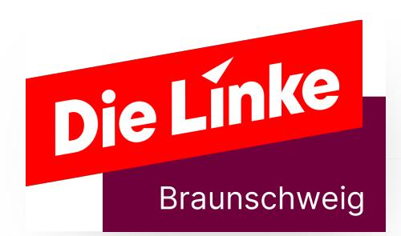

{0}------------------------------------------------

## Braunschweig gehört uns allen

/ [Kommunalwahl 2026](https://www.dielinke-braunschweig.de/kommunalwahl-2026/unser-wahlprogramm/) / Unser Wahlprogramm

{1}------------------------------------------------

## Unser Programm zur Kommunalwahl

Liebe Braunschweiger\*innen,

am Sonntag, dem 13. September 2026, ist Kommunalwahl: Wir alle bestimmen gemeinsam über die Zusammensetzung des Rates der Stadt und der Stadtbezirksräte und wählen eine\*n neue\*n Oberbür‐ germeister\*in.

**Keine andere Wahl ist so nah an unserem alltäglichen Leben.** Viele Probleme werden durch die Bundespolitik verursacht. Dennoch können wir mit der Kommunalpolitik die Stadt so gestalten, dass alle, die hier wohnen, die bestmöglichen Bedingungen für ein gutes Leben und Zusammenleben haben - unabhängig von Einkommen, Herkunft, Geschlecht, Alter, familiärer Situation, Bildungsstand, Hautfarbe oder sexueller Orientierung.

**Aber immer häufiger erleben wir, dass unsere Stadt nicht mehr uns gehört**, sondern denen, die mit Mieten, Energie, Pflege und Bildung Profite machen. Konzerne, denen nichts an Braunschweig oder unserer Stadtgemeinschaft liegt, greifen nach Einfluss und versuchen uns zu entzweien.

Auf den folgenden Seiten wollen wir euch zeigen, wie **Die Linke** das ändern will. **Wir werden uns entschieden gegen die zunehmende soziale Kälte und den Einfluss der Großkonzerne stellen.** Stellt euch ein Braunschweig vor,

▪ in dem Wohnraum bezahlbar ist. ▪ in dem Mobilität klimafreundlich, barrierefrei und erschwinglich ist. ▪ in dem der gesellschaftliche Zusammenhalt gestärkt und niemand zurückgelassen wird. ▪in dem alle Kinder gleiche Chancen auf Bildung haben.

Schon jetzt setzen wir, **Die Linke Braunschweig**, uns hier vor Ort mit den Menschen für die Menschen ein. Wir haben im letzten Jahr unter anderem eine KüfA �Küche für alle) und das bundesweite Projekt "Die Linke hilft" in Braunschweig aufgebaut. Dies ermöglicht uns direkte Hilfe, unbürokratisch da, wo sie gebraucht wird. Durch unsere Haustürgespräche, unsere offenen Treffen und unsere regelmäßigen Infostände sind wir nah an den Menschen dran, die sonst selten eine Stimme haben, und können sie bei ihren Problemen unterstützen.

{2}------------------------------------------------

Aber wenn wir stark im Rat vertreten sind, können wir noch viel mehr erreichen. Mit einer Kommunalpolitik, die alle mitdenkt, können wir eine soziale Stadtgemeinschaft schaffen und Demokratie und Solidari‐ tät stärken.

**Dafür brauchen wir eure Stimme.** Zusammen holen wir uns Braun‐ schweig von den Großkonzernen zurück und machen es zu einer lebenswerten Stadt, die sich um ihre Bewohner\*innen kümmert.

**Niemals alleine, immer gemeinsam!**

## Braunschweig ist bezahlbar

Wohnen - Sicher und bezahlbar für alle

Wohnen ist ein Menschenrecht. In vielen Städten fehlt es an günstigem, hochwertigem Wohnraum, auch in Braunschweig. Deshalb darf der Bereich Wohnen nicht dem Markt überlassen werden.

Die Einflussmöglichkeiten der Kommune auf die Versorgung mit günstigem Wohnraum sind mit ca. 5,3 % der Wohnungen in kommunaler Hand gering. Die finanzielle Schwächung der städti‐ schen Wohnbaugesellschaft Nibelungen-Wohnbau GmbH �NiWo) verringert diesen Einfluss noch. Demgegenüber nutzen die beiden großen Wohnungskonzerne LEG und Vonovia gesetzliche Spielräume bis an den Rand der Legalität und darüber hinaus. So werden hohe, illegale Mieten verlangt, Mieten durch überflüssige Modernisierung erhöht (z.B. Smarte Rauchmelder) oder Mieter\*innen über nicht nachvollziehbare Betriebskostenabrech‐ nungen abgezockt. jekten gab es einen ersten richtigen Schritt, den Bestand an

Im Jahr 2023 gab es ca. 3.700 Sozialwohnungen. Demgegen‐ über hätten laut dem Wohnraumversorgungskonzept 27.000 Haushalte Anspruch auf einen Wohnberechtigungsschein und somit geförderten Wohnraum. 80 % der bestehenden Sozialwoh‐ nungen befinden sich in kommunalem oder genossenschaftli‐ chem Besitz. Mit der Einführung der 30%�Quote bei Neubaupro‐

{3}------------------------------------------------

Sozialwohnungen zu erhöhen und andere Wohnungsunterneh‐ men in die Pflicht zu nehmen. Der Großteil der Sozialwohnungen befindet sich in der Weststadt. Die Spaltung in reiche und arme Stadtbezirke wird auch durch den Bindungstausch bei neu gebauten sozialem Wohnraum weiter befördert.

Die Angebotsmieten sind in den letzten Jahren stark gestiegen. Von 2012 bis 2024 wurden sie um ca. 67 % auf ca. 9,30 €/m² erhöht. Laut dem Zensus 2022 lag die durchschnittliche Bestandsmiete in Braunschweig bei ca. 7,30 €. Das sind etwa 1,10 € mehr als bei der NiWo oder den großen Wohnbaugenos‐ senschaften.

Seit Jahren kann die Stadt den realen Wohnungsleerstand nicht beziffern. Folglich kann daraus auch kein Handlungsbedarf abgeleitet oder aktiv gegen unbegründeten Leerstand vorge‐ gangen werden.

Mit dem 2022 vom Rat beschlossenen Braunschweiger Bauland‐ modell Wohnen wurde ein Vorgehen erarbeitet, um neuen "bezahlbaren" Wohnraum zu schaffen. Die Entwicklung von Bauland ist nur noch in Kooperation mit der Stadt über die Grundstücksgesellschaft Braunschweig GGB möglich.

Laut der Zentralen Beratungsstelle Niedersachsen gab es Anfang 2025 ca. 550 obdachlose Menschen in Braunschweig. Trotzdem sind die von der Stadt gestellten Notunterkünfte nicht ausgelastet. Das liegt nicht daran, dass kein Bedarf da ist, sondern an den prekären Zuständen in diesen Unterkünften.

#### Unsere Vision:

In Braunschweig haben alle Menschen unabhängig vom Einkom‐ men Zugang zu einem sicheren und lebenswerten Zuhause. Der größte Teil des Wohnungsbestandes befindet sich in kommuna‐ ler Hand oder im Besitz gemeinnütziger Träger. Mit unbefristeten Mietverträgen, niedrigen Kosten und guter Architektur wird eine Durchmischung der Einkommensschichten gefördert. Eine langfristig geplante, aktive Bodenvorratspolitik ermöglicht es, Baugrundstücke preiswert zur Verfügung zu stellen.

{4}------------------------------------------------

▪ **NiWo stärken:** Es werden Unternehmensstrukturen aufge‐ baut, um eigene Wohnbauprojekte zu entwickeln. Die Gewinnabführung der NiWo an die Stadt wird abgeschafft. Stattdessen werden alle Gewinne sowie weitere städtische Mittel in die Schaffung von hochwertigem, bezahlbarem Wohnraum durch Umbau, Neubau, Instandhaltung und Ankauf von Wohnungen investiert. ▪ Neuer Wohnraum wird vorwiegend durch die NiWo, Wohnbaugenossenschaften oder gemeinnützige Träger geschaffen. Außerdem werden neue gemeinschaftliche Wohnkonzepte gefördert. ▪ Um den Bestand an **sozialem Wohnraum** zu erhöhen, wird die Quote für sozial gebundene Wohnungen bei Neubaupro‐ jekten auf mindestens 50 % erhöht. Außerdem wird der Bindungstausch abgeschafft, Sozialbindungen mit Fördermit‐ teln des Bundes und des Landes angekauft und die Bindungsdauer auf 60 oder mehr Jahre erhöht. ▪ Der **Leerstand von Wohnraum** wird kontinuierlich erfasst. Bei unbegründetem langanhaltenden Leerstand wird eine Abgabe/Steuer erhoben, ggf. werden die Wohnungen enteig‐ net und in kommunale Hand überführt. ▪ In den Notunterkünften für **Obdachlose** werden hohe Standards umgesetzt. Ein Housing-First-Konzeptes wird entwickelt. Weiteres dazu im Kapitel Arbeit & Soziales. ▪ Die Wohnungsbestand der Konzerne LEG und Vonovia wird vergesellschaftet. ▪ Um Mieter\*innen zu unterstützen, wird eine **zentralen Meldestelle "Wohnen"** geschaffen. Diese nimmt Hinweise zu überhöhten Mieten entgegen, berät Mieter\*innen, setzt Maßnahmen gegen Mietwucher durch und bietet eine kostenlose Mietberatung an. Außerdem wird eine jährliche Informationskampagne zu Rechten von Mieter\*innen sowie den Hilfsangeboten der Stadt durchgeführt. ▪ Mit einer aktiven **Bauland- und Bodenpolitik** wird die Schaf‐ fung von günstigem Wohnraum unterstützt. Dafür wird die GGB finanziell besser ausgestattet und das Vorkaufsrecht zum Erwerb von vorrätigen Flächen genutzt. Bauland wird vorrangig über kommunales Erbbaurecht vergeben.

{5}------------------------------------------------

Die finanzielle Lage der Kommunen in Deutschland ist von einem dramatisch anwachsenden strukturellen Defizit gekennzeichnet. Die Schere zwischen ihren wachsenden Aufgaben und ihren eingeschränkten Entscheidungs- und Handlungsmöglichkeiten wird immer größer. Die Bundesvereinigung der kommunalen Spitzenverbände gibt für 2024 ein gegenüber dem Vorjahr sprunghaft von 6,3 Mrd. auf 24,3 Mrd. Euro angewachsenes jährliches Finanzdefizit an und prognostiziert ein weiteres Anwachsen auf 35 Mrd. Euro. Die Gesamtschulden überschrei‐ ten inzwischen 320 Mrd. Euro. Hinzu kommt ein Investitionsstau von 215 Mrd. Euro. Während Bund und Länder Steuererhöhun‐ gen scheuen und Schuldenbremsen unterliegen, werden immer mehr Pflichtaufgaben ohne ausreichende Gegenfinanzierung auf die Kommunen übertragen. Der Grundsatz kommunaler Selbst‐ verwaltung wird damit systematisch untergraben. Da Kommunen nur sehr begrenzten Einfluss auf ihre Steuereinnahmen haben, wird in allen Bereichen gekürzt, die Infrastruktur kaputtgespart, ohne dass sich das Defizit dadurch merklich verringern lässt. Durch ein einmaliges Sondervermögen des Bundes lässt sich das Problem keinesfalls lösen. Ein Umsteuern auf Bundesebene hin zu einer dauerhaften, soliden Finanzausstattung der Kommu‐ nen ist überfällig.

Das beschriebene strukturelle Finanzproblem zeigt sich auch in Braunschweig, wo derzeit mit einem jährlichen Defizit von mehr als 200 Mio. Euro gerechnet wird. Neben hohen Investi-tionsund Personalkosten im Zuge des Rechtsanspruches auf Kitaund Schulkind-Betreuung schlagen hier insbesondere auch steigende Defizite beim Städtischen Klinikum (rund 80 Mio.) und der BSVG �40 Mio.) zu Buche – die die betroffenen Einrichtungen nicht zu verantworten haben und deren Übernahme zwingend notwendig ist.

Auch die von der breiten Ratsmehrheit getragene Privatisie‐ rungspolitik der letzten Jahrzehnte wirkt sich negativ auf den städtischen Haushalt aus. So entgehen der Stadt dauerhaft Gewinneinnahmen aus den früheren Stadtwerken (heute u. a. BS|Energy/Veolia). Viele der großen Schulneubauten und Schul‐ sanierungen erfolgen inzwischen im Rahmen von Public-Private 

{6}------------------------------------------------

Partnership �PPP��Privatisierungen, u. a. der Neubau der 6. IGS� Diese Schulen werden durch einen privaten Konzern saniert und für 20 Jahre betrieben, was zu dauerhaften, hohen Mietver‐ pflichtungen und später zu unkalkulierbaren Folgekosten führt. Die Linke lehnt jegliche Privatisierungen von Einrichtungen der Daseinsvorsorge schon allein wegen der Aufgabe der demokrati‐ schen Kontrolle strikt ab.

Zu hohen Mietverpflichtungen führt auch die zunehmende Tendenz der Stadt, eigene Gebäude zu veräußern und stattdes‐ sen hochpreisige Anmietungen vorzunehmen wie bei der Stadt‐ bibliothek und dem Kulturinstitut �ECE�, dem BraWo-Center III sowie in Zukunft auch der Städtischen Musikschule �New-Yorker-Stiftung).

Die Linke sieht die Notwendigkeit moderner, zentraler Räumlich‐ keiten für die Städtische Musikschule. Aber wir haben im Rat der Stadt gegen das Haus der Musik gestimmt, denn wir sind gegen das Stiftungsmodell, gegen die erwähnte Anmietung und dagegen, dass die Stadt a) New Yorker für 15 Mio. Euro ein nutzloses Kaufhausgebäude abkauft, b) das finanzielle Risiko für den geplanten Konzertsaal trägt.

Die geplanten Investitionen in Schulen und Kitas, Klimaschutz und Wärmewende tragen wir selbstverständlich mit. Manche Investitionen wie z. B. den Bau der Stiftshöfe sehen wir hingegen kritisch. Die Stadt ist nicht verantwortlich für den Bau von Hotels und Luxuswohnungen, für die nun, entgegen der Planung, kein Investor gefunden werden konnte, so dass sie mit weiteren 65 Mio. Euro in Vorleistung geht.

Andere seit langem geplante Investitionen werden hingegen auf den Sankt-Nimmerleinstag verschoben wie z. B. die Neubauten der Jugendzentren B 58 und Watenbüttel und der barrierefreie Umbau des Gesundheitsamtes. Das ist für uns nicht hinnehmbar.

Angesichts der finanziellen Lage ist zu befürchten, dass massive Kürzungsprogramme alle Bereiche des öffentlichen Lebens treffen und viele Vereine und freie Träger in eine existenzgefähr‐ dende Situation bringen. Kürzungen in den Bereichen Soziales, Kultur, Bildung und Breitensport werden wir uns konsequent entgegenstellen.

{7}------------------------------------------------

2024 hat die Stadt Braunschweig den Grundsteuerhebesatz gleich zweimal angehoben um insgesamt 50 % mit Wirkung ab 01.01.2025. Die Linke hat Grundsteuererhöhungen stets abgelehnt, da diese von den Hauseigentümern vollständig auf die Mieten umgelegt werden können. Seit vielen Jahren beantragt Die Linke hingegen in jeder Haushaltsberatung vergeblich die Erhöhung der Gewerbesteuer und eine Touris‐ musabgabe �Bettensteuer).

Die Einführung eines Bürgerhaushaltes in Braunschweig war auf Initiative der Linken beschlossen worden. Im Jahr 2015 hatten 2.700 Braunschweigerinnen und Braunschweiger Vorschläge zum Haushalt unterbreitet, zu denen rund 300.000 Bewertungen abgegeben wurden. Das war die größte Bürger\*innenbeteiligung zu konkreten Projekten, die es in Braunschweig je gab. Trotzdem wurde der Bürgerhaushalt im Jahr 2017 wieder abgeschafft und in eine unverbindliche "Ideenbörse" umgewandelt.

#### Unsere Vision:

Die neue Bundesregierung hat ihre Steuerpolitik grundlegend geändert und die Staatsausgaben neu priorisiert. Den Kommu‐ nen stehen wieder auskömmliche Mittel zur Verfügung. Der immense Investitionsstau bei Schulen, Kitas und Infrastruktur wurde abgebaut. Energie- und Wasserversorgung, Straßenreini‐ gung, Müllabfuhr und Abwasserentsorgung gehören wieder der Stadt, und die Einwohner\*innen und ihre gewählten Vertreter\*in‐ nen entscheiden selbst über die zu erbringenden Leistungen und die erhobenen Gebühren.

#### So will Die Linke das erreichen:

▪ Keine weiteren Privatisierungen der öffentlichen Daseinsvor‐ sorge, stattdessen Rekommunalisierung der privatisierten Bereiche, damit die Stadt wieder die demokratische Kontrolle über die Einrichtungen und zusätzliche Einnahmen hat. ▪ In den privatisierten Bereichen muss die Stadt im Vorfeld auslaufender Konzessionsverträge rechtzeitig Maßnahmen ergreifen und Kompetenzen aufbauen, um die Aufgaben wieder selbst übernehmen zu können. ▪Einsetzen der finanziellen Mittel zielgerichtet im Sozialbe‐

{8}------------------------------------------------

▪ Sparsame Haushaltsführung durch Einsparungen bei Defizit‐ ausgleich wie z. B. der des Braunschweiger Flughafens oder beim Budget der Wirtschaftsförderung. ▪ Absenkung des Grundsteuer-Hebesatzes auf ein dem Stand vor 2024 entsprechendes Niveau. ▪ Stattdessen Anhebung des Hebesatzes der Gewerbesteuer von 450 % auf 470 %. ▪ Einführung einer Bettensteuer von 4 % auf den Übernach‐ tungspreis in Hotels. ▪ Mehr Bürgerbeteiligung an der städtischen Haushaltspolitik durch Wiedereinführung eines Bürgerhaushaltes.

#### Arbeit & Soziales - Solidarisch statt prekär

In unserer Gesellschaft geht die Schere zwischen Arm und Reich immer weiter auseinander. Das prägt auch die Gesellschaft in Braunschweig.

Im Jahr 2020 waren 9,1 % der Braunschweiger\*innen auf soziale Unterstützungsleistungen angewiesen. Unter den Kindern und Jugendlichen waren dabei 14,3 % betroffen, so steht es im Sozialbericht der Stadt Braunschweig �2022�. Es zeigen sich eklatante Unterschiede zwischen den Stadtteilen. Im Planungs‐ bezirk Weststadt Nord war der Anteil dabei mit 44,7 % am höchsten, wohingegen es in Lamme nur 1,5 % waren. Ein derarti‐ ges Auseinanderdriften der Stadtteile ist nicht hinnehmbar, hier muss durch eine verantwortungsvolle Stadtplanung, insbeson‐ dere beim sozialen Wohnungsbau, gegengesteuert werden (siehe auch 'Wohnen').

Die Ursachen der Familienarmut sind vielfältig. Die Politik der Bundesregierungen der letzten Jahrzehnte hat dafür gesorgt, dass der prekäre Beschäftigungssektor immer weiter angewach‐ sen ist. Der Mindestlohn, ein Herzensprojekt der Linken, liegt noch immer auf viel zu niedrigem Niveau. Anstelle einer bedarfs‐ deckenden und sanktionsfreien Mindestsicherung gibt es neue Sanktionen.

{9}------------------------------------------------

Arbeitsmarkt-, Sozial- und Gesellschaftspolitik der verschiede‐ nen Bundesregierungen lassen sich von der Kommune nicht aufheben. Doch wir können vor Ort alles dafür tun, die Lage der sozial Benachteiligten zu verbessern.

Wir akzeptieren nicht, dass städtische Gesellschaften Neuein‐ stellungen mit einer zweijährigen Befristung vornehmen oder nicht nach Tarifvertrag �TVöD� bezahlen.

#### Unsere Vision:

Die Stadt Braunschweig tut alles, um arme Familien und ihre Kinder zu unterstützen. Sie unterstützt die Eltern dabei, eine berufliche Perspektive zu finden und stellt Bedürftigen – auch Menschen in Altersarmut – städtische Leistungen wie den ÖPNV, das Mittagessen in Schulen und Kitas, Kultur- und Sportange‐ bote kostenlos zur Verfügung. Es gibt genügend Sozialarbei‐ ter\*innen und Beratungsstellen, an die man sich bei jeder Problemlage wenden kann. Sozialwohnungen und bezahlbarer Wohnraum verteilen sich über die gesamte Stadt, in allen Stadt‐ teilen leben Menschen aller Einkommensgruppen Tür an Tür.

#### So will Die Linke das erreichen:

▪ Erfüllung der gesetzlich verankerten Auskunfts-, Beratungs-, und Informationspflichten durch das Jobcenter und Sozial‐ amt sowie aktive Information der Leistungsberechtigten über "freiwillige Leistungen" der Stadt. ▪ Im öffentlichen Bereich müssen dem Bedarf entsprechend viele sozialversicherungspflichtige Arbeitsplätze erhalten und geschaffen werden. Neueinstellungen sollen grundsätzlich unbefristet erfolgen. ▪ Auszubildende, die ihre Ausbildung bei städtischen Betrieben erfolgreich abgeschlossen haben, werden unbefristet übernommen. ▪ Für Langzeitarbeitslose schafft die Stadt niedrigschwellige, freiwillige, sozialversicherungspflichtige Beschäftigungsan‐ gebote. ▪ Ein "Braunschweiger Vergabekonzeptes" mit Mindeststan‐ dards für Löhne �Tarifbindung), Arbeitsbedingungen und ökologische Aspekte wird erstellt. ▪Für alle Kinder soll es ein kostenloses, öffentlich finanziertes

{10}------------------------------------------------

Mittagessen an jeder Schule und in jedem Kindergarten geben (siehe auch 'Kinder und Jugend'). Die erfolgten Verbesserungen im neuen Bildungs- und Teilhabepaket �BuT�, nach dem Kinder von Leistungsberechtigten kostenlos ihr Mittagessen erhalten, reichen nicht aus. Das Angebot muss – auch zur Vermeidung von Diskriminierung – für alle Kinder gelten.

▪ Für Kinder von Empfänger\*innen von Sozialleistungen und Geringverdiener\*innen sollen das Schulmaterial kostenlos zur Verfügung gestellt und die Kosten für Klassenfahrten übernommen werden. ▪ Die im Braunschweig-Pass enthaltenen Leistungen werden ausgeweitet. Die Nutzung des ÖPNV und z. B. der Schwimm‐ badbesuch wird den Betroffenen kostenlos ermöglicht. ▪ Der auf Initiative der Linken getroffene Ratsbeschluss zur Schaffung weiterer dezentraler Wohnungen für Wohnungs‐ lose muss endlich umgesetzt werden. Die Sozialarbeit muss in diesem Bereich deutlich aufgestockt und Housing-First zur Priorität werden. ▪ Für die bestehenden Notunterkünfte werden angemessene Mindeststandards festgelegt. Insbesondere soll niemand mehr Angst um seine körperliche Unversehrtheit und sein Hab und Gut haben müssen, wenn eine Unterkunft in Anspruch genommen wird (siehe auch Abschnitt "Wohnen"). ▪ Das Angebot im Bereich der Schuldner\*innenberatung wird ausgebaut, um den Betroffenen eine zeitnahe Unterstützung zu ermöglichen.

#### Mobilität – Sozial, ökologisch, barrierefrei

Die Stadt Braunschweig hat mit dem Mobilitätsentwicklungsplan in den vergangenen Jahren eine zukunftsorientierte Strategie für die Verkehrsplanung bis 2035 entwickelt. Die Umsetzung verläuft bisher leider schleppend.

Der Öffentliche Personennahverkehr �ÖPNV� ist für viele Menschen in Braunschweig bereits heute ein unerlässlicher Teil des Lebens. Jedoch sind die Preise zu hoch und die Wartedauer an vielen Haltestellen ist zu lang, um eine einfache Option für spontane Wege innerhalb der Stadt zu sein. Dies macht sich

{11}------------------------------------------------

besonders an Wochenenden und in der Nacht bemerkbar, wenn Straßenbahnen teilweise nur im Stundentakt fahren.

Des Weiteren gibt es große Bereiche im westlichen Ringgebiet, in denen aktuell keine Straßenbahn-Anbindung besteht und die Busanbindung sogar vor kurzem verschlechtert wurde. Das ÖPNV�Netz der Stadt leitet alle Linien durch die Innenstadt, was für einige Verbindungen einen weiten Umweg bedeutet. Das Straßenbahnnetz ist zwar bereits seit längerem mit Niederflur‐ fahrzeugen ausgestattet, aber es gibt in den Bahnen nicht ausreichend Mehrzweckfläche, was u. a. die Barrierefreiheit beeinträchtigt.

Personen aus den Außenbezirken und dem Umland sind oft auf das Auto angewiesen, um in die Innenstadt zu gelangen, u. a., weil die Finanzierung der Regiobuslinien permanent in Frage gestellt wird. Der ÖPNV ist keine Alternative, weil er nicht verlässlich und praktisch genug ist.

Auf Initiative der Linken verfügt Braunschweig über ein Sozialti‐ cket für Transferleistungsberechtigte und über ein kostengünsti‐ ges Schüler\*innenticket. Leider wurden die Preise für diese Tickets mit dem Doppelhaushalt 2025/2026 drastisch um 50 % bzw. 33 % erhöht. Das wollen wir nicht hinnehmen!

Jedes Jahr müssen in Braunschweig etwa 15 Menschen ins Gefängnis, weil sie zum wiederholten Male ohne Fahrschein gefahren sind. Dies trifft vor allem arme Menschen. In der aktuel‐ len Ratsperiode wurde ein von uns gestellter Antrag, in diesen Fällen keine Strafanzeige mehr zu stellen, von der Mehrheit im Rat der Stadt abgelehnt.

#### Unsere Vision:

In Braunschweig können alle Menschen ihre Ziele schnell, angenehm und sicher erreichen. In der Innenstadt sind ÖPNV und Fahrradinfrastruktur so ausgebaut, dass sie für den Großteil der Einwohner\*innen die komfortabelste und günstigste Option sind, auch und insbesondere für Menschen mit eingeschränkter Mobilität. Parkplätze stehen primär Anwohner\*innen und Perso‐ nen, die auf besonders kurze Fußwege angewiesen sind, zur Verfügung.

{12}------------------------------------------------

▪ Der Mobilitätsentwicklungsplan der Stadt Braunschweig bleibt weiterhin Basis für die langfristige Verkehrsplanung der Stadt. Um seine Verbindlichkeit zu stärken, wird über den Status der Umsetzung öffentlich einsehbar informiert, beispielsweise über ein Online-Dashboard. ▪ Menschen, die familiär Sorgearbeit leisten, haben andere Mobilitätsbedürfnisse, sie legen mehr und andere Wege zurück. Daher werden deren Interessen von Anfang an bei der Umsetzung des Mobilitätsentwicklungsplanes berück‐ sichtigt. ▪ Tempo 30 in der Innenstadt wird ausgeweitet. Unsere Vision ist dieses Tempolimit überall innerhalb des wilhelminischen Rings. ▪ Die verschiedenen Fußgängerzonen in Innenstadt und Magni‐ viertel werden verbunden. Schritte hin zum autofreien Bohlweg werden unternommen. ▪ Das Sicherheitsgefühl wird verbessert: Fuß- und Radwege werden klar abgegrenzt, besser beleuchtet und bei Glätte geräumt, z.B. in der Innenstadt und auf dem Ringgleis. Auch regelmäßige Sitzgelegenheiten und Standards für Barriere‐ freiheit machen unmotorisierte Mobilität attraktiver. ▪ Lücken im Radwegenetz werden geschlossen, Velorouten ohne Kompromisse gebaut. ▪ Der ÖPNV wird weiter ausgebaut und attraktiver gemacht: Umsetzung von Stadt.Bahn.Plus, Vorrang von Bussen an Ampeln, separate Busspuren, bessere Verbindung von außen liegenden Stadtteilen untereinander, z.B. durch Expresslinien. ▪ Die Preise für die ÖPNV�Nutzung müssen sinken. Wir setzen uns ein für kostenlose Tickets für Menschen im Leistungsbe‐ zug sowie Schüler\*innen und Auszubildende. Mittelfristig muss der ÖPNV für alle kostenfrei sein. ▪ Die BSVG schließt sich Städten wie Köln und Potsdam an und stellt keine Strafanzeigen mehr wegen "Erschleichens von Leistungen". Niemand soll ins Gefängnis müssen, weil er oder sie kein Geld für einen Fahrschein hat.

# Parkplätze und kostenlose Anbindung an das Straßenbahn‐ netz attraktiver und bekannter gemacht, um den Besuch der Braunschweig ist zukunftsfähig

{13}------------------------------------------------

#### und die Straßen in der Innenstadt zu entlasten. Stadtentwicklung – Eine Stadt für alle

freiem Verkehr werden geprüft, z.B. Parkgebühren nach Fahrzeuggröße, Bevorzugung von emissionsfreier Lieferung bei öffentlichen Aufträgen, Bewohner\*innenparkausweise auch für Carsharing-Nutzende. Noch immer ist Braunschweig schwerpunktmäßig autogerecht. Zentrale Supermärkte sind kaum anders erreichbar. Flächen sind oft versiegelt, auch wenn die zunehmende Aufheizung schonhier und da zum Umdenken geführt hat, indem unter anderem Pocket-Parks gebaut wurden.

Braunschweig hat vielfältige Freizeitangebote. In manchen Stadtteilen kommt das öffentliche Leben jedoch merklich zum Erliegen, wenn Begegnungsorte wegfallen wie z. B. der Heidbergsee im Winter. Auch in anderen Stadtbezirken, insbe‐ sondere am Stadtrand, fehlen Treffpunkte. Bei der �Neu-)Planung von Wohnquartieren muss berücksichtigt werden, dass Freizeit- und Gesundheitsangebote fußläufig und barriere‐ frei erreichbar sind und sich niemand isoliert fühlt.

Einwohner\*innen, die Sorgearbeit im Alltag leisten, d.h., sich um Kinder, ältere Angehörige oder Menschen mit Behinderungen kümmern, Kinder, Kinderwagen- und Rollator-Schiebende sowie Rollstuhlfahrende machen einen großen Prozentsatz der Braun‐ schweiger\*innen aus. Sie brauchen kurze und sichere Wege zu Kitas und Schulen, zum Einkaufen, zu Ärzt\*innen und Pflegeein‐ richtungen. Ihre Perspektiven werden in der Planung zu selten mitgedacht.

## Unsere Vision:

Neue Wohngebiete sind grün, haben Frischluftschneisen und sind mit allen Verkehrsmitteln komfortabel erreichbar. Jede\*r Einwohner\*in von Braunschweig hat die Möglichkeit, spontan und ohne Probleme in der eigenen Nachbarschaft Freizeit- und Gesundheitsangebote wahrzunehmen. Die Ansiedlung von Nahversorgern und lokalen Begegnungsstätten in den Wohnge‐ bieten wird gefördert.

Es gibt keine Angsträume mehr in der Stadt, Straßen und Plätze sind offen und gut beleuchtet. Es gibt öffentliche Ruhebereiche ohne Konsumzwang, mit Schatten und Trinkwasserspendern. Im öffentlichen Raum gibt es mehr Notrufknöpfe sowie kostenlose, barrierefreie und saubere Toiletten mit Wickelplätzen.

{14}------------------------------------------------

#### So will Die Linke das erreichen:

▪ Bei der Planung ihrer Nachbarschaft werden Menschen aus allen Bereichen und die Bedürfnisse aller Altersgruppen einbezogen. Dafür wird mit Initiativen für Kinder, Alte und Menschen mit Behinderungen zusammengearbeitet. ▪ Das Ziel "Stadt der kurzen Wege" wird verfolgt: Durch wohnortnahe Einkaufsmöglichkeiten, Kitas, Spielplätze, Nachbarschaftszentren sowie kulturelle und sportliche Einrichtungen werden möglichst gute Bedingungen für die Vereinbarkeit von Arbeit und Beruf geschaffen. ▪ Einwohner\*innen werden an Planungsprozessen beteiligt, zum Beispiel durch Workshops und Umfragen – nicht erst im Anschluss an schon gefallene Entscheidungen, sondern während des gesamten Prozesses. ▪ Ehrenamtliches Engagement (z.B. nachbarschaftliche Unter‐ stützung, Büchertausch, Werkstattangebote) wird gestärkt. ▪ Städtische Vorgaben für Barrierefreiheit werden verbessert. ▪ Kleingartenvereine sind wichtige Orte der Naherholung. Sie werden bei Schutz und Erhalt ihrer Anlagen unterstützt.

## Gemeinwohlorientierte Daseinsvorsorge & Rekommu‐ nalisierung

Die Daseinsvorsorge umfasst Aufgaben, Güter und Leistungen, die unabdingbar für das menschliche Dasein sind. Dazu gehören z.B. die Energie- und Wasserversorgung, die Abfallentsorgung, Verkehrsleistungen und die Stadtreinigung. Die Daseinsvorsorge kann auch weitere Aspekte wie z.B. die Ernährung umfassen. Nach dem Prinzip der kommunalen Selbstverwaltung liegt die Verantwortung dafür bei der Kommunen und ist ein Teil des Sozialstaatsprinzips. Die Linke ist der Auffassung, dass eine gute und günstige "Daseinsvorsorge für alle" nur funktioniert, wenn sie unabhängig von Konzerninteressen und Gewinnabsich‐ ten ist. Besonders hervorzuheben sind die Verteilnetze von Strom, Gas, Wasser und Fernwärme, da sie ein natürliches Monopol sind. Ein großer Teil der Braunschweiger Daseinsvor‐ sorge wurde nach der Jahrtausendwende unter der Führung der CDU teilweise oder vollständig an private Unternehmen verkauft

{15}------------------------------------------------

(z.B. BS Energy und ALBA�. Die Verschuldung der Stadt wurde somit auf Kosten des Services und der Preise für die Einwoh‐ ner\*innen Braunschweigs reduziert. Die Versorgungsverträge der Unternehmen mit der Kommune werden über mehrere Jahrzehnte abgeschlossen und sind dementsprechend für einen langen Zeitraum zementiert.

In dem Unternehmen BS Energy und dessen Tochtergesellschaf‐ ten vereinen sich viele Bereiche der Daseinsvorsorge � Gas, Strom, Fernwärme, Wasser, Abwasser, Straßenbeleuchtung, Lichtsignalanlagen und Verteilnetze. BS Energy übernimmt ebenfalls die Aufgabe der Grundversorgung für Strom und Gas in der Stadt und hat im Vergleich zu anderen Grundversorgern deutlich höhere Preise für die Verbraucher\*innen. Die Mehrheit an BS Energy und somit die Entscheidung über das wirtschaftli‐ che Handeln hält der internationale Konzern Veolia S.A. Die Stadt Braunschweig besitzt mit 25,1 % der Anteile eine Sperrminorität, die sie jedoch nicht gewillt ist im Sinne der Einwohner\*innen anzuwenden. Im Jahr 2023 wurden von BS Energy 79,6 Mio. Jahresüberschuss erzielt. Problematisch dabei ist, dass die Stadt durch Konzessionsentgelte und Gewinnausschüttungen profitiert.

Die ALBA Braunschweig GmbH ist mit der Abfallwirtschaft und der Stadtreinigung in Braunschweig betraut und Tochtergesell‐ schaft des Konzernes ALBA SE. Im Zuge der damals anstehen‐ den Verlängerung der Versorgungsverträge mit ALBA hat die Stadtverwaltung im Jahre 2023 ein Gutachten erstellt. In dem Gutachten steht, dass der Verkauf langfristig ein schlechtes Geschäft für die Stadt war und die Rekommunalisierung die wirtschaftlich günstigste Form sei.

Aufgrund der hohen kommunalen Verschuldung werden viele Bauprojekte wie z.B. der Neubau der 6. IGS "Wendenring" mit sogenannten Public-Private Partnership �PPP� Projekten umgesetzt. Dabei übernimmt die GOLDBECK GmbH den Neubau sowie den technischen Betrieb der Schule für 20 Jahre. Die genauen Vertragsbedingungen zwischen der Stadt und GOLDBECK sind nicht bekannt. Bei PPP�Projekten gibt es einen Konflikt zwischen den öffentlichen Interessen, z.B. der Umset‐ zung einer öffentlichen Leistung und dem Gewinninteresse der

{16}------------------------------------------------

privaten Unternehmen. Kosten für die Kommune werden in die Zukunft verschoben.

#### Unsere Vision:

Die gesamte Daseinsvorsorge von der Energie- über die Wasser‐ versorgung, der Müllentsorgung sowie den Verteilnetzen sind vollständig in kommunaler Hand. Im Zentrum der kommunalen Unternehmen stehen die Bedürfnisse der Einwohner\*innen und der Mitarbeiter\*innen. Die Gewinne werden vollständig in die Instandhaltung, Modernisierung und den Ausbau der kommuna‐ len Infrastruktur reinvestiert. Über verschiedene Beteiligungsfor‐ mate der Stadt können Einwohner\*innen demokratisch die Daseinsvorsorge mitgestalten. Stadtteilzentren und öffentliche Kantinen als gesellschaftliche Treffpunkte werden von der Stadt ebenfalls als Teil der Daseinsvorsorge angesehen und ausge‐ baut sowie gefördert.

#### So will Die Linke das erreichen:

▪ Die städtischen Beteiligung bei BS Energy wird auf mindes‐ tens 51 % erweitert. Dadurch erfolgt die Beschränkung der Einflussnahme des multinationalen Konzerns Veolia S.A. Langfristig ist die vollständige Rekommunalisierung von BS Energy und aller Tochtergesellschaften angestrebt. ▪ Es werden Konzepte zur Rekommunalisierung der verschie‐ denen Bereiche der Daseinsvorsorge nach Ablauf der jeweili‐ gen Versorgungsverträge erstellt. Langfristig sollen Verwal‐ tungsstrukturen und Know-How zur Übernahme dieser kommunalen Aufgaben aufgebaut werden – z.B. Für ALBA bis zum Jahr 2031. ▪ Zur Stärkung der demokratischen Mitgestaltung bei kommu‐ nalen Unternehmen der Daseinsvorsorge werden weiterfüh‐ rende Beteiligungsformate für Einwohner\*innen entwickelt. Das Mitspracherecht der Mitarbeiter\*innen bei der Organisa‐ tion und Entwicklung kommunaler Unternehmen wird ausge‐ weitet. ▪ Die Durchführung von Baumaßnahmen als PPP�Verfahren und damit verbundenen Übertragung hoheitlicher Aufgaben auf Banken und Konzerne wird pauschal abgelehnt. ▪Um öffentliche Bauprojekte unabhängig von privaten Unter‐

{17}------------------------------------------------

nehmen und ohne PPP�Verfahren umsetzen zu können, wird in Kooperation mit den angrenzenden Kommunen ein Kon‐ zept für eine gemeinschaftliche kommunale Bauhütte für das Gebiet des Regionalverbandes Großraum Braunschweig entwickelt.

▪ Das Angebot an öffentlichen, geschlechtsneutralen Toiletten und Trinkbrunnen besonders in der Nähe von Parkanlagen und belebten Stadtbereichen wird ausgebaut. ▪ In Zusammenarbeit mit der Stadtgesellschaft entwickelt die Verwaltung ein Konzept für öffentliche Kantinen, die nährstoffreiche Mahlzeiten zu günstigen Preisen anbieten. Die Umsetzung eines Pilotprojektes soll von der TU Braun‐ schweig begleitet werden.

#### Soziale Energiewende

In dem beschlossenen Integrierten Klimaschutzkonzept 2.0 wurde der Kommunalen Wärmeplanung �KWP� eine hohe Priori‐ tät beigemessen. Diese wird jedoch erst zum offiziellen Fristende der Bundesgesetzgebung im Juli 2026 fertiggestellt. Ein weiteres Ziel im Klimaschutzkonzept ist die Klimaneutralität bis "möglichst" 2030. Dieses Ziel ist nicht mehr zu erreichen. Die richtigen Hebel, besonders im Bereich der klimaneutralen Wärmeversorgung und der Speichertechnologien, wurden zu spät in Bewegung gesetzt. Hierbei steht besonders BS Energy als Grundversorger und Netzbetreiber für Strom und Fernwärme auf der Bremse und das, obwohl er sich Treibhausgasneutralität bis 2035 als Ziel gesetzt hat. Im Rahmen des Ausstiegs aus der Steinkohleverbrennung hat BS Energy 250 Mio. € in Biomasseund Gasturbinen-Heizkraftwerke investiert. Nun wird der Großteil des Stromes und der Wärme über Erdgas erzeugt. BS Energy nennt Schlagwörter wie Wasserstoff und Geothermie, aber wie das Ziel der Treibhausgasneutralität ganz konkret erreicht werden soll, bleibt weiterhin völlig unklar. Stattdessen werden üppige Gewinne an die Anteilseigner ausgeschüttet. All das ist ein Schlag ins Gesicht der Menschen, denen die steigen‐ den CO �Preise bei Strom, Gas und Fernwärme weitergereicht werden. 2

{18}------------------------------------------------

Braunschweig geht langsam, aber stetig voran. 2025 wurde einer großen PV�Freiflächenanlage in Völkenrode zugestimmt. Weitere Anlagen sind in Thune, Wenden und Völkenrode geplant. Die alten Windkraftanlagen in der Nähe von Geitelde werden in den nächsten Jahren modernisiert. Die von der Stadt, BS Energy, Volksbank BRAWO und weiteren Partnern 2022 gegrün‐ dete "Energiegenossenschaft Braunschweiger Land eG" ist ein erster Schritt, um die Finanzierung der Energiewende in Braun‐ schweig auf breitere Beine zu stellen. Innerhalb der Genossen‐ schaft ist die Mitbestimmung der Mitglieder jedoch stark einge‐ schränkt.

#### Unsere Vision:

Braunschweig erreicht eine vollständig klimaneutrale Energiever‐ sorgung bis 2035. Günstige Energie basiert auf einer Kombina‐ tion aus dezentralen Energieerzeugungsanlagen sowie verschie‐ denen Speichertechnologien für Elektrizität und Wärme. Die erhöhte Komplexität der dezentralen Energieversorgung wird mittels intelligenter Netze �Smart Grids) gelöst. Mit einer Energiegenossenschaft für alle können alle Braunschweiger\*in‐ nen an der Energiewende mitwirken und von ihr profitieren.

#### So will Die Linke das erreichen:

▪ Die KWP wird sozial gerecht gestaltet. Dabei liegt der Fokus auf Groß-Wärmepumpen, Wärmespeichern und dem Ausbau des Wärmenetzes über die bereits bestehende Planung hinaus. ▪ Beim Ausbau der erneuerbaren Energien haben bereits versiegelte Flächen oder Flächen zur Mehrfach-Nutzung Vorrang - z.B. PV Parkplatzüberdachung, öffentliche Gebäude. ▪ Um der Komplexität der dezentralen Energieversorgung gerecht zu werden, wird in ein sicheres und stabiles Strom‐ netz und in den Bau von Batteriespeicher-Großanlagen investiert. ▪ Langfristig wird die Rekommunalisierung von BS Energy angestrebt. Bis dahin wird Einfluss auf BS Energy genommen, um niedrige Preise für die Menschen durchzusetzen. ▪Die Energiegenossenschaft Braunschweiger Land wird zu

{19}------------------------------------------------

einer Bürger\*innen-Energiegenossenschaft für alle umgebaut, Mitspracherecht für alle Mitglieder und günstige Anteile.

▪ Balkonkraftwerke und Mieter\*innenstrommodelle werden finanziell gefördert und durch Know-How unterstützt. ▪ Die Öffentlichkeitsarbeit der städtischen Energieberatung wird gestärkt, insbesondere für einkommensschwache Haushalte. ▪Verhinderung von Strom- und Gassperren.

#### Kommunale Wirtschaftspolitik

Die Wirtschaftsstruktur Braunschweigs ist durch einen starken industriellen Sektor und viele Forschungsinstitute geprägt. Daneben existiert ein Dienstleistungsgewerbe mit einem starken Einzelhandel.

Aufgrund der kleinen Stadtfläche spielt die Landwirtschaft in Braunschweig eine untergeordnete Rolle. 2021 wurden mittels EU�Fördermittel ein Projekt für urbane Landwirtschaft gefördert. Dabei wurden Flächen für Gemeinschaftsgärten an interessierte Personengruppen oder Vereine vergeben. In den Plänen der Bahnstadt sind ebenfalls Flächen für urbane Landwirtschaft vorgesehen.

Die kommunale Wirtschaftsförderung erfolgt in Braunschweig durch die städtischen Unternehmen *Braunschweig Zukunft GmbH* (für Wirtschaftsförderung) und der *Struktur-Förderung Braunschweig GmbH* �Entwicklung von Gewerbestandorten und Räumlichkeiten). Der aktuelle öffentliche Fokus der Braun‐ schweiger Wirtschaftsförderung liegt auf Unterstützung der Unternehmen bei den Themen Energieeffizienz und Nachhaltig‐ keit. Die Stadt Braunschweig hat von 2023 bis 2025 an der Gemeinschaftsstudie "Kreislaufstadt � Chancen für Resilienz und Wertschöpfung" teilgenommen.

## Unsere Vision:

Die regionale Wirtschaft, insbesondere KMUs (kleine und mittlere Unternehmen) stehen in gesellschaftlicher Verantwor‐ tung und leisten einen angemessenen Beitrag zum Gemeinwohl

{20}------------------------------------------------

sowie für eine nachhaltige und soziale Stadtentwicklung. Die städtische Infrastruktur ist auf eine zukunftsfähige und kreislauf‐ wirtschaftliche Entwicklung ausgelegt. Besonderer Fokus bei der Wirtschaftsförderung liegt auf Nachhaltigkeit, urbaner Landwirt‐ schaft sowie Kooperativen/Genossenschaften und gemein‐ wohlorientierten Unternehmen.

#### So will Die Linke das erreichen:

▪ In Zusammenarbeit mit den umliegenden Landkreisen und Gemeinden und unter Einhaltung ökologischer Kriterien wird eine aktive Liegenschafts-, Ansiedlungs- und Entwicklungs‐ politik umgesetzt. ▪ Die Unterstützung des regionalen Mittelstand erfolgt durch die priorisierte Auftragsvergabe an KMUs unter Beachtung sozialer und ökologischer Standards. ▪ Die Unterstützung von Unternehmen bei der Umstellung auf nachhaltige und energieeffiziente Prozesse und Geschäfts‐ modelle wird ausgebaut. Außerdem werden innovative Start-Ups und Unternehmensneugründungen gefördert. ▪ Die Stadt entwickelt einen Aktionsplan für eine kommunale bzw. regionale Kreislaufwirtschaft. ▪ In Braunschweig wird eine Verwaltungseinheit für Kreislauf‐ wirtschaft geschaffen, die ehrenamtliche Arbeit und Projek‐ ten wie z. B. Makerspaces, Share- & Repair-Projekte unter‐ stützt. ▪ In allen Stadtteilen werden Reparatur-Cafés und Initiativen gefördert wie z.B. 'AntiRost' und 'Hey, Alter'. ▪ Um die Wiederverwendung von Baumaterial zu fördern, wird eine Baustoff- und Material-börse unter städtischer Koordi‐ nierung geschaffen. Bei der Erteilung von Abrissgenehmigun‐ gen wird die mögliche Weiternutzung von Komponenten geregelt. ▪ Die Stadt erarbeitet in Kooperation mit der Stadtbevölkerung einen Aktionsplan mit der Zielsetzung Aufbau und Förderung einer aktiven urbanen Landwirtschaft als Teil der städtischen Nahrungsmittelversorgung. ▪ Das "Zentrenkonzept Einzelhandel" wird weitergeführt. Außerdem wird eine flächendeckende Nahversorgungsfunk‐ tion auch in den äußeren Stadtbezirken geplant ("Stadt der kurzen Wege").

{21}------------------------------------------------

▪ Der städtische Baustellenfonds zur Unterstützung kleiner Unternehmen bei Umsatzeinbußen durch Langzeit-Baustellen wird wieder eingeführt.

#### Digitalisierung demokratisch gestalten

Braunschweig war durch einen Antrag der Linken 2012 die zweite Stadt in Niedersachsen, die eine Informationsfreiheitssat‐ zung einführte. Dieser Vorreiterrolle wird die Stadt aber nicht länger gerecht.

Das Open-Data-Portal der Stadt wird wenig befüllt und die Datenformate sind oft nicht nutzerfreundlich. Zwar werden zahlreiche Daten offen zur Verfügung gestellt (etwa Parkhausbe‐ legung, Radverkehrszählungen und ein 3D�Modell der Stadt), diese sind aber über viele verschiedene Online-Angebote verteilt und oft schwer zu finden. Das gleiche gilt auch für digitale Angebote zur Mitbestimmung, die daher meist auch eher unbekannt sind und kaum genutzt werden.

Die Digitalisierung der Verwaltung schreitet voran, aber oftmals werden dabei Personen zurückgelassen, die Smartphones nicht nutzen können oder wollen, etwa bei der Kommunikation mit dem Jobcenter.

Das "Smart City"�Konzept, das die Stadt 2020 erstellt hat, enthält nur vage Zielsetzungen. Soziale Aspekte und Daten‐ schutz finden kaum Erwähnung. Stattdessen wurde in der vergangenen Wahlperiode mit den Stimmen von CDU, SPD und AfD im Rat eine Ausweitung der Videoüberwachung in der Braunschweiger Innenstadt beschlossen.

#### Unsere Vision:

Braunschweig schließt sich Vorreiterinnen wie Barcelona und Amsterdam in der *Cities Coalition for Digital Rights* an: Gemein‐

sam tauschen wir Erfahrungen aus und stehen für digitale

#### Rechte ein. Daten über die Bewohner\*innen der Stadt werden sparsam erhoben und fließen nicht an Konzerne ab, die damit Braunschweig ist unsere Stadt

{22}------------------------------------------------

So will Die Linke das erreichen: ▪ Braunschweig bekommt eine Digitalsatzung, in der Regeln Investitionen in die Leben von Kindern und Jugendlichen sind Investitionen in die Zukunft. Alle Kinder sollten unabhängig vom Einkommen ihrer Eltern die gleichen Chancen haben.

dafür festgelegt werden, welche Software genutzt wird. Mittelfristig soll auf offene Software umgestiegen werden. Der Zugang zu Informationen wird vereinfacht. Hierzu zählt eine Modernisierung des Ratsinformationssystems, eine Zusammenführung der aktuell verfügbaren Daten in einem zentralen Dashboard und die konsequentere Nutzung des städtischen Open-Data-Portals. Auch die Informationsfrei‐ heitssatzung muss so reformiert werden, dass unnötige Seit diesem Jahr haben Grundschüler\*innen in Niedersachsen Anspruch auf Ganztagsbetreuung. Die Kosten für Mittagessen müssen jedoch weiterhin durch die Eltern getragen werden. Eine Ermäßigung oder städtische Zuschüsse können beantragt werden. Das bedeutet jedoch neben der Stigmatisierung einen hohen bürokratischen Aufwand, oft zusätzlich verbunden mit sprachlichen Hindernissen.

Hürden für Anfragen wegfallen (z.B. Auskunft auch an Stellen außerhalb Braunschweigs, Deckelung der Kosten). ▪ Um allen Einwohner\*innen den Zugang zu digitalen Diensten zu ermöglichen werden Internethotspots ausgebaut und Projekte zur Ausstattung von Schüler\*innen mit digitalen Lernmitteln gefördert. Hierbei werden gemeinnützige Initiati‐ ven wie "freifunk" unterstützt. Unsere Stadt bietet Jugendlichen bereits ein gutes kulturelles Angebot. Insbesondere Einrichtungen, in denen Jugendliche dieses selbst mitgestalten können, begrüßen wir. In den letzten Jahren hat sich aber gezeigt, dass diese Angebote auf einem wackeligen Fundament stehen und oft nicht die nötige Priorität bekommen, zum Beispiel, als der Neubau des Jugendzentrums "B58" im letzten Haushalt auf Eis gelegt wurde.

#### Die öffentliche Videoüberwachung wird nicht als leeres Sicherheitsversprechen ausgeweitet. Auch bei anderen Unsere Vision:

Formen von dauerhafter Datenerhebung muss Datenspar‐ samkeit Vorrang haben. ▪ KI�Systeme werden nicht genutzt, um die Menschen in Braunschweig zu überwachen oder Entscheidungen über ihr Leben zu treffen. Dies gilt für alle, insbesondere auch für Geflüchtete. Braunschweig wird eine Stadt, in der das Einkommen der Eltern kein Faktor für den Lernerfolg von Kindern ist. Alle Kinder und Jugendlichen haben in ihrer Nachbarschaft Angebote für ein soziales und kulturelles Leben, die sie problemlos wahrnehmen können. Auch am politischen Leben können sie teilnehmen und werden dabei ernst genommen.

#### Die Stadt fördert Vereine, die zum Beispiel Altgeräte reparie‐ ren oder digitale Bildungsarbeit leisten. So will Die Linke das erreichen:

- analogem Weg nutzbar sein. ▪ Keine Diskriminierung von Kindern aus ärmeren Familien: Zunächst in den Grundschulen, später in allen Schulen und Kitas, soll ein kostenloses Mittagessen angeboten werden (s.
- a. Kapitel Arbeit und Soziales) ▪ Die Versorgung mit KiTas wird zu einem höheren Prozentsatz durch die Stadt selbst sichergestellt, nicht nur durch freie Träger. KiTas erhalten auskömmliche, eigenverwaltete Etats. ▪ In Gebieten, die laut Sozialdaten besondere Probleme aufweisen, werden zusätzliche Betreuungskräfte eingesetzt. ▪Jedes Kind soll in unmittelbarer Nähe zur Wohnung einen

{23}------------------------------------------------

geeigneten, gepflegten Spielplatz mit intakten Spielgeräten vorfinden. In unterversorgten Stadtteilen wird zeitnah nachgesteuert.

▪ Jugendkultur wird aktiv gefördert, zum Beispiel über Treff‐ punkte für Bandproben, E�Sport, Graffiti und andere Hobbys. Die Finanzierung von Jugendkonferenzen, Jugendforen und Jugendzentren wird aktiv unterstützt. ▪ Das Jugendparlament wird gestärkt. Über seine Arbeit wird in Schulen aktiv informiert, insbesondere in Stadtteilen, die bisher unterrepräsentiert sind, damit die Teilhabe aller Jugendlichen gefördert wird. ▪ Die Jugendgerichtshilfe wird mit weiteren Stellen für Street‐ worker\*innen und Bewährungshelfer\*innen ausgebaut. ▪ Betreute Wohnangebote für Jugendliche aus schwierigen Familienverhältnissen werden gefördert. Auch unbegleiteten minderjährigen Geflüchteten soll eine gleichberechtigte Teilhabe ermöglicht werden, etwa durch besondere Unter‐ stützung beim Erlernen der Sprache und bei der Berufsorien‐ tierung. ▪ Die Kommune stellt geeignete Ausbildungsplätze zur Verfü‐ gung. Betriebe, die ausbilden, werden bei der Vergabe öffentlicher Aufträge bevorzugt, sofern das rechtlich möglich ist.

Bildung für alle – gute Lernräume, genug Personal

Für die Linke ist Bildung ein Menschenrecht.

In Niedersachsen sind die Organisation des Bildungssystems samt der Bildungsinhalte Landespolitik. In der Hand der Kommune liegen jedoch Ausstattung und Bereitstellung von Kindertagesstätten, die Ausstattung von Schulen, die Schulkind‐ betreuung und die Volkshochschule für die Erwachsenenbildung. Im Bereich der frühkindlichen Bildung sind Einrichtungen in kirchlicher Hand, an Wohlfahrtsverbände angegliedert und von Elterninitiativen getragen, die Zuschüsse aus dem städtischen Etat bekommen. Kitas sind gebührenfrei, für den Krippenbesuch müssen Eltern bezahlen.

Allgemeinbildende Schulen sind per Landesgesetzgebung inklu‐ sive Schulen, jedoch sind noch nicht alle baulich dafür eingerich 

{24}------------------------------------------------

sive Schulen, jedoch sind noch nicht alle baulich dafür eingerich‐ tet. Dasselbe gilt auch für die Ganztagsbetreuung an Grund‐ schulen ab 2026. Darüber hinaus müssen viele Schulgebäude renoviert werden, auch die berufsbildenden Schulen. Die von der Stadt bezuschusste Erwachsenenbildung wird hauptsächlich von der gemeinnützigen Volkshochschule GmbH angeboten.

#### Unsere Vision:

Das dreigliedrige System der allgemeinbildenden Schulen wird sukzessive durch eine Schule abgelöst, in der alle Kinder gemeinsam 9 Jahre lang denselben Lernstoff erlernen können und die damit der Gemeinschaft gegenüber der Konkurrenz den Vorzug gibt. Weitere Integrierte Gesamtschulen existieren, die nach diesem Konzept arbeiten. Mehr Personal wie multiprofes‐ sionelle Teams, Klassenassistenzen, Dolmetschende, Schulsozi‐ alarbeit sowie Lernzeiten, in denen alle Kinder in Kleingruppen gefördert und gefordert werden, sind vorhanden. Kitas und alle Schulen sind armutssensibel und barrierefrei, sodass Inklusion umgesetzt werden kann.

#### So will die Linke das erreichen:

▪ Bildungseinrichtungen und deren Ausstattung sind in kommunaler Hand, um Nachteile für Kinder aus sozioökono‐ misch schlechter gestellten Familien zu vermeiden. ▪ Erhöhung der kommunalen Mittel für Bildungseinrichtungen ▪ Krippenplätze sind für Eltern kostenfrei. ▪ Ausreichend kommunale Kitaplätze mit einem guten Betreu‐ ungsschlüssel sind vorhanden. ▪ Schulwege werden sicherer und vor Grundschulen werden "Schulstraßen" eingerichtet. ▪ Der Titel "Fahrradfreundliche Schule" wird ausgeschrieben. ▪ Alle Schulen sind barrierefrei mit Mensen, Ruhezonen, Schüler\*innenarbeitsplätzen und Arbeitsplätzen für Lehrkräfte. ▪ Die Kommune übernimmt die digitale Ausstattung der Klassen- und Funktionsräume. ▪ Braunschweiger Schulen erhalten Mittel aus dem Fonds des Startchancenprogrammes und Sprachförderung. ▪ Schulen, die sich gegen Rassismus und für Vielfalt engagie‐ ren, erhalten finanzielle Unterstützung.

{25}------------------------------------------------

▪ Es gibt an allen Grund- und weiterführenden Schulen das Angebot eines kostenfreien Mittagessens. ▪ Schwimmbäder werden in ausreichender Zahl vorgehalten, so dass jedes Kind das Schwimmen erlernen kann. ▪ Schulteams werden durch kommunale Schulsozialpäd‐ agog\*innen und im Rahmen der Eingliederungshilfe mit weiterem Fachpersonal ergänzt. ▪ Die Volkshochschule wird angemessen budgetiert. ▪Die 6. IGS erhält den Namen "Minna-Faßhauer-Schule".

#### Queere Emanzipation

Während rechte Kräfte international versuchen, die Uhren zurückzudrehen, kämpft Die Linke für die Rechte queerer Menschen und begreift diesen Kampf intersektional.

Menschen können von verschiedenen Formen struktureller Benachteiligung betroffen sein, die sich überschneiden und gegenseitig verstärken. Zu dem erlebten Sexismus und der Queerfeindlichkeit kommen weitere Diskriminierungsformen wie Rassismus und strukturelle Benachteiligungen wegen Alter, Behinderung, Neurodivergenz, psychischer Erkrankung oder sozioökonomischer Lage hinzu. Diese Unrechtsstrukturen müssen wir unbedingt mitdenken, um queere Politik für die gesamte Gesellschaft machen zu können.

#### Unsere Vision:

Braunschweig ist eine sichere und lebenswerte Stadt für queere Menschen, in der ihre Autonomie und ihre Lebensqualität keine Randthemen, sondern Kernpunkte sozialer Kommunalpolitik sind. Das umfasst politische Repräsentation und Sichtbarkeit im öffentlichen Raum, einen umfassenden und niedrigschwelligen Zugang zu Beratungs- und Gesundheitsleistungen, Sicherheit und Schutz vor Diskriminierung, eine rechtliche Gleichstellung sowie die finanzielle und infrastrukturelle Förderung queerer Projekte.

{26}------------------------------------------------

schwelligen Projekt- und Dauerförderung queerer Beratungs‐ stellen, Organisationen, Vereine und Projekte. Dazu zählen bereits bestehende Strukturen wie der VSE e.V., die zugehö‐ rige Trans\*Beratung Region Braunschweig und das Queer Refugees Project (siehe Kapitel Schutz und Integration) als auch mögliche neu geschaffene Angebote.

- ▪ Kostenfreier Zugang zu geschlechtsneutralen Toiletten im öffentlichen Raum. ▪ Bestehende Beratungs- und Hilfestrukturen werden weiter gefördert, vernetzt und ausgebaut, auch im Sinne der Prävention von Armut und Wohnungslosigkeit. ▪ Bürokratiearme Kostenübernahme von geschlechtsspezifi‐ scher Gesundheitsversorgung von trans\*, inter\*, nichtbinären und agender Menschen, die von der Gesundheits- und Krankenversicherung nicht abgedeckt wird, durch einen städtischen Fond. ▪Mehr queersensible Räume in der Gesundheitsversorgung, u.
- a. durch kostenfreie und qualifizierte Weiterbildung des medizinischen Personals. Informationen zu bestehenden diskriminierungssensiblen Räumen werden für die Öffentlich‐ keit leichter zugänglich gemacht. ▪ Der Sozialbericht der Stadt Braunschweig wird alle Geschlechtsidentitäten (zumindest auch "ohne Angabe" und "divers") berücksichtigen. ▪ Bürger\*innen werden bei Inanspruchnahme des SBGG auf die Möglichkeit eines Sperrvermerks im Melderegister hinge‐ wiesen und die Identität als trans\* Person wird bei einem Antrag als schutzwürdiger Grund nach BMG §51 Abs. 1 anerkannt. Dies ist unter dem TSG automatisch passiert. ▪ Es wird eine städtische Grundlagenforschung zur Verfolgung queerer Menschen im Nationalsozialismus und deren Konti‐ nuität nach 1945 sowie einen prominenten Platz in der Erinnerungskultur der Stadt Braunschweig geben. In einem ersten Schritt wird am Haus der Münzstraße 1, welches bereits im Kaiserreich als Polizeigebäude genutzt wurde, eine Gedenkplakette für die nach §175 verfolgten Homosexuellen angebracht. ▪ In Trauer und Nachleben: Freigabe eines Teils des städti‐ schen Friedhofs (bzw. eine Neuwidmung eines geeigneten Geländes) zur Verwendung als selbstverwaltete queere

{27}------------------------------------------------

#### Schutz & Integration - Solidarity City

Die Stadt Braunschweig betreibt derzeit acht Wohnstandorte und drei Notunterkünfte für geflüchtete Menschen, die auf verschiedene Stadtteile verteilt sind. Aktuell sind an diesen Standorten ca. 740 Menschen untergebracht. Weitere 100 geflüchtete Menschen leben in dezentralen Wohnungen. Unabhängig von der Auslastung bestehen strukturelle Heraus‐ forderungen in Bezug auf die personelle Ausstattung sowie die räumliche Qualität einzelner Wohnstandorte. In den kommunalen Unterkünften existieren bislang keine verbindlichen Gewalt‐ schutzkonzepte. Schutzbedarfe von FLINTA\*, queeren und minderjährigen Personen sowie von Familien werden daher nicht systematisch berücksichtigt. Der anhaltende Mangel an bezahl‐ barem Wohnraum trifft migrantisierte Menschen besonders stark. Personen im laufenden Asylverfahren sowie geduldete Menschen haben häufig keinen Zugang zu bestehenden Beratungs- und Wohnangeboten, etwa der Zentralen Stelle für Wohnraumhilfe. Der Übergang aus Gemeinschaftsunterkünften in regulären Wohnraum ist dadurch erheblich erschwert. Projekte wie das Probewohnen bestehen zwar, stehen bislang jedoch nur einem begrenzten Personenkreis offen.

Menschen ohne einen rechtlichen Aufenthaltsstatus müssen zur Wahrnehmung von einfachen Gesundheitsleistungen zuerst einen Behandlungsschein vom Sozialamt beantragen. Dies ist zum einen eine große Belastung für die Menschen, die oftmals gesundheitliche Beschwerden so lange verschleppen, bis sie sich chronifizieren oder teure Notfallbehandlungen notwendig werden. Zum anderen geht dies mit einem hohen Verwaltungs‐ aufwand einher. In Niedersachsen haben die Kommunen die Möglichkeit, Verträge mit den Krankenkassen zu schließen, um den Menschen eine Gesundheitskarte auszuhändigen, mit der die Möglichkeit besteht, unbürokratisch Ärzt\*innen aufsuchen zu können. Mit dem "Konzept zur Integration von Flüchtlingen in Braunschweig" wurde 2016 das zweite kommunale Handlungs‐ konzept verabschiedet. Nach mittlerweile über 10 Jahren gibt es keine öffentlich zugänglichen Berichte oder eine Evaluierung,

{28}------------------------------------------------

Seit 2018 ist Braunschweig auf Initiative der Seebrücke e.V. "sicherer Hafen". Dies bedeutet, dass sich Braunschweig bereit erklärt, über das zugewiesene Kontingent Geflüchtete aufzuneh‐ men. 2020 hat Braunschweig die Koordinierung der niedersäch‐ sischen Bündnisses "Städte sichere Hafen" übernommen. Seitdem ist wenig bis gar nichts passiert.

#### Unsere Vision:

Braunschweig soll eine Stadt der Solidarität sein, in der sich alle Menschen willkommen und zugehörig fühlen sowie solidarisch zusammenleben. Es wird der lösungsorientierte Ansatz der pragmatischen Integration verfolgt. Geflüchtete Menschen werden unabhängig von ihrem Aufenthaltsstatus in Gesellschaft, Bildung und Arbeit eingebunden.

#### So will Die Linke das erreichen:

▪ Die Sicherung der Kapazitäten sowie der personellen Ausstattung kommunaler Wohnstandorte für geflüchtete Menschen inklusive der Anwendung von Gewaltschutzkon‐ zepten und Berücksichtigung besonderer Bedarfe von FLINTA\*, queeren und minderjährigen Personen sowie von Familien. ▪ Die Stadt richtet eine unabhängige Ombudsstelle für Asylund Migrationsfragen ein, die für migrantisierte Menschen niedrigschwellig erreichbar ist, Beschwerden anonym entge‐ gennimmt und Missstände gegenüber Verwaltung und Politik bearbeitet. ▪ Zusammenarbeit der Stadt Braunschweig mit dem Flücht‐ lingsrat Niedersachsen e. V. und ansässigen Migrationsbera‐ tungsstellen im Rahmen des Projektes "Wege ins Bleibe‐ recht", um Modelle zur Aufenthaltssicherung für (langzeit-)geduldete Menschen zu erarbeiten und umzuset‐ zen. ▪ Die Ausländerbehörde sollte sich als niedrigschwellige Servicedienststelle verstehen: bessere Erreichbarkeit und Leistungen, Nutzung von Ermessensspielräumen zugunsten der Betroffenen, Kooperation mit den verschiedenen

{29}------------------------------------------------

▪ Eine verstärkte Kooperation mit den Wohnungsgesellschaf‐ ten und privaten Vermieter\*innen zur Vermittlung angemes‐ sener Wohnungen an migrantisierte Menschen, z.B. durch Ausweitung des Probewohnens. ▪ Eine bedarfsgerechte Bereitstellung von Ressourcen für alle Einrichtungen der Migrationsberatung bei freien Trägern und Vereinen, z. B. den Wohlfahrtsverbänden und Refugium e. V. ▪ Fortsetzung sinnvoller Integrationsprojekte wie z. B. die Schulbildungsberatung �SchuBS�, Vorbereitungsklassen, die Gesundheitslots\*innen, das Rucksack-Kita-Projekt etc. ▪ Die kontinuierliche Förderung der verschiedenen Initiativen und Projekte zur Integration, wie z. B. frauenBUNT e. V., Interkultureller Garten �Roots e. V.), TRIVT e. V./Welcome House, Garten ohne Grenzen, Nähwerk statt Flickwerk, inter‐ kultureller Angebote und integrativer Angebote von Sportver‐ einen. ▪ Stärkung themenspezifischer Arbeitskreise, an denen vielfäl‐ tige Akteure genauso wie die Ausländerbehörde teilnehmen. ▪ Die Einführung einer Gesundheitskarte für geflüchtete Menschen für eine deutlich besseren gesundheitlichen Versorgung. Außerdem werden dadurch teure bürokratische Strukturen innerhalb der Verwaltung abgeschafft. ▪ Transparente Auswertung und Neuauflage des Handlungs‐ konzeptes zur Integration von Migrant\*innen und Geflüchte‐ ten. ▪ Reaktivierung der Arbeit Braunschweigs im Verbund Städte sicherer Häfen. ▪ In Braunschweig werden Geflüchtete nicht zu Zwangsarbeit unter Mindestlohn verpflichtet.

#### Rassismus bekämpfen – vielfältig und migrantisch

Der raue Ton gegenüber People of Color und migrantisierten Menschen im öffentlichen Diskurs ist auch in Braunschweig spürbar und verschärft die Lage für Betroffene. Debatten über die öffentliche Sicherheit sind oft getrieben von rassistischen Vorurteilen, Instrumente wie Waffenverbotszonen sind Einfalls‐ tore für rassistisches Profiling. Dies ist Ausdruck des Rassismus, der noch immer tief in Gesellschaft und Institutionen verwurzelt

{30}------------------------------------------------

Auch wenn die Braunschweiger Ausländerbehörde im Oktober 2025 für ihre Erreichbarkeit ausgezeichnet wurde, zeigt ein genauer Blick die Schieflage dieser Bewertung: Im Mittelpunkt standen "hochqualifizierte Fachkräfte". Während bestimmte Gruppen also bevorzugt Zugang erhalten, erleben viele andere, insbesondere Menschen mit Fluchtgeschichte, weiterhin massive Hürden im Kontakt mit der Behörde. Eine funktionie‐ rende Ausländerbehörde darf jedoch nicht nach ökonomischer Nützlichkeit unterscheiden.

Die Linke kritisiert diese Ungleichbehandlung deutlich und fordert einen solidarischen, diskriminierungsfreien Zugang für alle Menschen. Institutioneller und struktureller Rassismus müssen aktiv und konsequent bekämpft werden. Es darf keine Toleranz gegenüber rassistischer Diskriminierungen in Behör‐ den, der Polizei und Schulen geben.

#### Unsere Vision:

Braunschweig wird eine Stadt ohne strukturellen Rassismus, in der alle Menschen – unabhängig von Hautfarbe, Religion, Herkunft und sozialer Lage – gleiche Chancen und Rechte besit‐ zen und an Entscheidungsprozessen und dem Stadtleben parti‐ zipieren können. Kulturelle Vielfalt wird als Stärke verstanden und gefördert.

#### So will Die Linke das erreichen:

▪ In allen wichtigen Anlaufstellen (z.B. Jobcenter, Ausländerbe‐ hörde) werden verpflichtend Sprachmittler\*innen eingesetzt. ▪ Betroffene von rassistischer Diskriminierung (bei Kontakt mit Behörden, aber auch z.B. der Wohnungssuche) erhalten eine kostenlose Rechtsberatung. ▪ Rassistische Handlungen sind oft keine Absicht, sondern entstammen Unwissenheit. Mitarbeitende der Stadt, insbe‐ sondere des Zentralen Ordnungsdienstes, müssen daher verpflichtend antirassistisch geschult und aufgeklärt werden. ▪ Die politische Teilhabe von People of Color und migrantisier‐ ten Menschen in lokalen Gremien und Entscheidungsprozes‐ sen wird aktiv gefördert.

{31}------------------------------------------------

▪ Die Diversität in der Verwaltung wird vorangetrieben, indem mögliche Quellen von Diskriminierung aus Bewerbungsver‐ fahren entfernt werden (z.B. durch Anonymisierung) und aktiv um Bewerber\*innen mit PoC�Hintergrund oder Migrati‐ onsgeschichte geworben wird. ▪ Die Arbeit der vielen internationalen Vereine, der Migranten-Organisationen und ihrer Begegnungsstätten wird weiter gefördert und unterstützt. ▪ Projekte zur demokratischen Teilhabe von Migrant\*innen werden unterstützt. ▪ Das Haus der Kulturen/Haus der Vielfalt soll weiter als unabhängig agierender, öffentlich finanzierter Ort bestehen. Ein geeignetes Konzept wird so bald wie möglich in einem partizipativen Prozess erarbeitet. ▪ Das Fest "Braunschweig international" wird auch weiterhin stattfinden.

#### Stadt ohne Hindernisse – Inklusion leben

Die Stadt Braunschweig hat sich verpflichtet, alle 5 Jahre eine Inklusionskonferenz durchzuführen. Im Jahr 2015 wurde ein 'Kommunaler Aktionsplan Inklusion' aufgelegt, der im Sinne der UN�Behindertenrechtskonvention Barrieren für Menschen mit Behinderungen abbauen und Strukturen für Gleichberechtigung schaffen soll. Ziel dessen ist, dass alle Einwohner\*innen an allen gesellschaftlichen Lebensbereichen gleichberechtigt und selbst‐ verständlich teilhaben. Die Koordinatorin dafür ist im Sozialrefe‐ rat der Stadtverwaltung angesiedelt. Außerdem berät der Behin‐ dertenbeirat die Ratsmitglieder und die Stadtverwaltung.

Die BSVG als Tochterunternehmen der Stadt Braunschweig setzt barrierefreie Fahrzeuge ein. Die Haltestellen werden nach und nach barrierefrei ausgebaut, aber nur wenige haben bereits ein akustisches Informationssystem, das blinden und sehbehinder‐ ten Menschen den Fahrplan oder wichtige Änderungen vorliest. Für diese Menschen gestaltet sich die Orientierung in der Stadt auch im Winter schwierig, wenn aufgrund nicht oder schlecht geräumter Gehwege die Bodenleitsysteme für sie nicht zu ertas‐ ten sind. Bei Baustellen werden Menschen mit Behinderungen nicht ausreichend mitgedacht.

{32}------------------------------------------------

#### Unsere Vision:

Einwohner\*innen mit Behinderungen sind ein voll integrierter Teil der Stadtgesellschaft. Ihre Teilhabe am gesellschaftlichen Leben und an der städtischen Politik ist räumlich und organisatorisch gewährleistet. Sie haben über ihre beratende Funktion hinaus bei politischen und Verwaltungsentscheidungen ein Vetorecht. Mit dem kostenlosen ÖPNV können sie sich jederzeit und ohne Schwierigkeiten fortbewegen. Durch eine höhere Repräsentanz werden die Belange und Bedürfnisse der behinderten Menschen einbezogen.

#### So will Die Linke das erreichen:

▪ Die Rechte des Behindertenbeirats werden gestärkt. ▪ Öffentliche Gebäude und der öffentliche Raum sind so zu gestalten, dass sie ohne Umwege und Barrieren sicher zu betreten sind �Rampen, Fahrstühle). ▪ In allen öffentlichen Gebäuden befinden sich frei zugängli‐ che, barrierefreie Toiletten. ▪ Einrichtungen, die einen Umbau planen, um barrierefrei zu werden, sollen finanziell unterstützt werden.

Alle Ampeln und der ÖPNV werden für seh- und hörbehinderte Menschen und Rollstuhlfahrende barrierefrei.

#### Unbezahlte Sorgearbeitende – sichtbar & unterstützt

Ein großer Teil der Braunschweiger\*innen durch alle Altersgrup‐ pen kümmert sich um Angehörige: Eltern um ihre Kinder, Kinder um ihre Eltern. Sie sorgen neben oder anstelle ihrer Erwerbsar‐ beit für all das, was diese Personen noch nicht oder nicht mehr selbst erledigen können. Damit ermöglichen sie anderen Erwerbsarbeit und Karrieren.

Diese Sorgearbeit ist in der Öffentlichkeit kaum sichtbar, weil sie innerhalb der Familien geschieht und soviel Zeit in Anspruch nimmt, dass den Sorgenden kaum Zeit für gesellschaftliche und politische Teilhabe bleibt und sie neben finanziellen Einbußen häufig einsam sind.

{33}------------------------------------------------

#### Unsere Vision:

Menschen, die sich unbezahlt um andere kümmern, die das nicht für sich selbst tun können, werden wertgeschätzt. Braun‐ schweig trägt zu deren Sichtbarkeit bei und unterstützt sie auf kommunaler Ebene.

#### So will Die Linke das erreichen:

▪ Die Zahl der unbezahlt Sorgearbeitenden samt ihrer Tätigkei‐ ten werden im Sozialbericht erhoben. ▪ Das Thema Sorgearbeit wird im Wirtschaftsdezernat angesiedelt. ▪ Eltern und pflegende Angehörige erhalten verbilligten ÖPNV und schnelleren Zugang zu Ämtern. ▪ Es existiert ein Care-Rat analog zum Ernährungsrat. ▪ Es gibt in kommunalen, barrierefreien Nachbarschaftszentren oder Sorgezentren spezielle Informations- und Beratungs‐ möglichkeiten und psychosoziale Betreuung von fürsorgen‐ den Angehörigen mit Kinderbetreuung. ▪ Lehrkräfte werden für 'young carers' in ihrer Schülerschaft sensibilisiert, wozu seitens der Stadt Braunschweig eine Zusammenarbeit mit den Studienseminaren und ggf. dem Kinderschutzbund initiiert wird. ▪ Es existieren niedrigschwellige Treffpunkte ohne Konsum‐ zwang.

#### Senior\*innen – Teilhabe & Unterstützung

In Braunschweig waren 2024 27,8% der Einwohner\*innen 60 Jahre und älter. Diese große Altersgruppe ist vielfältig: manche stehen noch im Erwerbsleben, der Großteil ist bereits in Rente, manche sind pflegebedürftig. Viele engagieren sich mit Renten‐ eintritt verstärkt gesellschaftlich und ehrenamtlich und kümmern sich um ihre Enkel oder um ihre sehr alten, pflegebedürftigen Eltern. Ein wachsender Anteil älterer Menschen ist von Altersar‐ mut bedroht. Das gilt insbesondere für Frauen, da die überwie‐ gend von ihnen übernommene unbezahlte Familienarbeit nicht in die Rentenkasse einzahlt. So sind ältere Menschen häufiger von Vereinzelung und Einsamkeit betroffen, weil sie sich Kino, Café

{34}------------------------------------------------

Vereinzelung und Einsamkeit betroffen, weil sie sich Kino, Café und ÖPNV nicht leisten können. Fehlende Barrierefreiheit mit der Folge, weniger mobil sein zu können, verstärkt das noch. Geringe digitale Kenntnisse stellen Hürden für viele ältere Einwohnende dar. Das alles bedeutet in der Folge, weniger Gehör in der Politik und weniger Beteiligungsmöglichkeiten im gesellschaftlichen Leben zu finden. Die Stadt Braunschweig hat zur Umsetzung ihrer Altenhilfeplanung einen begrüßenswerten Weg mit Umfragen begonnen. In den befragten Stadtteilen wurden zum Teil Arbeitskreise oder Runde Tische gegründet, die als Schwerpunktthemen seniorengerechtes Wohnen, Mobilität, Begegnungsorte für alle Generationen und die Nahversorgung herausgearbeitet haben. Pflege und Betreuung sowie das Zusammenleben verschiedener Generation sind weitere Themen.

## Unsere Vision:

Alle Menschen in Braunschweig – so auch Ältere und Alte – nehmen am gesellschaftlichen und politischen Leben in der Stadt teil. Die Stadt Braunschweig unterstützt deshalb das diskriminierungsfreie Älterwerden der Einwohner\*innen, indem sie in allen Prozessen die Teilhabe ermöglicht. Der Einsamkeit im Alter wird aktiv begegnet.

### So will Die Linke das erreichen:

▪ Die Altenhilfe wird in die Sozialplanung integriert. ▪ Die Umfragen werden fortgesetzt. ▪ Zur Umsetzung der Ergebnisse initiieren Bezirksräte unter Beteiligung von Begegnungsstätten, Seniorenheimen, Sozial‐ stationen und Bürger\*innen Arbeitskreise. ▪ Kommunale Arbeitsgruppen, die in den Stadtbezirken im Sinne einer 15�Minuten-Stadt die Bedingungen zur Verbesse‐ rung der Nahversorgung analysiert und zur Umsetzung beiträgt, werden gegründet. ▪ Analoge Zugänge zu Behörden und zum Bürgerbeteili‐ gungsportal 'mitreden' werden geschaffen. ▪ Ein kommunales Sorgezentrum, wo alle Generationen Infor‐ mationen und Beratung über finanzielle, personelle und persönliche Unterstützungsmöglichkeiten finden, wird einge‐ richtet. Das Seniorenbüro und Anlaufstellen können hier

{35}------------------------------------------------

▪ Die Stadtbezirke werden mit Blick auf die veränderte Mobili‐ tät von Senior\*innen überprüft und verbessert (z.B. alle Ampelschaltungen erhalten einen Knopf zur Verlängerung der Grünphase, alle Bürgersteige werden rollatorgerecht gestaltet, z.B. Absenkung der Bordsteine und Räumung bei Schnee). ▪ In kommunalen Pflegeeinrichtungen wird Mitbestimmung der Senior\*innen gewährleistet. ▪ Das Mehrgenerationenhaus, das Hospiz und die geronto‐ psychiatrische Beratungsstelle von "ambet e.V." werden weiterhin unterstützt.

#### Gleichstellung der Geschlechter

Auch in Braunschweig bestehen trotz rechtlicher Gleichstellung weiterhin deutliche strukturelle Unterschiede zwischen den Geschlechtern. Im Rat der Stadt Braunschweig sind 45 Prozent der Mandate von Frauen\* besetzt. In der Stadtverwaltung werden derzeit nur 2 von 16 Fachbereichen von Frauen\* geführt. Das Gleichstellungsreferat Braunschweig ist bereits eines der Referate mit den geringsten finanziellen Mitteln. Trotz‐ dem wurden im Haushaltsoptimierungsverfahren der Stadt Braunschweig in den letzten Jahren Einsparpotenziale am Gleichstellungsreferat diskutiert, inklusive der Reduzierung von Stellenanteilen. Damit fehlen Kapazitäten zur Umsetzung von Gleichstellungsprojekten, öffentlichen Veranstaltungen, Beratun‐ gen und Netzwerkarbeit.

Währenddessen steigen Fälle von Gewalt gegen Frauen signifi‐ kant an. Mehr als 70�80% der Opfer häuslicher Gewalt sind weiblich. Frauenhäuser und Beratungsstellen berichten von steigenden Kosten, während öffentliche Mittel nicht im gleichen Umfang steigen. Die Folge sind Kürzungen und immer längere Wartezeiten für Betroffene sowie eingeschränkte Präventionsund Unterstützungsarbeit. Dieses Problem wird im Rahmen des neuen Gewaltschutzgesetzes noch weiter verschärft, da vermeintliche Landes- oder Bundesmittel drohen, kommunale Mittel zu "ersetzen", statt sie zu ergänzen. Zudem hängen viele kommunale Angebote von Förderprogrammen auf Bundes- und

{36}------------------------------------------------

Gleichstellung entsteht nicht automatisch, sie muss politisch gestaltet werden. Eine geschlechtersensible Folgenabschätzung bei allen kommunalpolitischen Entscheidungen ist deshalb unverzichtbar. Gleichstellungspolitik darf kein freiwilliges Zusatz‐ thema sein, sondern muss verbindlicher Bestandteil kommuna‐ len Handelns werden.

#### Unsere Vision:

In Artikel 3 Abs. 2 des Grundgesetzes heißt es: "Männer und Frauen sind gleichberechtigt. Der Staat fördert die tatsächliche Durchsetzung der Gleichberechtigung von Frauen und Männern und wirkt auf die Beseitigung bestehender Nachteile hin." In unserer Vision für Braunschweig ist das verfassungsrechtliche Gleichheitsgebot für alle Geschlechter (auch diejenigen außer‐ halb des binären Geschlechtersystems) Wirklichkeit.

#### So will Die Linke das erreichen:

▪ Ausbau der personellen Ressourcen im Gleichstellungsreferat & langfristig gesicherte Förderstrukturen für Gleichstellungs-, Anti-Diskriminierungs- und Gewaltpräventionsarbeit. ▪ Unabhängigkeit der städtischen Antidiskriminierungsstelle, da dies einen niedrigschwelligen Zugang, eine konsequen‐ tere Interessenvertretung Betroffener sowie mehr Glaubwür‐ digkeit & Wirksamkeit der Diskriminierungsarbeit ermöglicht. ▪ Angemessene finanzielle Ausstattung des Frauenhauses. Die Kapazitäten müssen dem Bedarf gemäß, mindestens entsprechend der Istanbul-Konvention, ausgebaut werden. ▪ Eine bessere, dauerhaft abgesicherte kommunale Unterstüt‐ zung der Frauenberatungsstelle e.V., pro familia, der Beratungs- und Interventionsstelle bei häuslicher Gewalt �BISS�, der Frauen- und Mädchenberatung bei sexueller Gewalt e.V. und Sichtbar-Fachzentrum gegen sexualisierte Gewalt e.V., die in ihren Arbeitsbereichen eine genauso wertvolle wie unbedingt notwendige Arbeit leisten. Die Einrichtung einer Täterberatungsstelle bei der Stadt Braun‐ schweig finden wir richtig. ▪�Kriminal-)Statistische Erhebungen geschlechtsspezifischer

{37}------------------------------------------------

Gewalt und eine geschlechtsspezifische Datenerhebung in der Sozialberichterstattung.

- ▪ Sicherheit für Frauen und Mädchen im öffentlichen Raum beginnt bei der Stadtplanung. Eine feministische Stadtpla‐ nung sorgt für öffentlich zugängliche & sichere Räume für alle, barrierefreie Infrastruktur, längere Beleuchtungsachsen in Parks und Straßen, Räume für gemeinschaftliche Care-Arbeit und die Beteiligung marginalisierter Gruppen bei Entscheidungen (siehe "Stadtentwicklung" und "Mobilität"). ▪ Armut und Wohnungslosigkeit treffen Frauen\*, insbesondere Alleinerziehende und Rentner\*innen, besonders hart. Geschlechtsspezifische Zahlen zur Wohnungslosigkeit werden bislang nicht erfasst. Wir fordern eine geschlechts‐ spezifsche Datenerhebung in der Sozialberichterstattung sowie eine dauerhafte Finanzierung von Hilfsangeboten wie die 'Unter uns-Beratungsstelle' für Frauen. ▪ Die Linke lehnt eine Kriminalisierung sowie jegliche Diskrimi‐ nierung von Menschen in Prostitution / Sexarbeit ab. Oft werden vor allem ausländische Frauen in die Prostitution gezwungen. Sie haben keinen privaten Wohnraum und zu wenig Geld, als dass es für Steuern und Sozialversicherung reichen würde. In Braunschweig gehen viele Prostituierte in der Bruchstraße ihrer Tätigkeit nach. Hier sind Kontrollen sowie Beratungsangebote und ein Vorgehen gegen Gewalt besser möglich als an dezentralen Orten �Wohnungsprostitu‐ tion). Versuchen, die Bruchstraße einer anderen, "wertigeren" Nutzung zuzuführen, wird sich Die Linke entgegenstellen. Wir fordern mehr Kontrollen bezüglich illegaler Beschäftigung, Zwangsprostitution und Menschenhandel sowie eine umfas‐ sende Aufklärungsarbeit und niedrigschwellige, offensiv bekannt gemachte Hilfs- und Beratungsangebote für die Menschen in Prostitution / Sexarbeit. Das Gesundheitsamt der Stadt muss entsprechend ausgestattet sein. Gruppen und Vereine, die sich dieser Probleme annehmen und Prosti‐ tuierte / Sexarbeiter\*innen unterstützen, wie z. B. SOLWODI
  - e. V., ASUNA und KlaRissa haben ein Anrecht auf größtmögli‐ che Unterstützung und langfristige Absicherung seitens der Stadt.

{38}------------------------------------------------

Kommunen bilden die wichtigste Stütze der Kulturförderung. Gleichzeitig ist die Förderung von Kunst und Kultur eine sogenannte freiwillige Leistung und fällt in Zeiten knapper Haushalte leicht Kürzungen zum Opfer. Bedeutende Teile des Kulturetats sind an wenige große Institutionen gebunden. Aber auch größere kulturelle Einrichtungen wie das Staatstheater erhalten keine auskömmlichen Landesmittel und nehmen daher einen Großteil des städtischen Budgets in Anspruch. Das Finan‐ zierungsproblem verstärkt sich, wenn größere Investitionspro‐ jekte wie das "Haus der Musik" mit geschätzten Kosten von 120 Mio. € realisiert werden, während die kleineren, gemeinnützigen Projekte kaum eine Chance erhalten, sich zu entwickeln. Die Konzentration auf wenige große Projekte auf Kosten der kleine‐ ren Initiativen führt zu einer Verengung der kulturellen Vielfalt und missachtet die wichtige Rolle, die die Freie Szene in der kreativen und sozialen Integration der Stadt spielt. Denn gerade die vielen kleinen Akteure gestalten durch innovativen und niedrigschwelligen Angebote die Kulturlandschaft in Braun‐ schweig lebendig. Die bestehenden Finanzierungslücken sollen durch die Privatwirtschaft ausglichen werden. Im Bereich Kunst und Kultur bedeutet das: Institutionen und Projekte sollen sich um Kultursponsorings bemühen und der Gefahr einer wirtschaft‐ lichen Einflussnahme aussetzen. Kürzungen und Einsparungen bedeuten nicht nur einen katastrophalen Einschnitt in die kultu‐ relle Vielfalt, sondern bedrohen auch die Existenz von Kultur‐ schaffenden. Dabei bedeutet Arbeit im Kunst- und Kultursektor für viele Kulturschaffende ohnehin schon Selbstausbeutung.

2024 meldete das LOT Theater Insolvenz an. Die Stiftung Braun‐ schweiger Kulturbesitz erwarb die LOT Immobilie und eine Wiedereröffnung ist für dieses Jahr geplant.

Das Nachtleben und damit die Klub- und Kneipenkultur ist ein wichtiger Faktor im Tourismus und für die Attraktivität der Stadt, besonders für junge Menschen. Die Corona-Krise hat viele kleine Kulturbetriebe und Künstler\*innen in eine finanzielle Schieflage gebracht.

Aktuell werden im Zuge der Kulturentwicklungsplanung in einem partizipativen Prozess neue Kulturförderrichtlinien erarbeitet.

{39}------------------------------------------------

#### Unsere Vision:

In Braunschweig ist Kultur kein Luxus, sondern Teil der öffentli‐ chen Daseinsvorsorge. Das Erleben von Kunst und Kultur ist für alle möglich. Die städtische Kulturförderung wird weiter ausge‐ baut. Um eine Vielfalt von Kunst und Kultur zu sichern, werden auch Einrichtungen und Akteure in nicht-städtischer Träger‐ schaft weiter gestärkt. Neben der Hochkultur werden Clubkultur, Soziokultur, Stadtteilkultur, Erinnerungskultur, Subkultur und Jugendkultur als gleichwertige Facetten der Kulturlandschaft wahrgenommen. Ein weiterer Fokus der Kulturpolitik sind gute Arbeitsbedingungen und eine gute Bezahlung für die Kultur‐ schaffenden.

#### So will Die Linke das erreichen:

▪ Die Vergabe öffentlicher Gelder wird an Mindeststandards gebunden: Tarifbindung und Honoraruntergrenzen für Selbst‐ ständige gelten für Kulturinstitutionen in städtischer Hand und in der neuen kommunalen Kulturförderrichtlinie. ▪ In einem partizipativen Prozess werden an allen städtischen Kultureinrichtungen Zielvereinbarungen für ein diversitätsund teilhabeorientiertes Arbeiten getroffen. ▪ An mindestens einem Tag in der Woche ist der Eintritt in allen Museen frei. Der Besuch von Kultureinrichtungen in städti‐ scher Trägerschaft ist für alle Nutzer\*innen des Braunschweig-Passes kostenlos. ▪ Es wird eine digitale Kulturplattform entwickelt, auf der Kulturangebote leicht hinzugefügt und gefunden werden können. ▪ Kunst und Kultur wird von allen gemacht. Soziokultur und Kulturelle Bildung bilden einen besonderen Förderschwer‐ punkt. ▪ Der geplante Konzertsaal im Haus der Musik wird gestrichen. Die Musikschule erhält neue Räumlichkeiten und den geplan‐ ten "dritten Ort". ▪ Leerstände und Einrichtungen im kommunalen Besitz werden Kulturschaffenden kostenlos zur Verfügung gestellt. ▪Die Stadt unterstützt auch Subkulturen z. B. durch die Bereit‐

{40}------------------------------------------------

▪ Unterstützung der Club- und Kneipenkultur. Die geforderten Rückzahlungen der Corona-Hilfen sind für viele existenzbe‐ drohend. Hier fordern wir eine Unterstützung der Betriebe und Künstler. ▪ Kulturangebote für Kinder und Jugendliche sowie außerschu‐ lische Lernorte werden gesichert und ausgebaut. Es wird mehr Geld in frühkindliche kulturelle Bildung investiert. ▪ Statt kurzfristiger Projektarbeit werden langfristige und nachhaltige Finanzierungsangebote sowie faire Arbeitsbedin‐ gungen für Kulturarbeitende ermöglicht. ▪ Menschen, die sich kulturell engagieren, sollen mehr Sicht‐ barkeit und Würdigung erhalten.

#### Tierschutz

Haustiere wie Hunde, Katzen und andere Tierarten gehören mit zum Stadtbild Braunschweigs. Für viele Tierliebhaber\*innen, insbesondere für Kinder und ältere Menschen, sind sie wichtige Begleiter ihres Alltags.

Mit den Stadttauben bevölkern in der öffentlichen Wahrnehmung höchst umstrittene, ausgewilderte, frühere Haustiere unsere Stadt. Einerseits soll die ungehinderte Ausbreitung ihres Bestan‐ des z. B. durch ein Fütterungsverbot vermieden werden, andererseits werden ihnen durch ungeeignete Maßnahmen Einzelner entsetzliche Verletzungen zugefügt.

Die Zahl der Gänse an den städtischen Gewässern steigt von Jahr zu Jahr. Durch ihren Kot sind sie an Badeseen und selbst in Freibädern längst zur Plage geworden. Internationale Studien

#### belegen, dass sich die Tiere mehr und mehr in Städten ansie‐ deln, da sie hier vor Raubtieren geschützt sind. Braunschweig ist gesund & nachhaltig

#### immer mehr Wildtiere, wie z. B. Wildschweine, in die Stadt vor. Gesundheit ist keine Ware

Unsere Vision: Braunschweig ist eine Stadt, in der Menschen und Haus-, Stadtund Wildtiere in Einklang miteinander leben. Eine gute Gesundheitsversorgung gehört zur öffentlichen Daseinsvorsorge. Große kommunale Krankenhäuser sind der Daseinsvorsorge verpflichtet. Stellvertretend für die Kommune stellen sie die stationäre Krankenhausversorgung sicher und behandeln jede\*n Patient\*in unabhängig von der finanziellen 

{41}------------------------------------------------

So will Die Linke das erreichen: ▪ Die Arbeit des Braunschweiger Tierheims muss stets die notwendige Unterstützung erhalten. ▪ Personen, die einen Hund aus dem Tierheim aufnehmen, sind behandeln jede\*n Patient\*in unabhängig von der finanziellen Vergütung. Für Braunschweig und die Region kommt dem Städti‐ schen Klinikum �SKBS� als Maximalversorger in kommunaler Hand mit rund 1 500 Betten und 4 500 Mitarbeitenden daher eine zentrale Bedeutung zu.

drei Jahre lang von der Hundesteuer befreit. ▪ Schaffung von genügenden Freilaufflächen für Hunde in ganz Braunschweig. ▪ Die Stadt übernimmt die Kosten für tiermedizinische Notfall-Behandlungen freilaufender Katzen. ▪ Der Verein Stadttiere Braunschweig e.V., der durch das Einrichten von Taubenschlägen für eine artgerechte Unter‐ bringung und Fütterung sowie eine Regulierung des Bestan‐ des dieser Tiere sorgt, muss in seiner Arbeit angemessen unterstützt werden. ▪ Die Stadtverwaltung klärt die Bevölkerung in regelmäßigen Abständen über den Sinn der Fütterungsverbote und die Auswirkungen nicht artgerechter Fütterung von wild leben‐ den Tieren auf. ▪ Gänse werden nicht bejagt, sondern mit geeigneten Maßnah‐ men vergrämt. ▪ Zur Regulierung des Schwarzwildbestandes dürfen keine Doch das Klinikum steht vor großen Problemen. Zum Abbau von Doppelstrukturen und des erheblichen Sanierungsstaus wurde 2002 das Zwei-Standorte-Konzept vom Land Niedersachsen genehmigt. Die Umbaukosten werden derzeit auf rund 1 Mrd. Euro geschätzt, aber das eigentlich für die Finanzierung der Klinikinfrastruktur zuständige Land Niedersachsen hat bisher nur eine Beteiligung von 300 Mio. zugesagt. Das ist eine erhebliche Benachteiligung gegenüber anderen Großkrankenhäusern wie den Unikliniken in Hannover und Göttingen. Hinzu kommt ein jährliches, strukturelles Defizit von fast 80 Mio. Euro, das größtenteils in der unzureichenden Finanzierung der Gesund‐ heitsversorgung von Bundesseite begründet liegt. So ist die Stadt Braunschweig gezwungen, das Jahr für Jahr anwach‐ sende Defizit zu tragen. Das sorgt für Diskussionen im Rat der Stadt, eine mögliche Privatisierung schwingt mit, auch wenn das niemand klar sagen will.

Lebendfallen eingesetzt werden, die den Tieren große Qualen zufügen können. Für Die Linke ist und bleibt klar: Land und Bund müssen ihrer Verantwortung nachkommen und den unerlässlichen Umbau sowie die Gesundheitsleistungen angemessen bezahlen. Dafür setzen wir uns mit aller Kraft ein. Aber dass das Klinikum in kommunaler Hand bleibt, ist für uns unverhandelbar!

Auf den hohen finanziellen Druck geht auch der latente Mangel an ärztlichem und Pflegepersonal zurück. Für uns Linke ist klar: Der Kostendruck darf nicht auf dem Rücken der Beschäftigten und Patient\*innen ausgetragen werden. Ihr Wohl muss weit über einer so genannten Wirtschaftlichkeit angesiedelt sein. Wir stehen für eine bestmögliche Gesundheitsversorgung für jede und jeden, für verbindliche, ausreichend bemessene Personal‐ schlüssel und gegen das Unterlaufen von Tarifverträgen durch Outsourcing.

Für uns ist es ein Skandal, dass im letzten Doppelhaushalt der Stadt für 2025/2026 noch immer keine Mittel für den überfälli‐ gen, barrierefreien Umbau des Gesundheitsamtes eingestellt

{42}------------------------------------------------

wurden. Hinzu kommt ein eklatanter Personalmangel. Auch hier wollen wir Verbesserungen erreichen.

#### Unsere Vision:

Jede\*r Einwohner\*in hat einen Hausarzt in der Nähe und erhält bei Bedarf zeitnah einen Facharzttermin. Jeder und jedem stehen kostenlose Beratungs- und Präventionsangebote zur Verfügung. Unser modernes, gut ausgestattetes Städtisches Klinikum ist fertiggestellt, verfügt über ausreichend Personal und steht allen Einwohner\*innen der Region für die bestmögliche Behandlung zur Verfügung. Lange Wartezeiten in der Notauf‐ nahme kennt man nur noch aus Erzählungen. Alle Beschäftigten haben gute Arbeitsbedingungen und werden nach TVöD bezahlt.

#### So will Die Linke das erreichen:

▪ Das Städtische Klinikum bleibt in kommunaler Hand! ▪ Gesundheitsversorgung steht über Rentabilität: Wir kämpfen für eine bessere Finanzierung des Städtischen Klinikums durch Land und Bund. Im Zweifel steht die Stadt weiter für die Verluste des Klinikums ein. ▪ Keine Sparmaßnahmen zulasten der Patient\*innen und Beschäftigten des Klinikums. ▪ Eine unkomplizierte Erreichbarkeit des Klinikums, insbeson‐ dere der Notaufnahme, muss verbessert werden – zu jeder Uhrzeit und für jeden Geldbeutel. ▪ Kein weiteres Outsourcing im Klinikum! Das Personal aller Tochterunternehmen muss nach dem Tarifvertrag Öffentli‐ cher Dienst �TVöD� bezahlt werden. ▪ Keine Aushöhlung des Streikrechts für das Klinikpersonal! ▪ Eine stärkere Kooperation des Klinikums mit anderen gemein‐ nützigen Einrichtungen in der Gesundheitsversorgung. ▪ Die Ansiedlung von Ärzt\*innen in Braunschweig soll attrakti‐ ver gemacht werden, z. B. durch die Einrichtung kommunaler medizinischer Versorgungszentren. ▪ Präventive Maßnahmen müssen einen höheren Stellenwert erhalten. Zum Beispiel ist eine ausreichende Abdeckung mit psychiatrischen Therapieplätzen sicherzustellen, um einem Klinikaufenthalt vorzubeugen. ▪Existierende Hilfs- und Beratungsangebote wie z. B. den

{43}------------------------------------------------

sozialpsychiatrischen Dienst, die Aids-Hilfe, Einrichtungen der Suchtberatung und Selbsthilfe-Initiativen wollen wir stärken und ihre Vernetzung unterstützen. Insbesondere wollen wir cannabisspezifische Präventions- und Suchtbera‐ tungsangebote schaffen.

▪ Das Gesundheitsamt muss personell gestärkt und endlich barrierefrei umgebaut werden. ▪ Jegliche Militarisierung im Bereich des Gesundheitswe‐ sens lehnen wir ab.

#### Sport fördern – nicht verhindern

Sport ist ein wichtiger Bestandteil der Selbstverwirklichung für uns als Menschen. Bisher fehlt es in Braunschweig an genügend Angeboten von Sportstätten für die Nachfrage der hiesigen Vereine. Auch die Schwimmbäder sind überfüllt, Hallenzeiten sind umkämpft, die Kapazitäten reichen schlichtweg nicht aus.

Die Sportvereine verzeichnen steigende Mitgliedschaften. In Braunschweig sind über 70.000 Menschen in Sportvereinen registriert. Ein Großteil der Arbeit in Sportvereinen erfolgt durch ehrenamtliche Helfer\*innen und Trainer\*innen. Lokale Vereine haben besonders in der öffentlichen Wahrnehmung ein Problem. Die Berichterstattung über den Lokalsport in der Braunschwei‐ ger Zeitung ignoriert ihre Pressearbeit. Abseits des Aufbaus einer eigenen Social-Media Präsens existiert derzeit keine Platt‐ form, auf welcher Vereine ihre eigenen Sportangebote vorstellen und oder über Neuigkeiten berichten können.

2016 wurde der Sportentwicklungsplan "Masterplan Sport 2030" im Stadtrat beschlossen, 2021 wurde er fortgeschrieben. Im aktuellen Fokus standen die Bewegungs- und Sportmöglichkei‐ ten in den Stadtquartieren. Dazu gab es offene Workshops mit den Einwohner\*innen der Bezirke, um den aktuellen Stand darzustellen und Handlungsbedarf zu erkennen.

Durch das Projekt "Lebenschancen durch Sport" des Vereines VfB Rot-Weiß 04 werden seit 2008 Kinder und Jugendliche bei der Ausübung von Sport gefördert. 2021 wurde das erfolgreiche Projekt auf den Stadtteil Siegfriedviertel/Schwarzer Berg ausge‐ weitet. Ebenso gibt es eine Kooperation mit der TU Braun‐

{44}------------------------------------------------

Die Versorgung des Schul- und Vereinssports mit Hallenkapazi‐ täten ist seit vielen Jahren ein Problem. Es gibt zu wenige Hallen und die vorhandenen sind teilweise sanierungsbedürftig und nicht mehr zeitgemäß.

#### Unsere Vision:

Die Förderung des Breitensports steht im Fokus der Braun‐ schweiger Politik. Es gibt ein gutes und vielfältiges Sportange‐ bot, welches sich auf eine verlässliche Sportinfrastruktur stützt. Jeder Mensch, unabhängig von der Abstammung, Nationalität oder Sprache, der wirtschaftlichen oder sozialen Lage, des Geschlechts, Alters oder mit einer Behinderung, kann sich ohne großen Aufwand sportlich in Vereinen betätigen.

#### So will Die Linke das erreichen:

▪ Die Nutzungsentgelte für Sportstätten werden verringert. Für gemeinnützige Vereine erfolgt die Befreiung von der Zahlung der Umsatzsteuer für die Nutzung von Sportstätten. ▪ Eine verlässliche Förderung besonders für kleine Vereine wird sichergestellt (z.B. durch Ausbau der Bezuschussung für Ehrenamtliche Übungsleiter\*innen und der Unterhaltung der Sportstätten). ▪ Das Förderprogramm "Lebenschancen durch Sport" wird weitergeführt und auf weitere Stadtteile ausgeweitet. ▪ Durch die Förderung der Kooperation von Sportvereinen mit Kitas und Schulen werden Kinder und Jugendliche aktiver. ▪ Sportler\*innen mit Behinderung werden aktiv gefördert. ▪ Das Angebot an Schwimmbädern wird bedarfsorientiert erweitert. ▪ Die Schaffung einer kommunalen Online-Plattform ermöglicht lokalen Sportvereinen unabhängig von der Presse, Neuigkei‐ ten und Sportangebote sowie ihre Spielberichterstattung und Pressearbeit zu verbreiten. ▪ In jedem Stadtviertel erfolgen Ausbau, Modernisierung und Instandhaltung von Sport- und Bewegungsflächen für alle Generationen (z.B. öffentlich nutzbaren Fitnessparks).

{45}------------------------------------------------

Auch wenn das Thema in den letzten Jahren aus dem Zentrum der Aufmerksamkeit verschwunden ist, bleibt mangelnde Nachhaltigkeit ein großes Problem. Wir sehen den menschenge‐ machten Klimawandel als die größte Bedrohung für das Leben auf diesem Planeten. Ziel muss sein, zum Einhalten der planeta‐ ren Grenzen beizutragen. Dafür ist es notwendig, Schritte hin zu einer CO -neutralen Stadt zu machen und sich gleichzeitig auf die Folgen der Klimakrise vorzubereiten, die wir bereits heute spüren und in den kommenden Jahren immer stärker spüren werden. 2

Die Stadt Braunschweig hat sich das ambitionierte Ziel gesetzt, bis 2030 klimaneutral zu sein. Dem dazugehörigen Integrierten Klimaschutzkonzept 2.0 haben wir im Stadtrat zugestimmt, auch wenn soziale Folgen der darin beschriebenen Maßnahmen aus unserer Sicht oft nicht ausreichend mitgedacht wurden (zum Beispiel Mietsteigerungen als Folge von Gebäudesanierungen). Doch auch soziale Nachhaltigkeit gehört zu einem ganzheitlich nachhaltigen Konzept dazu. Daher werden wir unser Augenmerk darauf legen, dass die Stadt ihr Klimaschutzkonzept weiter verfolgt, dabei aber niemanden zurücklässt.

Umwelt- und insbesondere Klimaschutz sind keine Themen, die für sich allein betrachtet werden können. Entscheidende Forde‐ rungen finden sich daher auch in den Kapiteln "Mobilität" und "Energiepolitik". Mit der sozialen Nachhaltigkeit beschäftigen sich die Kapitel "Arbeit und Soziales" und "Soziale Energie‐ wende". Der wirtschaftlichen Nachhaltigkeit ist das Kapitel "Kommunale Wirtschaftspolitik" gewidmet.

### Unsere Vision:

Das Braunschweig der Zukunft soll noch nachhaltiger werden. Klimaschutz wird nicht nur bei Stadtentwicklung und Mobilität, sondern bei allen Planungsprozessen von Anfang an mitgedacht und ernsthaft als Ziel verfolgt. Um Braunschweig bestmöglich

{46}------------------------------------------------

## So will Die Linke das erreichen: Frieden scha�en - Kommunal gegen Militarisierung

 Das Klimaschutzkonzept der Stadt wird weiterhin verfolgt. Die Innenstadt wird weiter begrünt, um Aufenthaltsqualität zu stärken, aber auch um an Hitzetagen schattige Inseln zu schaffen. Versiegelte Flächen wie der Schlossplatz und der Bohlweg werden aufgebrochen. So wird die Stadt resilienter gegen‐ über immer häufiger auftretender Starkregenereignissen. Bei der Planung neuer Quartiere werden Umweltverbände mit Die zunehmenden Eskalationen von Krisen, Konflikten und Kriegen auf der ganzen Welt tragen das Potential in sich, die Existenz der Menschheit als Ganzes zu bedrohen. Die Politik vieler Staaten ist von Auf- und Wettrüsten geprägt. Die Ausga‐ ben für Kriegsgüter wachsen Jahr um Jahr und lassen große Teile der Gesellschaften immer weiter verarmen. Die bestehen‐ den Konflikte können nicht durch Vernichtung der jeweils anderen Seite, sondern nur politisch gelöst werden.

einbezogen. Öffentliche Beleuchtung wird naturverträglich angepasst, um Lichtverschmutzung zu reduzieren, ohne das Sicherheitsgefühl zu beeinträchtigen. ▪ Sanierungen von Bestandsgebäuden werden gefördert. Im Jahre 2015 begann die Aktivität, alljährlich zum Jahrestag des Atombombenabwurfes auf Hiroshima �6. August) eine Öffentlich‐ keitsarbeit der Stadt und der Zivilgesellschaft auszurichten, die das endgültige Verbot aller Atomwaffen anstrebt.

eingesetzt. ▪ Städtische Einrichtungen wie zum Beispiel Kantinen und Küchen in Krankenhäusern beziehen verstärkt Lebensmittel aus regionalem und biologischem Anbau. Braunschweig ist seit 1987 Mitglied bei den "Mayors for Peace". Diese Mitgliedschaft soll mit mehr Leben erfüllt werden. Das bisher gezeigte Engagement des Oberbürgermeisters wird dem nicht gerecht.

#### Wir setzen uns weiter dafür ein, den Baumbestand zu schützen, Unsere Vision:

unter anderem durch eine Baumschutzsatzung. Klimafreundliche Projekte, die zum Beispiel der Mobilitätswende zuträglich sind, sollen dadurch aber nicht beeinträchtigt werden. Die Konflikte dieser Welt sind vermeidbar und das Ergebnis eines nicht enden wollenden Konkurrenzkampfes um Rohstoffe, Transitwege und Einflusszonen. Dieser Politik halten wir unsere Perspektive einer Gesellschaft entgegen, die sich an den Bedürfnissen der Menschen nach Frieden, Sicherheit, Freiheit und Wohlstand orientiert und diese durch Kooperation und Solidarität für alle und nicht durch Dominanz für einige wenige erreichen will.

#### So will Die Linke das erreichen:

▪ Wir setzen uns dafür ein, dass in Braunschweig keine Kriegs‐ güter produziert werden - von Braunschweig aus soll kein Tod in die Welt getragen werden. ▪ Studierende werden bei der Einführung einer "Zivilklausel" an der TU Braunschweig unterstützt, mit der sich diese wissen‐ schaftliche Einrichtung selbst verpflichtet, nur für friedliche und zivile Zwecke zu forschen und zu lehren. ▪Dem Einsatz von Jugendoffizieren an Schulen stellen wir uns

{47}------------------------------------------------

entgegen. Außerdem soll Aktivitäten wie die Schulstreik- und anderen Aktionen der Schüler\*innen und Jugendlichen gegen die Wehrpflicht positiv gegenübergetreten werden.

▪ Zivilgesellschaftliche Initiativen gegen Wehrpflicht, Aufrüs‐ tung und Krieg werden aktiv unterstützt. ▪ Es wird keine Werbung der Bundeswehr auf Bussen und Bahnen in Braunschweig mehr geben. ▪ Die Stadt unterstützt die Initiative 'Kinder aus Gaza aufneh‐ men'. Darüber hinaus sind Kinder aus allen Kriegsgebieten aufzunehmen. ▪ Die Städtepartnerschaft mit der israelischen Stadt *Kiryat-Tivon* verpflichtet Braunschweig, einen Beitrag zu einem gerechten Frieden zwischen Palästina und Israel zu leisten. In einem ersten Schritt wird eine Städtepartnerschaft auch mit einer palästinensischen Stadt begründet, um einen Dialog "von unten" mit den Partnerstädten anzuregen. ▪ Angesichts der unter Beteiligung von Braunschweiger Militär‐ verbänden in der belgischen Stadt Roselies im 1. Weltkrieg begangenen Kriegsverbrechen soll die begonnene Friedens‐ partnerschaft mit der Gemeinde Aiseau-Presles, zu der heute der Ort Roselies gehört, weiterentwickelt werden. ▪ Braunschweig soll sicherer Hafen für Deserteure & Kriegs‐ dienstverweigerer aus allen Konfliktgebieten und von allen Kriegsparteien sein. Niemand soll zum Zwecke eines Kriegs‐ dienstes abgeschoben werden. Außerdem wird ein "Deserteurs-Denkmal" errichtet. Deserteure, zumeist einfa‐ che Soldaten, kennzeichnen die besten Überzeugungen "im Volk" gegen Krieg und Nazi-Diktatur und sollen Vorbild für andere sein, sich dem Töten und Sterben zu widersetzen.

#### Decolonize Braunschweig!

Erst vor wenigen Jahren, viel zu spät, wurde ein erster Ausgangspunkt für Forschungen zur vielfältigen Kolonialge‐ schichte Braunschweigs geschaffen. Aber nach wie vor fehlt ein gesamtstädtisches Aufarbeitungs- und Erinnerungskonzept. Dabei stand Braunschweig mit seinem Regenten Johann Albrecht zu Mecklenburg, dem langjährigen Präsidenten der Deutschen Kolonialgesellschaft, und dem Verein ehemaliger

{48}------------------------------------------------

Ostasiaten und Afrikaner zu Braunschweig noch bis in die 1920er Jahre im Zentrum der deutsch-imperialen Kolonialpolitik.

Das Kolonialdenkmal, auf dem explizit der in den deutschen Kolonien gefallenen Kriegsverbrechern gedacht wird, die für den Völkermord an den Herero und Nama verantwortlich waren, ist eine öffentliche Schande für die Stadt. Daran ändert auch der "Befreiungsversuch" mit drei schwarzen Spiegeln und polierten Natursteinplatten namens "Liberating the Monument" der Künst‐ lerin Patricia Kaersenhout nichts, der dieses Jahr eingeweiht wurde.

Nicht nur Denkmäler sprechen zu uns, auch Straßennamen erzählen Geschichte(n), manchmal auch die von unanständigen Leuten. Das führt zur berechtigten Frage: Sollte es in einer anständigen Stadt eine Lüderitzstraße geben, wo ihn doch schon Zeitgenossen "Lügenfritz" nannten und er heute als exemplarischer Kolonialverbrecher gilt? Städte wie Bo‐ chum, Köln und Berlin haben Umbenennungen bereits vollzogen.

Eine kritische Aufarbeitung der eigenen Kolonialgeschichte muss in Braunschweig mit der "Kolonialmacht Hanse" beginnen. Sie muss zudem auf die negative Rolle Braunschweigs beim Aufstieg des Nationalsozialismus hinweisen und Präventionsarbeit leisten, denn es ist kein Zufall, dass ausgerechnet Braunschweig bei rechten und faschistischen Parteigruppierungen wie der AfD einer der beliebtesten Tagungsorte Deutschlands geworden ist.

## Unsere Vision:

Braunschweig setzt sich aktiv und kritisch mit Geschichte und Gegenwart des Kolonialismus auseinander. Durch die Vermitt‐ lung der Erkenntnisse, etwa in Museen, trägt die Stadt zur gesamtgesellschaftlichen Dekolonialisierung bei. Die Verehrung von Kolonialverbrechern hat keinen Platz im öffentlichen Raum der Stadt. Den dieser Vergangenheit nachtrauernden nationalis‐ tischen Gruppierungen setzt die Stadtverwaltung mit Aufklärung und Widerstand ein deutliches demokratisches Zeichen entge‐ gen, das die Schatten der Vergangenheit bannt.

{49}------------------------------------------------

Museum. Straßen, die wie die Lüderitzstraße die Namen von Kolonialisten tragen, werden umbenannt.

▪ Besitzverhältnisse, Entschädigungs- und Rückgabeansprü‐ che von Ausstellungsstücken aus ehemaligen Kolonialgebie‐ ten in den Braunschweiger Museen, die in und auch noch nach der Kolonialzeit nach Braunschweig gelangt sind, werden erforscht und transparent dargestellt. ▪ Über den weiteren Umgang mit und die Rückgabe von sakra‐ len Kulturgütern und menschlichen Gebeinen wird entspre‐ chend dem ICOM Code of Ethics und der Erklärung der Vereinten Nationen für die Rechte indigener Völker mit den Herkunftsgesellschaften ein Dialog aufgenommen. ▪ Ein gesamtstädtisches Aufarbeitungs- und Erinnerungskon‐ zept zu Geschichte und Folgen des Kolonialismus wird entwi‐ ckelt. ▪ Mit Städten, die Bezug zur Braunschweiger Kolonialge‐ schichte haben, werden Städtepartnerschaften aufgenom‐ men und gepflegt, z. B. Blumenau in Brasilien oder Finschha‐ fen in Papua-Neuguinea.

#### Kein Platz für Rechts – Antifaschistisch & solidarisch

Besonders in den letzten Jahren haben menschen- und demokratiefeindliche und somit rechtsextreme Ideologien mehr Zulauf erhalten. Bundesweit nehmen rechte Straftaten jährlich zu und haben 2024 einen Höchststand erreicht. Auch in Braun‐ schweig nehmen rechtsextremistisch motivierte Straftaten zu und bedrohen das Zusammenleben.

Um gegen die rechte Bedrohung vorzugehen, hat Die Linke im Stadtrat den Antrag für einen "Lokalen Aktionsplan gegen Rechtsextremismus" eingebracht und in Zusammenarbeit mit den anderen demokratischen Parteien beschlossen. Die städti‐ sche Verwaltung hat jedoch noch keinen Fortschritt bei der Ausarbeitung des entsprechenden Aktionsplans mitgeteilt.

Auch im Rat der Stadt sind rechtsextremistische Kräfte vertre‐ ten, die AfD ist als demokratiefeindliche und rechtsradikale Kraft nicht kleinzureden. Jegliche Zusammenarbeit mit ihr lehnen wir ab.

{50}------------------------------------------------

#### Unsere Vision:

Braunschweig zeigt sich als demokratische Stadt und macht ihre klare antifaschistische Haltung sichtbar. Sie verfolgt eine aktive Erinnerungskultur und eine kommunale Friedenspolitik. Betrof‐ fene rechter Gewalt finden in Braunschweig Schutz und Unter‐ stützung. Der Aktionsplan gegen Rechtsextremismus ist ausge‐ arbeitet und umgesetzt.

#### So will Die Linke das erreichen:

▪ Wir setzen uns dafür ein, dass die aktuelle Vereinbarung der im Stadtrat vertretenen Fraktionen, nicht mit der AfD zusam‐ menzuarbeiten, bestehen bleibt. Für uns ist eine solche Zusammenarbeit in jedem Fall ausgeschlossen. ▪ Der Aktionsplan gegen Rechtsextremismus wird fortlaufend evaluiert, verbessert und angewendet. ▪ Kommunale Beratungs- und Unterstützungsstellen für Betrof‐ fene rechter Gewalt werden eingerichtet und finanziert. ▪ Bürgermeister\*innen und Ratsmitglieder zeigen öffentlich ihre demokratische und antifaschistische Haltung und treten für Betroffene rechter Gewalt ein. ▪ In der Kommunalverwaltung werden Mitarbeitende sensibili‐ siert und im Umgang mit rechtsextremem Verhalten geschult. ▪ Initiativen gegen Rechts �Bündnis gegen Rechts, Buntstadt, Omas gegen Rechts) erhalten kommunale Förderung und Räume. ▪ Schulen und Vereine erhalten finanzielle Unterstützung, um Fortbildungen zur Sensibilisierung, zur Reaktion auf rechtes Gedankengut und zu Gewaltfreiheit durchführen zu können (z.B. Mobile Beratung Niedersachsen gegen Rechtsextremis‐ mus). ▪ Zeitzeug\*innenprojekte, Stolperstein-Initiativen und lokale Archive werden regelmäßig bekannt gemacht und gefördert. ▪ Die politische Beteiligungsmöglichkeit aller, insbesondere Zugewanderter, wird transparent und niedrigschwellig.