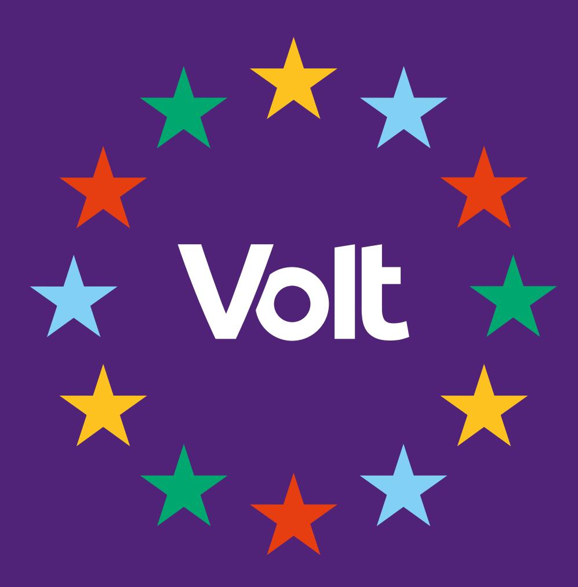

{0}------------------------------------------------

# *UNSERE VISION FÜR BRAUNSCHWEIG*

{1}------------------------------------------------

# Inhaltsverzeichnis

#### Vorwort

|                         | Europäisch denken, lokal handeln                      | – gemeinsam Braunschweig gestalten ..................... 4                                                                |
|-------------------------|-------------------------------------------------------|---------------------------------------------------------------------------------------------------------------------------|
|                         | 1. Bürger*innenbeteiligung –                          | mitgestaltend & transparent ............................................. 5                                               |
|                         |                                                       | Bürger*innenbeteiligung in der Kommune......................................................................... 5         |
| 2. Bildung & Demokratie | –                                                     | aufgeklärt & demokratiestärkend .......................................... 6                                              |
| Demokratie erleben      | –                                                     | Mitbestimmung von Anfang an..................................................... 6                                        |
| Vernetzte Bildung       | –                                                     | Gemeinsam stark für alle................................................................... 7                             |
|                         | Unterstützung, die ankommt                            | – Sozialarbeit für jedes Kind 8                                                                                           |
|                         | Räume für die Zukunft schaffen                        | – modern, digital und nachhaltig 9                                                                                        |
|                         |                                                       | Flexible Bildungsangebote und vielfältige Lernorte schaffen........................................ 9                     |
| 3. Mobilität & Verkehr  | –                                                     | sicher, klimafreundlich & gerecht ............................................. 11                                        |
| Der ÖPNV -              |                                                       | das Rückgrat der Verkehrswende .................................................................12                        |
|                         | Braunschweig als europäische Fahrradstadt             | ....................................................................12                                                    |
|                         | Der Autoverkehr der Zukunft                           | ..............................................................................................14                          |
|                         | 4. Umwelt & Nachhaltige Stadtplanung                  | – lebenswert & zukunftssicher ....................... 15                                                                  |
| Schwammstadt            |                                                       | .......................................................................................................................16 |
| Energie –               |                                                       | sauber & lokal........................................................................................................18  |
|                         | Altersgerechte und barrierefreie Stadtplanung         | ..............................................................21                                                          |
|                         | 5. Wohnen, Soziales & Kultur                          | – vielfältig & gerecht .......................................................... 22                                      |
|                         | Inklusion, Integration und gesellschaftliche Teilhabe | – Lebensqualität für alle........23                                                                                       |

{2}------------------------------------------------

| Altersfreundliche Stadt                         | – Stadt zum wohlfühlen.............................................................24    |
|-------------------------------------------------|------------------------------------------------------------------------------------------|
| Kinder- und jugendfreundliche Stadt             | – Gemeinsam besser leben................................24                               |
| Obdachlosigkeit wirksam angehen                 | – Wohnen statt Verdrängung ...............................26                             |
| Förderung von Kultur und Ehrenamt               | .................................................................................27      |
| 6. Wirtschaft, Arbeit & regionale Wertschöpfung | – innovativ & zukunftsfähig ............ 29                                              |
| Zukunftsfähige Wirtschaft fördern               | ....................................................................................29   |
| Gute Arbeit und Fachkräfte sichern              | ...................................................................................30    |
| 7. Digitalisierung & IT                         | – offen, souverän & bürger*innennah .......................................... 31        |
| Stadt Braunschweig digitalisieren               | ......................................................................................32 |
| Digitale Souveränität stärken                   | – offen, souverän & bürger*innennah..........................33                          |
| 8. Sicherheit & Zusammenhalt                    | – präventiv, gemeinschaftlich & organisiert ................. 34                         |
| Sicherheit und Zusammenhalt stärken             | ..............................................................................34         |
| Lebenswertes Braunschweig für alle -            | sicher & krisenfest.............................................35                       |

{3}------------------------------------------------

# Vorwort Europäisch denken, lokal handeln – gemeinsam Braunschweig gestalten

Braunschweig steht vor der Aufgabe, seine Zukunft aktiv zu gestalten: sozial gerecht, ökologisch nachhaltig und digital souverän. Die Herausforderungen unserer Zeit – vom Klimawandel über den demografischen Wandel bis hin zur Digitalisierung – machen nicht an Stadtgrenzen halt. Deshalb braucht es eine Kommunalpolitik, die offen für neue Ideen ist, voneinander lernt und erfolgreiche Lösungen konsequent vor Ort umsetzt.

Unsere Stadt lebt von den Menschen, die hier wohnen, arbeiten, lernen und sich engagieren. Eine zukunftsfähige Politik entsteht nicht allein in politischen Gremien, sondern im Dialog mit der Stadtgesellschaft. Demokratie bedeutet für uns, Bürger\*innen nicht nur anzuhören, sondern sie aktiv an Entscheidungen zu beteiligen. Transparente Prozesse, echte Mitbestimmung und eine offene Verwaltung schaffen Vertrauen und stärken den gesellschaftlichen Zusammenhalt.

Dabei lohnt der Blick über Braunschweig hinaus. In ganz Europa zeigen Städte und Regionen, wie moderne Kommunen funktionieren können: mit bürgernaher Verwaltung, digitaler Souveränität, nachhaltiger Stadtentwicklung und neuen Formen der Beteiligung. Digitale Vorreiter wie Estland zeigen, wie Verwaltung einfach und nutzerorientiert gestaltet werden kann. Partizipative Modelle aus anderen europäischen Städten machen deutlich, wie Menschen stärker in politische Entscheidungen einbezogen werden können. Diese Erfahrungen zeigen: Gute Politik entsteht dort, wo man voneinander lernt und Lösungen an die eigenen lokalen Bedürfnisse anpasst.

Für Braunschweig bedeutet das, mutig neue Wege zu gehen. Wir wollen eine Stadt, die ihre Entscheidungen gemeinsam mit den Bürger\*innen trifft, digitale Chancen nutzt und gleichzeitig die Kontrolle über zentrale Infrastrukturen bewahrt. Offene Standards, Open-Source-Lösungen und eine moderne digitale Verwaltung helfen dabei, Abhängigkeiten zu verringern, Transparenz zu schaffen und öffentliche Dienstleistungen verlässlich weiterzuentwickeln.

Gleichzeitig gestalten wir Braunschweig als lebenswerte Stadt für alle Generationen. Dazu gehören bezahlbarer Wohnraum, gute Bildung, sichere und nachhaltige Mobilität, soziale Teilhabe, lebendige Kultur sowie der Schutz unserer natürlichen Lebensgrundlagen. Klimaschutz und soziale Gerechtigkeit gehören dabei zusammen: Eine nachhaltige Stadt muss allen Menschen zugutekommen und allen ermöglichen, ihre Lebenswelt aktiv mitzugestalten.

"Europäisch denken, lokal handeln" heißt für uns: Wir verbinden internationale Erfahrungen mit den konkreten Bedürfnissen unserer Stadt. Wir holen gute Ideen nach Braunschweig, entwickeln sie gemeinsam weiter und setzen sie pragmatisch um.

{4}------------------------------------------------

#### Bürger\*innenbeteiligung in der Kommune

Demokratie lebt vom Mitmachen. Städte und Gemeinden werden stärker, gerechter und lebenswerter, wenn die Menschen vor Ort ihre Ideen und Anliegen einbringen können. Darum beteiligen wir Bürger\*innen konsequent an kommunalen Entscheidungsprozessen. Für eine lebendige, offene und zukunftsgewandte Kommunalpolitik, die Bürger\*innen nicht nur anhört, sondern aktiv einbindet. Gemeinsam gestalten wir unsere Gemeinde so, wie wir darin leben wollen.

- Mehr Bürgerdialog und Transparenz schaffen: Wir werden politische Entscheidungen verständlich und nachvollziehbar gestalten. Deshalb führen wir regelmäßige Bürgerversammlungen, Stadtteilkonferenzen und digitale Bürgerdialoge ein.
- Beteiligungsräte einführen: Wir fördern dauerhaft institutionalisierte, zufällig ausgeloste Beteiligungsräte, die politische Empfehlungskompetenz haben und kommunale Entscheidungen ergänzen.
- Beteiligung unterrepräsentierter Gruppen: Wir führen Beteiligungsformate für Frauen ein, z. B. Bürger\*innenräte und gezielte Beteiligungsprozesse bei städtischen Projekten.

## 1. Bürger\*innenbeteiligung - mitgestaltend & transparent

Unsere Demokratie lebt davon, dass Menschen sich einbringen und ihre Perspektiven einbringen können. Gleichzeitig wächst der Wunsch vieler Bürger\*innen, nicht nur informiert zu werden, sondern aktiv an Entscheidungen mitzuwirken. Wir wollen deshalb die Beteiligung in unserer Kommune stärken: transparenter, verbindlicher und für alle zugänglich. Denn gute Kommunalpolitik entsteht im Austausch mit den Menschen, die in unserer Stadt leben.

Wir setzen auf eine lebendige Beteiligungskultur, in der Bürgerinnen frühzeitig einbezogen werden und unterschiedliche Erfahrungen und Bedürfnisse Berücksichtigung finden. Unser Ziel ist eine offene, inklusive und zukunftsgewandte Kommune, in der Mitbestimmung zum festen Bestandteil politischer Entscheidungen wird. Dafür schaffen wir neue Beteiligungsformate, stärken demokratische Orte und ermöglichen es allen Einwohnerinnen, ihre Ideen einzubringen und unsere Gemeinde gemeinsam mitzugestalten.

{5}------------------------------------------------

- Bürger\*innen über Projekte mitentscheiden lassen: Wir ermöglichen Bürger\*innenhaushalte und Bürger\*innenentscheide zu wichtigen Themen. Mit einem kommunalen Beteiligungsbudget und Online-Abstimmungen schaffen wir neue Wege, wie Einwohner\*innen Projekte für ihre Stadt oder ihr Viertel mitgestalten können. So entstehen Parks, Begegnungsorte und Kulturprojekte, bei denen die Bedarfe aller Bevölkerungsgruppen berücksichtigt werden können.
- Lebenslang mitbestimmen: Wir schaffen generationsübergreifende, inklusive und dauerhafte Partizipationsangebote anstelle einmaliger Projekte.
- Demokratiezentren stärken: Wir schaffen offene, zentrale Orte wie Beteiligungs- und Demokratiezentren, in denen Beteiligungsräte, Initiativen, Dialogformate und Begegnung zusammenfinden. Diese werden durch hybride oder digitale Beteiligungsformate ergänzt.
- Kommunale Demokratieinfrastruktur erweitern: Schulen, Stadtteilzentren, Bibliotheken und Demokratieräume werden vernetzt, um Beteiligung wohnortnah und niedrigschwellig erlebbar zu machen.

- Altersgerechte Mitbestimmung stärken: Wir stärken Mitgestaltungsrechte durch Klassen- und Schülersprecher\*innen, Kinderkonferenzen und die Beteiligung an Ganztagsangeboten, Pausenräumen und Speiseplänen in Schulen.
- Kinder- und Jugendparlamente fördern: Wir stärken Kinder- und Jugendparlamente als gewählte kommunale Gremien. Diese erhalten verbindliche beratende Sitze in kommunalen Ausschüssen. Weiterhin unterstützen wir die Arbeit der Gremien mit personellen und finanziellen Mitteln.

# 2. Bildung & Demokratie – aufgeklärt & demokratiestärkend

Demokratie erleben - Mitbestimmung von Anfang an

Demokratie entsteht dort, wo Beteiligung real, verbindlich und wirksam ist. Schule und Kommune sind zentrale Lern- und Erfahrungsräume für Mitbestimmung. Wenn Kinder und Jugendliche ernsthaft einbezogen werden, entwickeln sie Verantwortung, Selbstwirksamkeit und Vertrauen in demokratische Prozesse. Unser Ansatz verbindet schulische Mitbestimmung, kommunale Jugendbeteiligung und gezielte Demokratieförderung zu einem gemeinsamen Beteiligungssystem.

{6}------------------------------------------------

- Schule und Kommune eng verzahnen: Wir setzen uns für Workshops, Rathausführungen und Ausschussbesuche für Jugendliche ein, um die Zusammenarbeit zwischen Schulen und Kommunen zu intensivieren.
- Kommunale Förderbudgets fördern: Die Budgets dienen der Demokratieförderung und sind fest im Haushalt verankert.
- Beteiligungsprojekte fördern: Wir fördern lokale Demokratieinitiativen und Kooperationen mit Schulen, Vereinen und Zivilgesellschaft. Fördermittel werden transparent und unter aktiver Mitwirkung junger Menschen vergeben.
- Gleichberechtigte Teilhabe: Wir führen Maßnahmen zur Verbesserung der Teilhabe von Frauen in allen kommunalen Gremien in Braunschweig ein, z. B. durch transparente Besetzungsverfahren und aktive Förderung von Kandidatinnen.
- Nachwuchsprogramme: Förderung und Ausbau von Nachwuchsprogrammen sowie Mentoring für Frauen in der Kommunalpolitik, z. B. durch lokale Mentoring-Netzwerke und Kooperationen mit Initiativen.

#### Vernetzte Bildung – Gemeinsam stark für alle

Eine zukunftsfähige Bildungspolitik braucht ein starkes Netzwerk statt einzelner Insellösungen. Kitas, Schulen, Hochschulen, Betriebe und öffentliche Stellen werden über eine zentrale Plattform vernetzt. Das schafft Transparenz, fördert Zusammenarbeit und ermöglicht echte Teilhabe. Ziel ist eine praxisnahe, demokratiefördernde Bildung, die offen für alle ist und regionale Besonderheiten berücksichtigt.

- Zentrale und regionale Bildungsplattform aufbauen: Wir bauen Bildungsplattformen zur Vernetzung von Kitas, Schulen, Hochschulen, Betrieben, Verwaltung, Vereinen und Bürger\*innen auf.
- Vernetzungsveranstaltungen durchführen: Regelmäßig werden öffentliche Veranstaltungen zu Bildungsthemen wie Schulausstattung, Kita-Ausbau, Ganztag, Digitalisierung und Inklusion durchgeführt.
- Austausch fördern: Zwischen Lehrkräften, pädagogischen Fachkräften und Bildungsträgern findet ein regelmäßiger Austausch statt, um Lernkonzepte weiterzuentwickeln. Die Stadt verbessert die Kommunikation, um eine stärkere Beteiligung zu ermöglichen.
- Vereinbarkeit fördern: Wir verbessern die Vereinbarkeit von Familie, Beruf und politischem Engagement, z. B. durch Kinderbetreuung während Sitzungen und angepasste Aufwandsentschädigungen. Wir etablieren flexible Sitzungszeiten und digitale Beteiligungsformate, z. B. durch hybride Ratssitzungen und digitale Zuschaltmöglichkeiten.
- Förderprogramme nutzen: Wir nutzen die Förderprogramme "Bildungskommune" und "Bildungsregion" für den Aufbau einer vernetzten kommunalen Bildungslandschaft.
- Zugang zu Bildungsangeboten transparent gestalten: Projekte, Fördermittel und bewährte Praxisbeispiele werden allen Beteiligten zur Verfügung gestellt.

{7}------------------------------------------------

- Möglichkeit schaffen: Alle Bürger\*innen sollen die Möglichkeit erhalten, sich aktiv einzubringen (z. B. bei Nachhilfe, Mentoring, Sprach- oder Musikangeboten, Vereinsarbeit).
- Bildung & Verwaltungskompetenz: Wir setzen auf Diversity-Schulungen für Verwaltung, Schulen sowie Jugend- und Sozialarbeit, um Sensibilität und Handlungskompetenz zu fördern. Die queerfreundliche Jugendarbeit wird ausgebaut, LSBTIQ\*- und FLINTA\*-Gruppen erhalten aktive Unterstützung. Mit dem Programm "Queerfreundliche Schule Braunschweig" sollen Fortbildungen für Lehrkräfte, Anti-Mobbing-Maßnahmen und Kooperationen zwischen Schulen, Vereinen und Beratungsstellen umgesetzt werden.

#### Unterstützung, die ankommt – Sozialarbeit für jedes Kind

Gute Bildung braucht verlässliche Begleitung, frühzeitige Förderung und Unterstützung in allen Bereichen des Systems. Deshalb stärken wir die Schulsozialarbeit, nutzen die Expertise gemeinnütziger Organisationen und begleiten Bildungsbiografien kontinuierlich. Unser Ziel ist, dass kein Kind verloren geht; unabhängig von Herkunft, Wohnort oder sozialer Lage.

- Sozialpädagogische Betreuung gewährleisten: Jede Schule muss unabhängig von Schulart oder Größe mindestens eine\*n Schulsozialarbeiter\*in haben. Wir fördern den Ausbau von weiteren Vollzeitstellen.
- Betreuungsschlüssel einführen: Ein\*e Schulsozialarbeiter\*in soll für maximal 150 Schüler\*innen zuständig sein. Damit folgen wir einer Empfehlung der "Gewerkschaft Erziehung und Wissenschaft" (GEW).
- Sozialpädagogische Begleitung ausweiten: Die sozialpädagogische Begleitung wird auf Kitas ausgeweitet, um frühzeitig zu unterstützen und Familien zu entlasten.
- Fachkräfte gezielt anwerben: Wir werben gezielt Fachkräfte mit Fremdsprachenkenntnissen an. Dadurch verbessern wir die Kommunikation mit Eltern und die Integration.
- Qualifizierte Ehrenamtliche einbinden: Insbesondere soll dies in der Elternarbeit und interkulturellen Vermittlung geschehen.
- Gemeinnützige Organisationen einbinden: Die systematische Einbindung dieser Organisationen bringt erprobte, evidenzbasierte Bildungs-, Förder- und Präventionsprogramme mit ein.
- Zentrale kommunalen Anlaufstelle aufbauen: Diese Anlaufstelle im Bildungsmanagement vernetzt Kitas, Schulen und gemeinnützige Träger.
- Externe Programme nutzen: Diese ergänzen das Bildungsangebot ohne zusätzliche kommunale Kosten.
- DSGVO-konforme digitale Lernendenakte einführen: Diese begleitet die gesamte Bildungsbiografie ab der Kita und gewährleistet nahtlose Übergänge zwischen Bildungseinrichtungen, ohne dass Informationen verloren gehen. Ab einem Alter von 16 Jahren kann die Lernendenakte selbstbestimmt genutzt werden, z. B. für Bewerbungen und Bildungswege.

{8}------------------------------------------------

- Förderbedarfe frühzeitig erkennen: Zu diesem Zweck soll die Zusammenarbeit von Lehrkräften, Schulsozialarbeit, Schulpsychologie und weiteren Fachstellen verbessert werden.

#### Räume für die Zukunft schaffen – modern, digital und nachhaltig

Gute Bildung braucht Räume, die Lernen, Begegnung und Selbstständigkeit fördern. In Niedersachsen stehen viele Schulgebäude vor einem Sanierungsstau, Schulwege sind oft unsicher und die digitale Infrastruktur ist uneinheitlich. Gleichzeitig entscheiden Erreichbarkeit, Mobilität und soziale Infrastruktur darüber, ob Bildung für alle wirklich zugänglich ist. Wir setzen deshalb auf wohnortnahe Lernorte, sichere Wege, moderne Technik und offene Bildungsräume im Alltag.

- Wohnortnahe Bildungsorte aufbauen: Diese dienen als dezentrale Lern- und Begegnungsorte für die gesamte Gesellschaft.
- Schulgebäude sanieren: Wir sanieren konsequent die Schulgebäude. Zugleich werden bestehende Schulgebäude zu offenen Schulbaukonzepten weiterentwickelt.
- Flexible Lernräume schaffen: Projekt- und Gruppenräume, Lernlabore sowie multifunktionale Flächen sind hier die Hauptbestandteile.
- Temporäre Pop-up-Schulen einsetzen: Eine Reserve an Schulcontainern für schnelle und unbürokratische Maßnahmen bei Raumnot.
- Gemeinschaftsgärten aufbauen: Wir stellen kommunale Flächen bereit, um auf ihnen generationsübergreifende Lern- und Begegnungsorte in Form von Gärten einzurichten.
- Schul- und Kitaumfelder verkehrsberuhigt gestalten: Parkverbotszonen werden vor Schulen und Kitas eingerichtet.
- Kommunale IT-Infrastruktur aufbauen: Wir bauen eine zentral gesteuerte kommunale IT-Infrastruktur an Schulen auf. Hierbei kommen lokale Server für Ausfallsicherheit, Datenschutz und digitale Souveränität zum Einsatz.
- IT-Fähigkeiten in der Schülerschaft fördern: Wir bilden eine Arbeitsgruppe IT-Support. Dabei unterstützen Schüler\*innen unter Anleitung von Fachkräften den IT-Betrieb. Dadurch bauen sie ihre IT-Fähigkeiten auf.
- Förderanträge vorbereiten: Wir stellen zusätzliches Personal ein, das bei der Erstellung von Förderanträgen unterstützt. So können bestehende Landes-, Bundes- und EU-Förderungen, wie beispielsweise den DigitalPakt, vollständig genutzt werden.

#### Flexible Bildungsangebote und vielfältige Lernorte schaffen

Gute Bildung entsteht nicht durch mehr Unterricht, sondern durch sinnvolle Lernzeit. Der Ganztag ermöglicht Kindern und Jugendlichen, selbstständig zu lernen, soziale Erfahrungen zu machen und eigene Interessen zu entwickeln. Gleichzeitig endet Bildung nicht an der Klassenzimmertür. Externe Lernorte verbinden Wissen mit der Realität und machen das Lernen lebendig, relevant und demokratisch erfahrbar.

{9}------------------------------------------------

- Räume für selbstbestimmtes Lernen schaffen: Der Ganztag schafft Räume für selbstbestimmtes Lernen im eigenen Tempo. Dabei wird auf konventionellen Unterricht im Ganztag an Grund- und weiterführenden Schulen verzichtet.
- Projekt-, problemorientierte und fächerübergreifende Lernformate fördern: Projektarbeit schafft ein Lernklima ohne Noten- und Leistungsdruck. Zusätzlich gibt es bei Bedarf individuelle Lernförderung und Zeit für Spiele, soziale Begegnungen und Freundschaften.
- Kooperationen mit externen Partnern vorantreiben: Systematisch binden wir externe Lernorte in den Bildungsalltag ein. Außerdem fördern wir Kooperationen mit lokalen Betrieben, Vereinen, Initiativen sowie kulturellen und zivilgesellschaftlichen Einrichtungen.
- Tiny Forests errichten: Tiny Forests verbinden Stadtbegrünung mit Umweltbildung und gesellschaftlicher Beteiligung. Kinder, Schulen und freiwillig Engagierte können bei der Pflanzung und Pflege mitwirken und dabei praxisnah ökologische Zusammenhänge kennenlernen. Als grüne Klassenzimmer und offene Lernorte ermöglichen sie Bildung für nachhaltige Entwicklung direkt im Stadtteil. Gleichzeitig können Bürgerinnen und Bürger im Sinne von Citizen Science die Entwicklung des Miniwaldes dokumentieren und so aktiv zum Verständnis urbaner Ökosysteme beitragen.

{10}------------------------------------------------

#### Sichere Straßen für ein entspanntes Zufußgehen

Wir stellen den Fußverkehr in den Mittelpunkt unserer Innenstadt und unserer Wohnquartiere. Dafür verbessern wir Wege und Plätze und verringern die Gefahren, die der Durchgangsverkehr und parkende Autos gerade für Kinder und mobilitätseingeschränkte Personen darstellen.

- Ein hochwertiges Fußverkehrsnetz entwickeln: Pontevedra in Spanien zeigt, wie mit breiten Gehwegen, barrierefreien Querungen und einem Wegweisungssystem das Zufußgehen zur neuen Normalität mit hoher Aufenthaltsqualität wird.
- Quartiere ohne Durchgangsverkehr: Wir wollen quartiersfremden Autoverkehr um Wohnstraßen herumführen statt mitten hindurch. In Barcelona entsteht innerhalb solcher Superblocks Platz für Gehwege, Bäume und Spielplätze. Wir unterstützen Schulstraßen, setzen uns für Pilotprojekte wie Sommerstraßen ein und fordern Konzepte zur Verkehrsberuhigung für jeden Stadtteil.
- Quartiersgaragen einrichten: Parkplätze in Wohngebieten konzentrieren wir platzsparend nach dem Vorbild von Zürich. Dazu werden auch in Bestandsquartieren Quartiersgaragen gebaut, die von der Stadt Braunschweig betrieben werden.
- Parkplätze fair verteilen: Wo Parkplätze auf der Straße erforderlich sind, soll die Stadtverwaltung bis zu 50 % für Anwohnende reservieren. Innerhalb der Kernstadt soll Parken grundsätzlich kostenpflichtig sein. Die Einnahmen sollen dem Betrieb der Quartiersgaragen oder dem ÖPNV zugutekommen.

# 3. Mobilität & Verkehr – sicher, klimafreundlich & gerecht

Unsere Mobilität verändert sich. Einerseits werden Autos immer größer und damit gefährlicher. Andererseits nutzen wir Braunschweiger\*innen immer öfter umweltfreundliche Verkehrsmittel. Wir wollen den Straßenraum neu aufteilen: weniger Platz für Autos, mehr für Fußgänger\*innen, Radfahrer und den ÖPNV. Das schafft sichere Straßen für alle. Unser Ziel ist die Vision Zero: keine Verkehrstoten und Schwerverletzten in Braunschweig.

Wir unterstützen entschlossen die Verkehrswende, denn ohne sie droht Braunschweig sein erklärtes Ziel, bis 2030 klimaneutral zu werden, zu verfehlen. Die Stadtverwaltung soll daher den bestehenden Mobilitätsentwicklungsplan konsequent umsetzen und, wo nötig, nachschärfen. Unser Ziel ist die 15-Minuten-Stadt: Alle wichtigen Orte in Braunschweig wie Wohnung, Arbeitsplatz, Einkaufsmöglichkeiten und medizinische Einrichtungen sollen innerhalb von 15 Minuten zu Fuß oder mit dem Rad erreichbar sein. Dafür soll die Stadtverwaltung über Abteilungsgrenzen hinweg enger zusammenarbeiten.

{11}------------------------------------------------

- Attraktive Stellplätze am Stadtrand schaffen: Damit auswärtige Besucher\*innen mit dem ÖPNV oder einem Leihrad in die Innenstadt fahren, verbessern wir das bestehende Park-and-Ride-Angebot.

#### Der ÖPNV – das Rückgrat der Verkehrswende

Im Mittelpunkt einer klimagerechten, für alle verfügbaren Mobilität stehen für uns verlässliche, erreichbare und bezahlbare öffentliche Verkehrsmittel. Mit einer starken Straßenbahn und Bussen als Ergänzung verbessern wir die Anbindung aller Stadtteile und machen den ÖPNV zuverlässiger - intelligent verknüpft mit Sharing-Diensten und der Regionalbahn.

- Den Verkehr auf den ÖPNV ausrichten: Nach dem Vorbild Zürichs geben wir Bus und Bahn, wo immer möglich, eigene Fahrspuren und bevorzugen sie an Ampeln. Wer Bus und Bahn fährt, soll nicht im Stau stehen.
- Öffentlichen Nahverkehr stabilisieren und ausweiten: Wir bekennen uns klar zu allen Teilprojekten des Straßenbahnausbaus "Stadt.Bahn.Plus". Die Stadtverwaltung soll die Planungen beschleunigen, umsetzen bzw. die Planungen der ruhenden Projekte wieder aufnehmen.
- Geschlechtersensible Linien- und Taktplanung: Der ÖPNV soll nicht nur das Pendeln, sondern auch nahräumliche Wegeketten ermöglichen (z.B. Arbeit – Kita – Einkaufen – Wohnung). Tangentiale Buslinien und ein dichter Takt außerhalb der Stoßzeiten ermöglichen es, Sorgearbeit ohne Auto und ohne großen Zeitverlust zu erledigen.
- Individualverkehr und ÖPNV besser verzahnen: An jeder Haltestelle sollen die Braunschweiger\*innen auf ihr Fahrrad, ein Leihrad, einen E-Scooter oder ein Leihauto umsteigen können. Eine gemeinsame App soll wie in Berlin alle Anbieter des Verbunds umweltfreundlicher Verkehrsmittel integrieren.
- Vernetzung mit dem Umland stärken: Wir finanzieren den Regionalverband wieder aus und nehmen die Einschränkungen im Angebot der Regiobusse zurück. Wir unterstützen die Reaktivierung der Bahnstrecke nach Harvesse und die Reaktivierung zusätzlicher Bahnhaltepunkte in Braunschweig samt Taktverdichtung ("S-Bahn Braunschweig").
- Ermäßigte Fahrkarten für Schüler\*innen, Azubis und Senior\*innen: Solange das Land Niedersachsen kein entsprechendes Ticket einführt, sichern wir die Finanzierung des Braunschweiger Schüler\*innen-Tickets, auch für Auszubildende, Studierende, Praktikant\*innen, Freiwilligendienstleistende und Senior\*innen.

#### Braunschweig als europäische Fahrradstadt

Flach, viel Grün entlang der Oker und theoretisch viel Platz auf breiten Straßen: Braunschweig hat großes Potenzial, um eine echte Fahrradstadt zu werden. Doch in der Realität hält der Ausbau der Infrastruktur nicht mit dem Anstieg der Radfahrenden mit. Je mehr von ihnen sich den wenigen Platz teilen, desto größer

{12}------------------------------------------------

wird das Unfallrisiko. Wir finden: Radfahren darf in Braunschweig keine Frage der Risikobereitschaft sein.

- Radfahren sicher machen: Wir achten auf die Umsetzung des vom Rat beschlossenen "Ziele- und Maßnahmenkatalogs Radverkehr", z. B. auf die Rotmarkierung von Kreuzungsfurten und die Verbreiterung der Radwege.
- Radverkehr und motorisierten Individualverkehr trennen: Eine konsequente Trennung senkt die Kollisionsgefahr am effektivsten. Wir sanieren die bestehenden maroden Radwege und weisen zusätzliche Fahrradstraßen aus – natürlich frei von Durchgangsverkehr.
- Radfahren als ganzjährige Alternative: Wir bauen den Winterdienst auf Radwegen aus und orientieren uns dabei z. B. an Oulu in Finnland. Dort werden Geh- und Radwege als Erstes geräumt. Über eine App bewerten die Bürger\*innen, ob ihre Straßen passierbar waren und der Winterdienst ordnungsgemäß durchgeführt wurde.
- Genauso schnell wie mit dem Auto: Weitere Velorouten in alle Himmelsrichtungen und Radschnellwege in die Nachbarkommunen machen das Pendeln mit dem Rad möglich. Wir treiben die Planungen voran und sorgen dafür, dass sie so konkurrenzfähig wie in Göttingen gestaltet werden.
- Sicher parken: Wir bauen flächendeckend wetterfeste Fahrradstellplätze, auch abschließbare und – wo sinnvoll – mit Gepäckaufbewahrung. Wir setzen uns nach Utrechter Vorbild für eine zeitgemäße Zahl an Abstellflächen in Neubaugebieten ein.

#### Lieferverkehr verträglich gestalten

Die Leitbilder der 15-Minuten-Stadt und der Vision Zero, aber auch unser verändertes Konsumverhalten, zwingen die Stadt Braunschweig, ihren Lieferverkehr neu zu denken. Wir müssen den steigenden Lieferverkehr in Wohngebieten dringend regulieren.

- Lieferzonenmanagement: In jeder Straße wollen wir bedarfsgerecht Stellplätze für Lieferfahrzeuge einrichten.
- Ausbau von Paketschränken: Flexible Lieferungen sind eine Erleichterung für Lieferant\*innen und Kund\*innen.
- Radinfrastruktur auf Lastenräder auslegen: Gegenüber der Auslieferung auf der Fahrbahn soll es attraktiver werden, Waren mit dem Rad auszuliefern.
- Einrichtung von Mikrodepots: In solchen Kleinverteilerzentren am Rand der Innenstadt werden Waren auf kleinere, möglichst umweltfreundlichere Fahrzeuge umgeladen. Die Zufahrt für große Lkw in die Innenstadt kann dadurch auf das notwendige Minimum begrenzt werden.

Viele dieser Maßnahmen hat bereits 2021 eine Beratungsfirma der Stadtverwaltung empfohlen. Wir setzen uns dafür ein, dass sie endlich umgesetzt werden.

{13}------------------------------------------------

#### Der Autoverkehr der Zukunft

Eine attraktiv gestaltete Verkehrswende wird viele Menschen dazu bewegen, ihr Auto weniger zu nutzen oder ganz abzuschaffen. Für andere wird es weiterhin eine Rolle spielen. Wer aber vorausschauend auf ein E-Auto umsteigt, dem fehlen in Braunschweig oft die nötigen Lademöglichkeiten, insbesondere in der Nähe von Mietwohnungen.

- Motorisierten Individualverkehr bündeln statt Durchgangsverkehr: Wir machen Braunschweig innerhalb des Wilhelminischen Rings autoarm. In der Innenstadt von Gent wird schon heute Kfz-Durchgangsverkehr baulich unterbunden. Weil der Kfz-Verkehr zunächst auf eine Ringstraße geleitet wird, sind dort die meisten Ziele mit klimafreundlichen Verkehrsmitteln schneller erreichbar.
- "Tempo 30" ausweiten: Ausgedehnte Tempo-30-Zonen haben Helsinki geholfen, null Verkehrstote zu verzeichnen. Münster und andere Städte zeigen, dass auch hierzulande "Tempo 30" zum Standard in Innenstädten und Wohngebieten werden kann.
- E-Mobilität ausbauen: Wir fördern den weiteren Ausbau der Ladeinfrastruktur für Elektrofahrzeuge. Neben Ladepunkten am Straßenrand elektrifizieren wir vor allem die städtischen Parkhäuser und künftigen Quartiersgaragen, ausgehend vom Bedarf der kommenden Jahrzehnte.
- Lokale Batteriespeicher aufbauen: E-Autos können Lastspitzen abfangen und das Stromnetz stabilisieren. Wir unterstützen Vehicle-to-Grid (V2G) mit finanziellen und baurechtlichen Anreizen sowie im Rahmen der Elektrifizierung des städtischen Fahrzeugparks.
- Carsharing-Angebote stärken: Wir schaffen attraktive Rahmenbedingungen für Anbieter von Carsharing, z. B. indem Carsharing-Kund\*innen keine Parkgebühren zahlen.

{14}------------------------------------------------

#### Versiegelung verringern

In Niedersachsen wird durch die Bebauung mit Straßen und Gebäuden pro Tag eine Fläche von 4,9 Hektar versiegelt. Diese Fläche kann dann unwiderruflich weder CO₂ mehr speichern noch Wasser aufnehmen.

- Versiegelung begrenzen: Flächen müssen als CO₂- und Wasserspeicher erhalten bleiben.
- Natürliche Gewässer wiederherstellen: Flussläufe, Auenlandschaften und Moore können bei Hochwasser große Wassermengen zurückhalten und damit Schäden in bebauten Gebieten vermeiden. Des Weiteren bieten sie verschiedenen Tier- und Pflanzenarten einen geschützten Lebensraum.
- Brachliegende Flächen begrünen: Vor allem in Innenstädten sollen Flächen begrünt werden, um Städte im Sommer zu kühlen. Zusätzlich dienen diese Flächen als eine Art Schwamm bei Starkregen.
- Parks und Grünflächen erhalten: Diese dienen als Naherholungsgebiete für die Bevölkerung.
- Bestehende Potenziale ausschöpfen: Die vorhandene Bausubstanz soll als Wohnraum oder für Gewerbe nachgenutzt werden.

# 4. Umwelt & Nachhaltige Stadtplanung – lebenswert & zukunftssicher

Unsere Umwelt verändert sich. Der Klimawandel macht sich auch in Braunschweig immer deutlicher bemerkbar: Hitzewellen werden häufiger, Starkregen intensiver und wertvolle Grünflächen verschwinden durch zunehmende Versiegelung. Gleichzeitig wächst das Bewusstsein dafür, dass lebenswerte Städte widerstandsfähig, nachhaltig und naturnah gestaltet werden müssen. Wir wollen Braunschweig klimaresilient und zukunftssicher machen – mit mehr Grün, einer sicheren Wasserversorgung, einer nachhaltigen Energieversorgung und einer Stadtplanung, die Mensch und Natur gleichermaßen in den Mittelpunkt stellt.

Wir setzen uns entschlossen für eine nachhaltige Stadtentwicklung ein, denn Umwelt- und Klimaschutz sind die Grundlage für Lebensqualität, Gesundheit und Wohlstand. Unser Ziel ist die klimaresiliente Schwammstadt: eine Stadt, die Wasser speichert statt ableitet, Hitze wirksam reduziert, natürliche Lebensräume schützt und Ressourcen verantwortungsvoll nutzt. So schaffen wir ein Braunschweig, das auch für kommende Generationen lebenswert, widerstandsfähig und zukunftssicher bleibt.

{15}------------------------------------------------

#### Trinkwasserversorgung gewährleisten

Die Versorgung mit Trinkwasser steht vor großen Herausforderungen. Dazu gehören Verschmutzungen durch Pestizide und Düngemittel, sinkende Grundwasserspiegel sowie steigende Temperaturen. Es ist notwendig, dass sauberes Wasser auch weiterhin für alle Verbraucher\*innen zur Verfügung steht.

- Die Wasserversorgung gewährleisten: Die Wasserversorgung zählt zur öffentlichen Daseinsvorsorge, da sie in der Regel ein natürliches Monopol darstellt. Die Bevölkerung soll über die Politik Einfluss auf die Gestaltung der Wasserversorgung nehmen können. Öffentliche Betriebe streben nach Kostendeckung, nicht nach Gewinnmaximierung.
- Soziale Härten verhindern: Jeder Mensch hat Anspruch auf Wasserversorgung. Wir setzen uns dafür ein, dass bis zu einer gewissen Grundmenge vergünstigte Wassergebühren pro Person eingeführt werden.
- Verursacherprinzip konsequent anwenden: Personen und Unternehmen sollen für von ihnen verursachte Verunreinigungen einen finanziellen Ausgleich zahlen.
- Intelligente Bewässerungssysteme fördern: Wir fördern Investitionen in der Landwirtschaft sowie Wassersparmaßnahmen für Privatkund\*innen und die Industrie. Dadurch lässt sich der Wasserbedarf senken und die Wasservorräte schonen.

#### Schwammstadt

Der natürliche Wasserkreislauf ist gestört. Im Zuge des Klimawandels werden Niederschlags- und Trockenheitsereignisse extremer. Städte und urbane Räume sind wegen des hohen Versiegelungsgrades in besonderer Weise betroffen. Große Niederschlagsmengen müssen zukünftig aufgefangen werden, um Wasser für trockene Perioden zu speichern und Flutereignisse abzuschwächen. Wir wollen deshalb das Konzept der Schwammstadt umsetzen.

- Städtebauliche Planungen prüfen: Bei allen Bauvorhaben wird geprüft, inwiefern diese mit dem Schwammstadtkonzept kompatibel sind und das städtische Mikroklima fördern.
- Wasserdurchlässigen Straßenbelag einsetzen: Hierdurch wird die Versickerung von Regenwasser gewährleistet. Je nach Bedarf und Einsatzort kommen beispielsweise Pflastersteine, Rasengitter oder Schotterrasen zum Einsatz.
- Leitungsgräben nutzen: Dadurch wird Regenwasser gespeichert, um Grünflächen und Stadtbäume zu bewässern.
- Flächen entsiegeln: Wasser im Boden sollte auch in Zentrumsnähe gespeichert werden können. Dazu sollen konkrete Konzepte für ausgewiesene versiegelte Plätze erarbeitet werden. Potenziale für eine zentrumsnahe Teilentsiegelung sind der Schlossplatz, der Friedrich-Wilhelm-Platz und der Kohlmarkt.

{16}------------------------------------------------

- Gebäudedächer und Fassaden begrünen: Begrünte Flächen wirken kühlend auf das Stadtklima. Zugleich speichern sie Regenwasser.
- Regenwasser als Ressource betrachten: Regenwasser soll vor Ort gesammelt und für geeignete Maßnahmen genutzt werden.
- Informationsarbeit und Kampagnen durchführen: Das Konzept der Schwammstadt muss in der Bevölkerung bekannter gemacht werden. Durch Informationskampagnen klären wir die Bevölkerung über die Maßnahmen auf.
- "Braunschweiger Entsiegelungs-Bonus" einführen: Wer Schottergärten oder versiegelte Einfahrten in Blühflächen oder Sickerpflaster umwandelt, erhält einen direkten Zuschuss.
- Niederschlagswassergebühr senken: Haushalte, die nachweislich Regenwasser in Zisternen sammeln oder auf dem eigenen Grundstück versickern lassen, sollen eine reduzierte Niederschlagswassergebühr zahlen.
- Versickerungskonzepte für Straßenbäume: Jede Grundsanierung einer Straße
  - (z. B. am Ring oder in den Quartieren) muss zwingend ein Versickerungskonzept enthalten, um das Stadtklima aktiv zu kühlen.

#### Nachverdichtung

Da neue Flächen knapp sind und Versiegelung vermieden werden soll, sind kluge Konzepte wie die Nachverdichtung bestehender Quartiere notwendig. Unser Ziel ist es, mehr Wohnraum zu schaffen, ohne Lebensqualität einzubüßen. Notwendig ist hierbei eine ökologische, gerechte und nachhaltige Stadtgestaltung. Dabei nehmen wir die Sorgen der Anwohnenden ernst und setzen auf Transparenz, Beteiligung und gemeinsames Gestalten. Auf diese Weise entsteht eine Stadt, die zusammenwächst und niemanden zurücklässt.

- Nachverdichtung bevorzugen: Vor allem soll diese Vorrang vor Neubauten haben, da dadurch keine neuen, unbebauten Flächen versiegelt werden.
- Bestandssanierungen priorisieren: Statt Abriss und Neubau soll vorzugsweise im Bestand saniert werden, um Ressourcen wie Beton, Stahl und Glas zu sparen.
- Bestehende Wohngebäude aufstocken: Um Wohnraum zu schaffen, ohne neue Flächen versiegeln zu müssen, sollen bevorzugt Aufstockungen auf bestehenden Wohngebäuden vorgenommen werden. Außerdem wird bereits vorhandene Infrastruktur wie Versorgungsleitungen genutzt.
- Innenstädte entwickeln: Wir konzentrieren uns auf die Weiterentwicklung des Bestehenden, statt auf der "grünen" Wiese zu bauen. So werden Wege kurzgehalten und der soziale Austausch der Menschen vor Ort gestärkt. Dies stellt eine effektive Maßnahme gegen die Verödung von Innenstädten dar.

#### Hitzeplanung

Der Klimawandel führt auch in Braunschweig zu immer häufigeren und intensiveren Hitzewellen, die eine zunehmende Gefahr für die Gesundheit der Bevölkerung

{17}------------------------------------------------

darstellen. Hiervon sind besonders ältere, kranke und sozial benachteiligte Menschen betroffen. Hitzebedingte Todesfälle nehmen zu und die kommunale Infrastruktur, wie Rettungsdienste sowie Pflege- und Gesundheitseinrichtungen, wird zusätzlich belastet. Um diesen Herausforderungen wirksam zu begegnen, ist ein Hitzeschutzplan als Teil der kommunalen Daseinsvorsorge unverzichtbar.

- Klimaanpassungen als gemeinschaftliche Aufgabe betrachten: Schon bei der Planung und Umgestaltung bebauten Flächen sollen Hitzeschutzaspekte in die Bebauungspläne einfließen.
- Hitzekarten optimieren: Das Projekt "Co-Adapted Braunschweig" weiter ausbauen und fördern. Es werden in Live-Karten digitale Messdaten zur Verfügung gestellt, auf denen Hitzenester identifiziert werden. Hier können sich betroffene Personen frühzeitig im Falle nahender Hitzewellen informieren und Maßnahmen ergreifen.
- Gebäude begrünen: Durch die Wasserverdunstung der Pflanzen werden begrünte Gebäude im Sommer gekühlt und der Straßenlärm für die Bewohnenden gemindert. Außerdem werden durch ihre filternden Eigenschaften Schadstoffe gebunden.
- Kühlzentren errichten: Installation von mobilen Wassergärten und Nebelstelen in den Sommermonaten auf versiegelten Plätzen, solange bauliche Veränderungen noch andauern. Diese öffentlichen, klimatisierten Räume sollen vor allem älteren, gesundheitlich angeschlagenen Menschen, Kindern sowie obdachlosen Menschen die Möglichkeit geben, der Sommerhitze zu entfliehen und damit das Gesundheitssystem zu entlasten.
- Pocket-Parks fördern: Sie verwandeln kleine, bisher ungenutzte oder wenig wahrgenommene Flächen in der Stadt in öffentlich zugängliche grüne Mini-Parks. Sie kühlen aufgeheizte Innenstädte, verbessern das Stadtklima und schaffen neue Orte für Begegnung und Erholung. Erfolgreiche Beispiele aus Paris, London, Barcelona und Kopenhagen zeigen, wie solche Projekte schnell die Lebensqualität erhöhen können.

#### Energie – sauber & lokal

Die Energiewende findet auch in Braunschweig statt. Sie ist dezentral, erneuerbar und sozial gerecht zu gestalten. Durch die lokale Produktion, Nutzung und Speicherung können die Anwohnenden von erneuerbaren Energien profitieren. Damit können regionale Wertschöpfung und soziale Teilhabe verknüpft werden. Wir streben eine vollständig erneuerbare Energieversorgung an, die das Klima und die Menschen schützt und unsere Kommune widerstandsfähig macht.

- Wind- und Solarflächen ausweisen: Dies ermöglicht den Ausbau weiterer erneuerbarer Energien. Hiervon profitiert die Allgemeinheit in erheblichem Maße.

{18}------------------------------------------------

- Erneuerbare Wärme nutzen: Dafür wird eine kommunale Wärmeplanung erarbeitet, die vorhandene sowie notwendige neue Infrastruktur (z. B. Biogas, Abwärme, Geothermie, Wärmepumpen, BHKW etc.) berücksichtigt.
- Energetische Sanierungen fördern: Unternehmen und private Haushalte werden bei Sanierungen unterstützt. So stärken wir die Energieeffizienz.
- Energienetze und Infrastruktur modernisieren: Die lokalen Netze werden digitalisiert und an die neuen Anforderungen der Energiewende angepasst.
- Beratung und Informationskampagnen durchführen: Diese unterstützen Bürger\*innen bei der Umstellung ihrer Energiesysteme.
- Flächen für Photovoltaik nutzen: Bereits versiegelte Flächen sollen für PV-Anlagen genutzt werden. Dafür kommen Dächer, z. B. auf öffentlichen Liegenschaften, sowie die Überdachung von Parkplätzen infrage.
- Solar-Kraftwerk Braunschweig: Schnellstmögliche Belegung aller geeigneten städtischen Dächer (Schulen, Kitas, Verwaltung) und Parkplätze mit Photovoltaik. Wir begreifen unsere öffentlichen Dächer und Parkplätze als Gemeinschaftsprojekt. Der Prozess sieht vor, dass wir neben städtischen Investitionen auch Bürgerenergiegenossenschaften den Vortritt lassen. So wird die Modernisierung der Schulen und Kitas zu einem Mitmachprozess, bei dem die Braunschweiger\*innen direkt in die lokale Energiewende investieren und davon profitieren können.
- Klima-Veto im Rat: Jede Vorlage für den Stadtrat muss eine Berechnung der CO₂-Auswirkungen enthalten. Projekte, die das 1,5-Grad-Ziel gefährden, müssen automatisch ein fachliches Vetoverfahren durchlaufen.
- Klima-Sanierungsfonds: Einrichtung eines städtischen Fonds, der Mieter\*innen unterstützt, wenn Modernisierungsumlagen nach energetischen Sanierungen die Warmmiete um mehr als 10 % steigen lassen.
- Beratung und Unterstützung: Aufbau eines städtischen Beratungsteams, das Hausbesitzerinnen und Vermieter\*innen beim Heizungstausch proaktiv begleitet.
- Verbindliche Fernwärmeanschlüsse: Verbindliche Terminzusagen für den Anschluss an das Fernwärmenetz bis spätestens 2027 für alle beschlossenen Gebiete, um Planungssicherheit für Eigentümer\*innen zu schaffen.

{19}------------------------------------------------

#### Abfallmanagement & Kreislaufwirtschaft

Wir bevorzugen Kreislaufwirtschaft statt Wegwerfgesellschaft. Das Abfallmanagement wollen wir neu denken: progressiv, transparent und nachhaltig. Der Erhalt unserer natürlichen Lebensgrundlagen erfordert einen radikalen Kurswechsel in der Abfallpolitik. Wir setzen auf eine intelligente Kreislaufwirtschaft, die Ressourcen schont, soziale Gerechtigkeit fördert und Abfall vermeidet.

- Ressourcen schonen: Durch konsequente Abfallvermeidung und Recycling verringern wir den Ressourcenverbrauch.
- Eine Müllvermeidungsstrategie entwickeln: Wir erarbeiten eine umfassende kommunale Müllvermeidungsstrategie, um unsere Stadt zur Vorreiterin im Umweltschutz zu machen, und integrieren diese in das kommende Abfallwirtschaftskonzept der Stadt Braunschweig.
- Mehrweg bevorzugen: Bei öffentlichen Veranstaltungen sollen Mehrweg- statt Einwegverpackungen verpflichtend genutzt werden. Außerdem unterstützen wir die lokale Gastronomie bei der Umstellung auf standardisierte Mehrwegsysteme.
- Kreislaufwirtschaft fördern: Volt unterstützt lokale Reparaturinitiativen und Tauschbörsen für Gebrauchsgegenstände, um die Lebensdauer von Produkten zu verlängern. Die Wiederverwendung soll zum Standard werden.
- Pfandsammlung erleichtern: Durch die Installation von Flaschenablagen an öffentlichen Mülleimern erleichtern wir die Sammlung von Pfandflaschen im öffentlichen Raum. Dies schützt die Würde der Sammelnden und verhindert, dass wertvolle Rohstoffe im Restmüll landen.
- Bioabfalloffensive durchführen: Bioabfall ist viel zu wertvoll für die Tonne. Wir investieren in moderne Vergärungsanlagen, um organische Abfälle in hochwertigem Kompost und grüne Energie umzuwandeln.
- Müllverbrennung abbauen: Recycling steht bei uns vor der Verbrennung. Unser Ziel ist es, langfristig die Müllverbrennung abzubauen und der stofflichen Trennung den Vorrang zu geben.
- Informationskampagnen unterstützen: In Schulen und Kitas unterstützen wir Informationskampagnen, um schon früh ein Bewusstsein für den Wert von Ressourcen zu fördern.
- Beschaffungswesen stärken: Die Stadt Braunschweig geht mit gutem Beispiel voran, indem sie bei der Beschaffung von Produkten und Dienstleistungen verstärkt auf recycelte, reparierbare und langlebige Produkte setzt.
- Bürgerbeteiligung fördern: Durch verstärkte Dialoge mit den Bürger\*innen zum Thema Kreislaufwirtschaft fördern wir die Bürgerbeteiligung, um sie aktiv in die Gestaltung der "Zero-Waste"-Strategie einzubinden.

{20}------------------------------------------------

#### Altersgerechte und barrierefreie Stadtplanung

In einer alternden Gesellschaft entscheidet die Gestaltung unserer Städte darüber, ob Teilhabe, Selbstständigkeit und Würde bis ins hohe Alter oder mit Einschränkungen möglich bleiben. Barrierearme Wege, gut erreichbare Dienstleistungen und sichere öffentliche Räume kommen dabei nicht nur älteren und eingeschränkten Menschen zugute, sondern stärken den gesellschaftlichen Zusammenhalt insgesamt.

- Barrierefreiheit in allen Bauvorhaben einplanen: Beschlüsse sollen grundsätzlich auf ihre Auswirkungen auf die Barrierefreiheit geprüft werden, insbesondere bei öffentlichen Bauvorhaben sowie bei der Verkehrs- und Infrastrukturplanung.
- Den öffentlichen Raum barrierefrei gestalten: Wir setzen uns für taktile, akustische und visuelle Leitsysteme für Menschen mit Sehbeeinträchtigungen ein. Zusätzlich sollen Beschilderungen gut lesbar sein.
- Mobilität barrierearm gestalten: Mobilität muss durch sichere, gut ausgebaute Wege, zugängliche Haltestellen und einen öffentlichen Nahverkehr gewährleistet werden, der von allen Menschen selbstständig und barrierearm genutzt werden kann.
- Altersgerechten Wohnraum erweitern: Wir achten darauf, dass Bebauungspläne verstärkt altersgerechtes Wohnen berücksichtigen.
- Altersgerechtes Wohnen und lebendige Quartiere fördern: Die Förderung barrierefreier, bezahlbarer Wohnungen und von Mehrgenerationenhäusern ermöglicht mehr Menschen ein selbstbestimmtes Leben in den eigenen vier Wänden. Quartiersmanagements bündeln soziale, pflegerische und medizinische Angebote vor Ort und schaffen Begegnungsräume.
- Altersgerechte Gesundheits- und Daseinsvorsorge sichern: Pflege- und Gesundheitslots\*innen werden vor Ort unter Einbindung der öffentlichen Gesundheitsträger eingesetzt. Das stärkt die Versorgung im Alter.

#### Vielfältiger Lebensraum anstelle grüner Wüsten im Garten

Der größte Teil der nicht bebauten Flächen innerhalb geschlossener Ortschaften ist von privaten Gärten bedeckt. Dabei hat sich in den letzten Jahren der Trend durchgesetzt, alte Gehölze und vielfältige Blumenbeete zu entfernen und durch Beton und Rasen zu ersetzen. Wir zeigen, dass es auch anders geht und Mensch und Natur unbehelligt nebeneinander leben können.

- Natur im eigenen Garten oder Kleingarten wagen: Kostenfreie Schulungen für Bürger\*innen zeigen, wie man mit einfachen Mitteln und relativ wenig Aufwand einen Garten schaffen kann, der neben dem Menschen auch der Natur ein Zuhause bietet.

{21}------------------------------------------------

- Bäume alt werden lassen: Ein Baum braucht Jahre bis Jahrzehnte, um groß zu werden. Wir schützen durch eine Baumschutzverordnung alte und große Bäume und erhalten den Baumbestand innerhalb der geschlossenen Ortschaften.
- Kleintieren ein sicheres Zuhause schaffen: Für kleine Tiere wie Igel stellen Mähroboter gerade nachts eine Gefahr dar. Zum Schutz dieser Tiere werden wir ein Nachtfahrverbot für Mähroboter einführen.
- Steinwüsten begrünen: Neben versiegelten Flächen sind mancherorts auch grüne Vorgärten dem tristen Grau gewichen. Wir setzen die Niedersächsische Bauordnung konsequent um und sorgen für den Rückbau von Schottergärten.
- Die Nacht natürlich erleben: Grelle und starke Beleuchtung in der Nacht blendet Tiere und stört Insekten. Um den Verlust des Lebensraums für nachtaktive Tiere einzuschränken, werden wir Beleuchtung, die nicht der Sicherheit dient, ab 22:30 Uhr abschalten. Dazu zählen die Beleuchtung von Gebäuden, Denkmälern und Dekorationen wie Lichterketten in Gärten.

# 5. Wohnen, Soziales & Kultur – vielfältig & gerecht

Unsere Stadt lebt von den Menschen, die in ihr wohnen. Doch steigende Mieten, soziale Ungleichheit, der demografische Wandel und der Fachkräftemangel im Gesundheits- und Pflegebereich stellen Braunschweig vor große Herausforderungen. Gleichzeitig braucht eine lebenswerte Stadt bezahlbaren Wohnraum, starke Nachbarschaften, kulturelle Vielfalt und Orte, an denen sich alle Menschen unabhängig von Alter, Herkunft, Einkommen oder Beeinträchtigung willkommen fühlen. Wir wollen Braunschweig gerechter, vielfältiger und lebenswerter gestalten – mit einer Sozialpolitik, die Teilhabe ermöglicht, statt Ausgrenzung zu verwalten.

Wir setzen uns entschlossen für soziale Gerechtigkeit und gesellschaftlichen Zusammenhalt ein, denn nur eine Stadt, in der alle Menschen die gleichen Chancen auf Wohnen, Bildung, Gesundheit, Kultur und Freizeit haben, ist zukunftsfähig. Unser Ziel ist eine Stadt für alle: bezahlbar, inklusiv und lebendig. Dafür schaffen wir Wohnraum statt Verdrängung, stärken Ehrenamt und Kultur, fördern Gesundheit und Teilhabe und sorgen dafür, dass niemand in Braunschweig zurückgelassen wird.

{22}------------------------------------------------

#### Inklusion, Integration und gesellschaftliche Teilhabe – Lebensqualität für alle

Wir wollen eine Stadt, in der sich jeder Mensch wohlfühlen kann. Deshalb bauen wir Barrieren ab und fördern sowie begleiten Bürger\*innen, die unsere Hilfe brauchen. Damit können alle Menschen am gesellschaftlichen Leben und am Alltag teilhaben.

- Integration vor Ort stärken: Kommunale Integrationsbeauftragte, interkulturelle Begegnungsstätten und Beratungsstellen sorgen für schnelle Unterstützung und echten Austausch. Darüber hinaus werden Sprach- und Bildungsangebote ausgebaut.
- Evaluation: Durch einen jährlichen "Queer- und FLINTA-Bericht Braunschweig" werden Fortschritte, Bedarfe und Umsetzungserfolge transparent dokumentiert, um die Maßnahmen kontinuierlich zu verbessern.
- Soziale Teilhabe für alle sichern: Kostenfreie Kultur-, Sport- und Freizeitangebote für Kinder und einkommensschwache Familien. Projekte gegen soziale Isolation und Armut werden gezielt gefördert.
- Vielfalt in der Verwaltung fördern: Diversitätsstrategien erhöhen den Anteil von Menschen mit Migrations- und Behinderungserfahrung in Verwaltungen und kommunalen Gremien deutlich. Durch die Unterzeichnung der Charta der Vielfalt erhält Braunschweig Unterstützung und Verbindlichkeit.
- Sichtbarkeit und Teilhabe stärken: Städtische Gebäude sollen an relevanten queerpolitischen Aktionstagen beflaggt werden, um Solidarität zu zeigen.
- Mitbestimmung und Beteiligung ermöglichen: Migrations- und Inklusionsbeiräte sowie Beteiligungsformate für benachteiligte Gruppen schaffen Raum für Mitsprache. Ihre Perspektiven fließen systematisch in kommunale Planungs- und Entscheidungsprozesse ein.
- Behindertenrechte konsequent umsetzen: Wir fordern, dass in allen Aktivitäten der Stadt und in allen Situationen des städtischen Lebens Bürger\*innen mit Beeinträchtigungen gefördert und nicht behindert werden. Dazu entwickeln wir einen verbindlichen Aktionsplan zur Umsetzung der UN-Behindertenrechtskonvention.
- Defensive Architektur zurückbauen: Wir bauen Infrastruktur zurück, die das Ziel hat, obdachlose Menschen zu verdrängen. So erhöhen wir die Aufenthaltsqualität für alle Bürger\*innen. Obdachlosigkeit begegnen wir mit echter Unterstützung statt mit Vertreibung.
- Schwarzfahren entkriminalisieren: Das Fahren ohne Fahrschein ist eine Straftat gemäß § 265a StGB. Damit eine Strafverfolgung erfolgt, müssen Verkehrsbetriebe hierfür einen Strafantrag stellen. Wir weisen die BSVG dazu an, keine Strafanträge zu stellen.

{23}------------------------------------------------

#### Altersfreundliche Stadt – Stadt zum wohlfühlen

Eine altersfreundliche Kommune ist eine lebenswerte Kommune für alle Generationen. Der Anteil älterer Menschen steigt und damit auch der Bedarf an altersgerechtem Wohnraum, medizinischer Versorgung, Pflege und Mobilität. Um ein Altern in Würde in unserer Gemeinde zu ermöglichen, fördern wir außerdem soziale Einbindung sowie die gesellschaftliche und digitale Teilhabe von Senior\*innen.

- Ambulante und stationäre Pflegeangebote stärken: Beratungsangebote für Pflegebedürftige stärken die Selbstbestimmung im Alter. Wohnortnahe Pflegeplätze, mobile Pflegedienste, Tagespflegeeinrichtungen und Entlastungsprogramme für pflegende Angehörige werden ausgebaut und reduzieren unbezahlte Carearbeit.
- Digitale Teilhabe fördern: Kostenlose Digitalsprechstunden, Schulungen und Treffpunkte für ältere Menschen stärken digitale Kompetenzen und ermöglichen eine aktive Teilhabe an einer zunehmend digitalen Gesellschaft.
- Freizeit, Kultur und Ehrenamt unterstützen: Kommunale Programme, die Seniorensport, Kulturangebote, generationenübergreifende Projekte und ehrenamtliches Engagement stärken, erhalten besondere Förderung.
- Mitbestimmung sichern: Kommunale Seniorenvertretungen, Seniorenbeiräte und regelmäßige Bürgerdialoge zu altersrelevanten Themen gewährleisten, dass ältere Menschen bei Entscheidungen, die ihr Leben betreffen, mitreden können.
- Drei Monate kostenloser ÖPNV für Senior\*innen bei Rückgabe der Fahrerlaubnis: Dies bietet einen Anreiz, frühzeitig die eigene Mobilität umzustellen.

#### Kinder- und jugendfreundliche Stadt – Gemeinsam besser leben

Kinder und Jugendliche sind nicht nur die Zukunft unserer Stadt, sondern auch heute ein wichtiger Teil der Gesellschaft. Mit gezielten Maßnahmen und kreativen Beteiligungsformaten schaffen wir lebenswerte Orte für junge Menschen und Familien.

- Bildung und Betreuung für alle sichern: Wir ermöglichen allen Kindern gleiche Chancen, unabhängig von Herkunft und Geldbeutel. Daher sorgen wir für ganztägige Betreuung, moderne Schulen und kostenfreie Krippenplätze. Frühkindliche Bildung, digitale Ausstattung und kostenfreie, gesunde Mahlzeiten in Kitas und Schulen verbessern die Perspektiven für alle.
- Ein sicheres und kinderfreundliches Braunschweig gestalten: Verkehrsberuhigte Zonen, sichere Fuß- und Radwege sowie modernisierte Spielplätze und Jugendzentren schaffen Freiräume und Bewegungsmöglichkeiten. Kostenfreie Schwimm- und Sportangebote sowie inklusive Freizeitflächen sorgen für ein gutes Aufwachsen.

{24}------------------------------------------------

- Freizeit-, Kultur- und Sportangebote ausbauen: Offene Jugendtreffs, kreative Workshops, Theater- und Ferienprojekte stärken Selbstvertrauen, Gemeinschaft und Teilhabe. Jugendkulturveranstaltungen, Graffiti-Wände und selbstverwaltete Freiräume fördern Kreativität und jugendliches Engagement.
- Kinder und Jugendliche mitbestimmen lassen: Jugendparlamente, Beteiligungsbudgets und Mitspracherechte im Stadtrat stärken Demokratieverständnis und Verantwortungsgefühl. Beteiligungsprojekte bei der Gestaltung von Spielplätzen, Schulhöfen und Freizeitflächen geben jungen Menschen eine Stimme.
- Kinderarmut präventiv entgegenwirken: Bereits vor der Geburt erhalten werdende Eltern Informationen zu Unterstützungs- und Fortbildungsangeboten. Zur Geburt jedes Kindes werden ein Hausbesuch durch Sozialarbeitende und ein Babybegrüßungspaket angeboten, um die Hemmschwelle zur Kontaktaufnahme zu senken.
- Nachwuchs im Ehrenamt fördern: Durch Jugendbudgets, Mentoringprojekte und gezielte Unterstützung von Jugendverbänden und kulturellen Initiativen wird junges Engagement gestärkt.

#### Bezahlbaren Wohnraum schaffen

Wohnen ist ein Menschenrecht, kein Spekulationsobjekt. Deshalb brauchen wir geeignete Mittel, um Wohnraum verfügbar zu machen und Mieten bezahlbar zu halten. Damit setzen wir uns für eine lebendige Stadt ein, in der alle ein gutes Zuhause finden.

- Kommunalen Wohnungsbau stärken: Wir schaffen Wohnungen, die dauerhaft günstig bleiben und dem Gemeinwohl dienen. Dazu stärken wir personell und finanziell unsere kommunale Wohnungsbaugesellschaft, die Nibelungen-Wohnbau-GmbH Braunschweig, sowie Genossenschaften und Bürger\*innenprojekte.
- Aktive Bodenpolitik betreiben: Mit Erbbaurechten, Vorkaufsrechten und kommunalen Grundstücksankäufen sichern wir Boden für die Nibelungen-Wohnbau und Baugenossenschaften und verhindern Bodenspekulation. Flächenreserven werden gezielt für gemeinwohlorientierte Projekte genutzt.
- Sozial gerechtes Bauen vorantreiben: Bei jedem Wohnbauprojekt sollen mindestens 40 % der Wohnungen als Sozialwohnungen oder preisgedämpfter Wohnraum entstehen. So bleibt Wohnen auch für Normalverdienende bezahlbar.
- Vorhandene Flächen effektiv nutzen: Wir setzen auf Nachverdichtung, Aufstockungen und die Nutzung innerörtlicher Brachflächen wie z. B. alter, stillgelegter Industrieanlagen oder leerstehender Büro- und Gewerbeflächen. So entsteht neuer Wohnraum ohne zusätzlichen Flächenverbrauch. Die Genehmigungsverfahren für diese Umwandlungen werden beschleunigt, um den Aufwand pragmatisch zu reduzieren.

{25}------------------------------------------------

- Gute Konzepte statt großes Geld: Städtische Grundstücke sollen nicht mehr an die Meistbietenden gehen, sondern an die Projekte mit den besten sozialen und ökologischen Konzepten. So sorgen wir für ein lebendiges, bezahlbares und nachhaltiges Braunschweig.

#### Obdachlosigkeit wirksam angehen – Wohnen statt Verdrängung

Jeder Mensch hat ein Recht auf ein sicheres Zuhause. Obdachlosigkeit ist kein individuelles Versagen, sondern Ausdruck gesellschaftlicher Probleme wie Wohnraummangel, Armut oder Krankheit. Deshalb setzen wir auf wirksame Unterstützung statt Verdrängung und schaffen die Voraussetzungen dafür, dass niemand dauerhaft auf der Straße leben muss.

- Housing First umsetzen: Unser Ziel ist es, obdachlosen Menschen möglichst schnell eine eigene, dauerhafte Wohnung sowie bedarfsgerechte persönliche Unterstützung anzubieten. Internationale Beispiele wie Helsinki zeigen, dass Housing First Obdachlosigkeit nachhaltig verringern und den Betroffenen eine neue Perspektive eröffnen kann.
- Prävention stärken: Wir bauen Beratungsangebote bei Mietschulden und drohenden Wohnungsverlust aus. Frühzeitige Hilfen und eine enge Zusammenarbeit zwischen Stadt, sozialen Trägern und Wohnungswirtschaft sollen verhindern, dass Menschen ihre Wohnung verlieren.
- Bezahlbaren Wohnraum bereitstellen: Gemeinsam mit der Nibelungen-Wohnbau, Wohnungsgenossenschaften und sozialen Trägern schaffen wir mehr bezahlbaren Wohnraum für Menschen mit besonderem Unterstützungsbedarf. Kooperationen mit privaten Vermieter\*innen sollen zusätzliche Wohnungen für Housing-First-Projekte erschließen.
- Individuelle Unterstützung ermöglichen: Sozialarbeit, psychosoziale Beratung, Sucht- und Gesundheitsangebote sowie Unterstützung bei Behördenangelegenheiten begleiten den Weg zurück in ein selbstbestimmtes Leben. Die Hilfen richten sich nach dem individuellen Bedarf und erfolgen freiwillig.
- Verdrängung beenden: Defensive Architektur, deren Zweck die Verdrängung obdachloser Menschen ist, bauen wir zurück. Statt Ausgrenzung setzen wir auf menschenwürdige Aufenthaltsorte und nachhaltige Lösungen.
- Hilfsangebote ausbauen: Notunterkünfte, Tagesaufenthalte, medizinische Versorgung und niedrigschwellige Beratungsangebote werden bedarfsgerecht ausgebaut und besser miteinander vernetzt. Niemand soll in Braunschweig ohne Zugang zu grundlegender Hilfe bleiben.

{26}------------------------------------------------

#### Gesundheitsversorgung vor Ort sichern

Gesundheit ist ein öffentliches Gut. Ein durchdachtes Versorgungskonzept gewährleistet eine gute und bezahlbare Gesundheitsversorgung für alle – unabhängig von Wohnort, Alter, Herkunft oder Einkommen. Präventionsprogramme für die physische und psychische Gesundheit wirken sich direkt auf die Lebensqualität, Leistungsfähigkeit und Sicherheit der Menschen sowie der Kommune aus.

- Psychische Gesundheit stärken: Wir stärken die Krisenhilfe für Jugendliche und Senior\*innen, psychosoziale Beratungsstellen und die kommunale Suizidprävention.
- Öffentlichen Gesundheitsdienst modernisieren: Wir stellen mehr Personal zur Verfügung und schaffen digitale Gesundheitsämter sowie kommunale Angebote zu Prävention, psychischer Gesundheit und Suchtberatung.
- Braunschweigs Klinikum zukunftsfähig aufstellen: Ein modernes Klinikum ist für uns ein zentraler Pfeiler der professionellen Gesundheitsversorgung in unserer Region. Daher unterstützen wir den Um- und Ausbau des Braunschweiger Klinikums zu einem Zentralklinikum, das allen Bürger\*innen medizinische Leistungen auf höchstem Niveau anbieten kann.
- Gesundheitspersonal stärken: Gut ausgebildete und motivierte Fachkräfte sind das Rückgrat einer guten Versorgung. Regionale Ausbildungsinitiativen, höhere Personalschlüssel, tarifliche Zusatzleistungen und Anreize wie Dienstwohnungen und Kita-Plätze für medizinisches Personal erhöhen die Verfügbarkeit von Fachkräften und die Qualität der Versorgung.
- Gesundheit und Wohlbefinden fördern: Niedrigschwellige Beratungsstellen, Schulsozialarbeit und Präventionsprogramme sichern frühzeitige Hilfe bei Krisen, Mobbing und Stress. Öffentliche Bewegungsangebote und Ernährungsprojekte stärken die körperliche und seelische Gesundheit.
- Gesundheit und soziale Versorgung: Queersensible psychologische Beratung soll verstärkt gefördert werden. Zudem soll die Stadt eine geschützte Unterbringung für queere und FLINTA-Geflüchtete sicherstellen, um Schutz und Teilhabe in allen Lebensbereichen zu gewährleisten.

#### Förderung von Kultur und Ehrenamt

Kulturelle Vielfalt, Vereinsleben und ehrenamtliches Engagement sind das Rückgrat des gesellschaftlichen Zusammenhalts. Um diesen zu erhalten, brauchen wir eine moderne, zukunftsfähige Kultur- und Ehrenamtsstrategie.

- Kommunale Kulturförderung statt Prunkbauten: Vielfältige, lokale Kulturprojekte machen unsere Stadt lebenswert. Deshalb investieren wir lieber in transparente, faire und dauerhaft gesicherte Förderprogramme für Theater, Musikschulen, Stadtbibliotheken und Festivals, statt in zusätzliche Konzertsäle für exklusive Inszenierungen. Folglich haben wir uns für eine Musikschule im

{27}------------------------------------------------

leerstehenden Gewandhaus ausgesprochen und werden dies auch weiterhin tun. Gleichzeitig sprechen wir uns gegen die Pläne für das Haus der Musik aus.

- Räume für Kreativität schaffen: Leerstehende Gebäude werden für Kultur-Start-ups, Vereine und soziale Projekte genutzt. Kultur- und Kreativquartiere entstehen in Zusammenarbeit mit Wirtschaft, Verwaltung und Zivilgesellschaft.
- Kultur- und Vereinshäuser erhalten und modernisieren: Bürgerhäuser, Sportstätten und Jugendzentren werden saniert und digitalisiert – barrierefrei und multifunktional.
- Förderstruktur stärken: Mit einem jährlichen "Fonds für Vielfalt und queere Projekte" (5.000–15.000 €) sollen Initiativen, Vereine und Projekte direkte Unterstützung erhalten, um Angebote für queere Menschen kontinuierlich auszubauen.
- Ehrenamt und Bürgerengagement würdigen: Mit einem Fest für die vielen ehrenamtlich tätigen Bürger\*innen würdigt die Stadt Braunschweig den wertvollen Beitrag, den diese für unsere Stadtgesellschaft leisten.

#### Politik für Freizeit und Sport: Bewegung, Begegnung und Lebensqualität für alle

Sport ist nicht nur Bewegung, sondern auch Begegnung, Bildung und Beteiligung. Investitionen in unsere kommunalen Sport- und Freizeitangebote wirken sich daher direkt auf Lebensqualität, Gesundheit und sozialen Zusammenhalt in unserer Stadt aus. Dabei denken wir ökologische Aspekte und Barrierefreiheit konsequent mit und schaffen vielfältige, nachhaltige Freizeitmöglichkeiten für alle.

- Sport- und Freizeitanlagen sanieren und ausbauen: Kommunale Sportstätten, Schwimmbäder, Bolzplätze, Skateparks und Freizeitflächen werden erhalten und modernisiert. Für uns war daher von Anfang an klar, dass das Gliesmaroder Bad erhalten werden muss.
- Bewegung und Gesundheit im Alltag fördern: Wir modernisieren und pflegen Bewegungsangebote wie Trimm-dich-Pfade, Outdoor-Fitnessgeräte und Bewegungsparcours im öffentlichen Raum und etablieren temporäre Spielstraßen in den Sommermonaten als neuen Standard für Bewegungsräume direkt vor der Haustür.
- Sport für alle ermöglichen: Barrierefreie Sportangebote für Menschen mit Behinderung, integrative Projekte für Geflüchtete und generationsübergreifende Freizeitaktivitäten schaffen Begegnungsräume und stärken den gesellschaftlichen Zusammenhalt.
- Kooperationen mit Schulen und Kitas fördern: Kooperationen sowie gemeinsame Sport- und Ferienangebote verbessern die Nutzung kommunaler Hallen und Anlagen.
- Digitalisierung nutzen: Digitale Sportangebote, Onlinebuchungssysteme für Sportstätten, digitale Treffpunkte und Livestreams lokaler Sportveranstaltungen werden gefördert.

{28}------------------------------------------------

### Zukunftsfähige Wirtschaft fördern

Eine moderne Wirtschaftspolitik unterstützt Unternehmen bei den Herausforderungen der kommenden Jahrzehnte: Digitalisierung, Fachkräftemangel, Klimaanpassung und nachhaltige Produktion. Dabei richten wir den Blick besonders auf kleine und mittlere Unternehmen, Start-ups, soziale Unternehmen und Genossenschaften, die unsere Stadt wirtschaftlich und gesellschaftlich prägen.

Regionale Wertschöpfung stärken: Wir fördern lokale Wirtschaftskreisläufe und unterstützen Unternehmen, die nachhaltige, soziale und innovative Lösungen entwickeln. Kommunale Aufträge sollen stärker regionale Anbieter berücksichtigen, sofern dies rechtlich möglich ist. Beispiele wie die französische Stadt Grenoble zeigen, wie eine nachhaltige Beschaffungspolitik lokale Unternehmen stärken und gleichzeitig ökologische Standards verbessern kann.

- Gründungen und Innovation fördern: Wir stärken Gründer\*innenzentren, offene Werkstätten und Innovationsräume, in denen Unternehmen, Wissenschaft und Gesellschaft zusammenarbeiten können. Erfolgreiche Beispiele wie die Berliner "Factory" oder die niederländische Stadt Eindhoven zeigen, wie durch die Verbindung von Forschung, Start-ups und etablierten Unternehmen neue Arbeitsplätze und technologische Entwicklungen entstehen können.
- Wissenschaft und Stadt besser verbinden: Die Potenziale der Hochschulen, der Forschungseinrichtungen und lokaler Unternehmen sollen stärker für kommunale Zukunftsprojekte genutzt werden. Nach dem Vorbild von Städten wie Eindhoven wollen wir Wissenschaft, Verwaltung und Wirtschaft enger

# 6. Wirtschaft, Arbeit & regionale Wertschöpfung – innovativ & zukunftsfähig

Braunschweig ist ein bedeutender Wissenschafts- und Wirtschaftsstandort. Mit seinen Hochschulen, zahlreichen Forschungseinrichtungen, innovativen Unternehmen und einer vielfältigen Mittelstandsstruktur besitzt unsere Stadt großes Potenzial. Dieses wollen wir nutzen, um wirtschaftliche Entwicklung mit sozialer Verantwortung, Klimaschutz und digitaler Souveränität zu verbinden. Eine starke lokale Wirtschaft schafft sichere Arbeitsplätze, stärkt die Stadtgesellschaft und ermöglicht Investitionen in die Zukunft.

Dabei geht es nicht darum, Wirtschaft gegen Umwelt oder soziale Interessen auszuspielen. Erfolgreiche Städte zeigen, dass nachhaltige Entwicklung und wirtschaftliche Stärke zusammengehören. Wir wollen Braunschweig zu einem Standort machen, an dem Innovation entsteht, gute Arbeit gesichert wird und regionale Wertschöpfung allen Menschen zugutekommt.

{29}------------------------------------------------

miteinander vernetzen, um Lösungen für Mobilität, Energie, Digitalisierung und Klimaschutz direkt vor Ort zu entwickeln.

- Nachhaltige Beschaffung ausbauen: Die Stadt Braunschweig ist eine große Auftraggeberin und kann mit ihrer Einkaufsmacht Veränderungen anstoßen. Öffentliche Beschaffung soll stärker soziale, ökologische und regionale Kriterien berücksichtigen. Städte wie Kopenhagen zeigen, wie kommunale Beschaffung genutzt werden kann, um Klimaziele zu erreichen und nachhaltige Märkte zu fördern.
- Gewerbeflächen nachhaltig entwickeln: Neue Gewerbeflächen müssen flächensparend und zukunftsorientiert geplant werden. Vorrang haben die Nachnutzung bestehender Gebäude, die Entwicklung innerstädtischer Potenziale und nachhaltige Gewerbekonzepte. Beispiele aus Freiburg zeigen, wie moderne Gewerbegebiete mit hoher Energieeffizienz, guter Erreichbarkeit und geringer Flächenversiegelung gestaltet werden können.

#### Gute Arbeit und Fachkräfte sichern

Der wirtschaftliche Erfolg unserer Stadt hängt von den Menschen ab, die hier arbeiten. Deshalb braucht Braunschweig gute Arbeitsbedingungen, faire Beschäftigung und Strategien gegen den Fachkräftemangel.

- Fachkräfte gewinnen und halten: Wir unterstützen Maßnahmen, die Braunschweig als attraktiven Arbeits- und Lebensort stärken. Dazu gehören bezahlbarer Wohnraum, gute Mobilität, Vereinbarkeit von Familie und Beruf sowie eine offene Stadtgesellschaft.
- Weiterbildung und lebenslanges Lernen fördern: Der digitale und ökologische Wandel verändert viele Berufe. Deshalb unterstützen wir Weiterbildungsangebote, Kooperationen zwischen Bildungseinrichtungen und Unternehmen sowie niedrigschwellige Angebote für Beschäftigte und Arbeitssuchende.
- Soziale Unternehmen und Genossenschaften stärken: Unternehmen, die gesellschaftliche Verantwortung übernehmen, leisten einen wichtigen Beitrag für unsere Stadt. Wir fördern Modelle wie Genossenschaften, gemeinwohlorientierte Unternehmen und soziale Innovationen. Beispiele aus Städten wie Barcelona zeigen, wie soziale Ökonomie, lokale Entwicklung und gesellschaftlichen Zusammenhalt stärken können.
- Attraktive Flächen bereitstellen: Wir stellen attraktive, moderne und nachhaltige Gewerbeflächen bereit. Dazu gehören gut ausgestattete Flächen mit zukunftsweisender Infrastruktur sowie flexible Mietmodelle (z. B. skalierbare Flächen, kurzfristige Verträge oder Shared-Facilities). Dadurch ziehen wir neue und etablierte Handwerksbetriebe an und halten diese. Ansässige Unternehmen werden so attraktiver für Fachkräfte und Auszubildende. Dadurch wirken wir dem Fachkräftemangel im Handwerk entgegen.

{30}------------------------------------------------

#### Smart City Braunschweig

Unsere Vision für Braunschweig ist eine smarte, digitalisierte Stadt, in der Technologie und Innovation die Lebensqualität der Bürgerinnen verbessern. Wir fördern eine digitale Infrastruktur, innovative Lösungen für die Herausforderungen von Stadt und Region und sorgen für eine bessere Einbindung der Bürger\*innen.

- Gebäude und Wege intelligent beleuchten: Die Beleuchtung von öffentlichen Straßen, Wegen, Plätzen und Gebäuden erfolgt mit Bewegungssensoren und dimmbaren LEDs. So wird Energie gespart und Lichtverschmutzung verringert, ohne die Sicherheit zu beeinträchtigen.
- Induktionsschleifen an Radwegen einbauen: Sensoren erkennen Radfahrende frühzeitig und starten oder verlängern an Ampeln die Grünphase passend. So wird der Verkehrsfluss reibungsloser, Wartezeiten werden reduziert und die Attraktivität des Radverkehrs gesteigert.
- Data Sharing von Mobilitätsanbietern: Um Mobilität nachhaltig, effizient und nutzerzentriert zu gestalten, setzen wir auf transparentes und verantwortungsvolles Data Sharing zwischen allen Mobilitätsanbietern. Dies ermöglicht eine bessere Koordination der verschiedenen Mobilitätsformen, führt zu weniger Verkehrsbelastung, verkürzt Wartezeiten und verbessert die Infrastrukturplanung.

# 7. Digitalisierung & IT – offen, souverän & bürger\*innennah

Unsere Verwaltung muss sich grundlegend verändern. Während unser Alltag längst digital geworden ist, arbeiten viele Behörden noch immer mit langsamen, komplizierten und papierbasierten Prozessen. Gleichzeitig verschärfen Fachkräftemangel, demografischer Wandel und steigende Anforderungen den Druck auf die Kommunen. Wir wollen Digitalisierung nicht als Selbstzweck, sondern als Werkzeug nutzen: für schnellere Verfahren, bessere Dienstleistungen und mehr Beteiligung der Bürger\*innen. Gleichzeitig müssen wir unsere digitale Infrastruktur stärken und uns unabhängiger von außereuropäischen Technologiekonzernen machen.

Wir setzen uns entschlossen für eine digitale und souveräne Stadt ein, denn eine leistungsfähige Verwaltung ist Voraussetzung für einen handlungsfähigen Staat und einen attraktiven Wirtschaftsstandort. Unser Ziel ist die Smart City Braunschweig: eine Stadt mit digitalen, barrierefreien und benutzerfreundlichen Verwaltungsangeboten, intelligenter Infrastruktur und offenen, europäischen IT-Lösungen. So schaffen wir eine Verwaltung, die schneller arbeitet, Bürger\*innen besser einbindet und Braunschweig fit für die digitale Zukunft macht.

{31}------------------------------------------------

- Alle Informationen in einer App zusammenfassen: Wir stellen den Bürger\*innen alle Informationen und Services in leichter Sprache und barrierefrei in einer App oder einem Portal zur Verfügung. Zu den enthaltenen Informationen gehören unter anderem Standorte von Abfallcontainern, E-Ladesäulen, Parkand-Ride-Angebote, Müllabfuhrtermine, kulturelle Angebote und Veranstaltungen sowie transparente Daten über die aktuelle Energieerzeugung, Informationen zu politischen Terminen und Beteiligungsverfahren, Neuigkeiten aus der Stadtverwaltung, Termine für Ämter und Bürgerämter sowie Informationen über Integrationsstellen und Begegnungsorte.
- Bürger\*innenbeteiligung digital integrieren: Das Portal beziehungsweise die App wird auch die Möglichkeit bieten, dass Bürger\*innen ihre Ideen einbringen und diskutieren können. Dadurch können sie ihre Interessen und Bedürfnisse besser vertreten, und die Verwaltung kann ihre Entscheidungen darauf abstimmen.

#### Stadt Braunschweig digitalisieren

Die digitale Transformation Braunschweigs ist für uns kein nebensächliches Randthema, sondern eine zentrale Zukunftsaufgabe. Die Stadtverwaltung muss trotz des Fachkräftemangels, des demografischen Wandels und der zunehmenden gesellschaftlichen Herausforderungen für unsere Bürger\*innen besser funktionieren. Ziel ist es, dass bei der Digitalisierung nicht bloß schlechte analoge Arbeitsweisen übertragen werden, sondern eine qualitative Verbesserung ermöglicht wird. Um dieses Ziel zu erreichen, möchten wir die folgenden Maßnahmen umsetzen:

- Nutzer\*innenorientierte Verwaltung: Dänemark zeigt, wie digitale Verwaltung konsequent gestaltet werden kann: Durch das Prinzip "Digital First" sowie gemeinsame digitale Identitäten und Plattformen entstehen vernetzte, leicht zugängliche Dienstleistungen über Behörden-, Bildungs-, Gesundheits- und Finanzbereiche hinweg. Im Mittelpunkt steht dabei nicht die bloße Digitalisierung bestehender Formulare, sondern die Entwicklung einfacher, alltagstauglicher und effizienter Lösungen für Bürger\*innen.
- Rahmenstrategie Digitalisierung überarbeiten: Wir verstärken den digitalen Wandel in der Stadtverwaltung, sodass im Jahr 2030 alle städtischen Arbeitsbereiche umfassend durch digitale Technologien unterstützt werden. Die Strategie wird gemeinsam mit Vertreter\*innen der Behörden und demokratischen Parteien erarbeitet, um eine langfristige Verbindlichkeit zu erreichen.
- Etablierte und offene Standards verwenden: Die Verwaltungen aller Kommunen sollen auf offene Datenformate wie PDF/A oder XML, standardisierte Schnittstellen (APIs), gemeinsame Identitäts- und Sicherheitsstandards sowie interoperable Verwaltungssoftware nach EU- oder nationalen Vorgaben setzen, um eine umfassende digitale Vernetzung zu ermöglichen.

{32}------------------------------------------------

- Digitale Barrierefreiheit gewährleisten: Informationen werden in leichter Sprache bereitgestellt und Webseiten übersichtlich, verständlich und kontrastreich gestaltet.
- Digitalen europäischen Ausweis nutzen: Mit dem European Digital Identity Wallet sollen sich Europäer\*innen ab 2027 online ausweisen können – egal, wo sie sind. Wir setzen uns dafür ein, dass Braunschweig rechtzeitig die nötigen technischen Voraussetzungen schafft.
- Kommunale IT-Infrastruktur überprüfen: Wir werden die digitale Infrastruktur umfassend nach dem Beispiel Rosenheims und Hamburgs überprüfen und modernisieren – insbesondere in Schulen, Krankenhäusern und anderen sensiblen Infrastrukturen. So schaffen wir sichere, zuverlässige und datenschutzkonforme Systeme für eine moderne und bürgernahe Verwaltung. Diese Bestandsaufnahme fließt in die Umsetzungsplanung der Rahmenstrategie Digitalisierung ein.

#### Digitale Souveränität stärken – offen, souverän & bürger\*innennah

Die Kommunen erbringen einen Großteil der Versorgung der Bürger\*innen. Diese Leistungen dürfen nicht von der Willkür von Big Tech aus anderen Rechtsräumen abhängig sein. Daher sollen alle digitalen Angebote und Verfahren auf souveränen Lösungen basieren.

- Wero als Zahlungsmittel einführen: Wir setzen uns dafür ein, Wero als modernes europäisches Zahlungsmittel in der kommunalen Verwaltung einzuführen. Bürgerinnen sollen Gebühren einfach, sicher und in Echtzeit digital bezahlen können. Das reduziert den Verwaltungsaufwand, beschleunigt Prozesse und verbessert den Service für Bürger\*innen. Gleichzeitig stärken wir unsere europäische digitale Souveränität und machen uns unabhängig von USamerikanischen Zahlungsanbietern.
- Open Source nutzen: Wir setzen auf Open-Source-Lösungen und das Einer-für-Alle-Prinzip, wie es erfolgreiche Digitalstrategien in Europa bereits vormachen
  - etwa in Estland, wo wiederverwendbare, interoperable Systeme die digitale Verwaltung prägen. So vermeiden wir teure Insellösungen, reduzieren Abhängigkeiten von einzelnen Anbietern und beschleunigen die Digitalisierung durch übertragbare, einheitliche und transparente Lösungen für alle Kommunen.
- Social-Media-Auftritte souverän gestalten: Kommunen sollten ihren Bürger\*innen die Möglichkeit geben, Inhalte auf einer souveränen Plattform wie Mastodon zu konsumieren. Die Pflege mehrerer Plattformen erfordert nur einen geringen Mehraufwand und hilft den Bürgerinnen, selbst digital souveräner zu werden.

{33}------------------------------------------------

### Sicherheit und Zusammenhalt stärken

Sicherheit ist ein Grundbedürfnis. Alle Menschen wollen sich wohl und geschützt fühlen – auf dem Heimweg, an der Haltestelle, bei Veranstaltungen oder online. Dabei spielt es keine Rolle, welches Geschlecht sie haben, woher sie kommen oder in welcher Lebenslage sie sind. Sicherheit gelingt durch ein Zusammenspiel von Prävention, Teilhabe und städtischer Gestaltung, nicht durch reine Kontrolle. Wir setzen daher auf abgestimmte Prävention und technische Modernisierung. Wir fördern gesellschaftlichen Zusammenhalt, wirtschaftliche Perspektiven und ein gesundes soziales Umfeld, um Vandalismus, Kriminalität und Extremismus vorzubeugen.

- Zusammenhalt stärken: Wir richten eine Expert\*innengruppe gegen Hasskriminalität ein. Diese besteht aus Vertreter\*innen der Polizei, Bildungseinrichtungen und Sozialarbeit. Sie entwickelt Projekte gegen Rassismus, Extremismus und Gewalt und stärkt die Zusammenarbeit zwischen Behörden und Zivilgesellschaften. Antidiskriminierungstrainings für Behörden fördern Respekt im Umgang und Vertrauen in die Institutionen.
- Schutzräume schaffen, Sicherheit schenken: Schutzwohnungen und Notunterkünfte für Opfer von Gewalt werden ausgebaut. Vereine, die sichere Räume schaffen, werden gefördert und "Housing First"-Projekte für obdachlose Menschen in der Stadt umgesetzt. Antisemitismus, Rassismus und jede Form gruppenbezogener Menschenfeindlichkeit werden konsequent bekämpft.

# 8. Sicherheit & Zusammenhalt – präventiv, gemeinschaftlich & organisiert

Sicherheit bedeutet heute mehr als den Schutz vor Kriminalität. Hitzewellen, Starkregen, Hochwasser und längere Trockenperioden stellen auch Braunschweig vor neue Herausforderungen. Gleichzeitig erwarten die Menschen sichere öffentliche Räume, eine verlässliche Daseinsvorsorge und eine Stadt, die auch in Krisen handlungsfähig bleibt. Wir wollen Braunschweig widerstandsfähiger machen – durch vorausschauende Stadtplanung, wirksame Prävention, einen modernen Katastrophenschutz und einen starken gesellschaftlichen Zusammenhalt.

Wir setzen uns für eine präventive und resiliente Sicherheitspolitik ein, denn Sicherheit entsteht dort, wo Risiken früh erkannt, Schäden begrenzt und Menschen wirksam geschützt werden. Unser Ziel ist ein sicheres und krisenfestes Braunschweig: eine Stadt, die auf die Folgen des Klimawandels vorbereitet ist, ihre kritische Infrastruktur schützt und allen Menschen auch in außergewöhnlichen Situationen Sicherheit und Verlässlichkeit bietet.

{34}------------------------------------------------

- Gefährdete Gruppen besser schützen: Unabhängige Meldestellen für sexuelle Belästigung und Diskriminierung werden eingerichtet. Nachttaxis werden gefördert und der Ausstieg zwischen Haltestellen ermöglicht. Besonders schutzbedürftige Menschen werden bei Krisen und Notlagen gezielt berücksichtigt.
- Sicherheit von Veranstaltungen gewährleisten: Die Stadt Braunschweig unterstützt ehrenamtliche Veranstalter aktiv bei der Umsetzung sicherheitsrelevanter Maßnahmen – mit Wissen, Ausrüstung und konkreten Hilfen. So können kulturelle Veranstaltungen planbar, sicher und unkompliziert durchgeführt werden.
- Kriminalität präventiv verringern: Kampagnen für Zivilcourage im ÖPNV und im öffentlichen Raum stärken die gemeinsame Verantwortungsübernahme. Kostenfreie Drug-Checking-Angebote und Aufklärungsarbeit retten Leben und schaffen Zugänge zu Hilfsangeboten. Arbeitsmarktangebote bieten attraktive Alternativen zu organisierter Kriminalität. So verhindern wir Kriminalität, bevor sie entsteht.
- Präventionsarbeit ausbauen: Kommunale Präventionsräte helfen, Sicherheitsprobleme frühzeitig zu erkennen und gemeinsam mit Polizei, Sozialarbeit, Schulen und Anwohner\*innen Gegenmaßnahmen zu entwickeln. Probleme sollen dort gelöst werden, wo sie entstehen.
- Gewalt und Extremismus vorbeugen: Mehr kommunale Beratungsstellen gegen Radikalisierung, Mobbing und Gewalt sowie präventive Streetwork-Angebote bieten Unterstützung und greifen Probleme auf, bevor sie eskalieren.
- Kommunale Ordnungsdienste stärken: Mehr Personal, digitale Ausstattung und mobile Einsatzteams sorgen besonders in Brennpunktvierteln, an Bahnhöfen und bei Großveranstaltungen für mehr Sicherheit. Dabei setzen wir auf Bürgernähe und Prävention statt auf reine Kontrolle.

#### Lebenswertes Braunschweig für alle – sicher & krisenfest

Eine gut gestaltete und gut vorbereitete Stadt schenkt Sicherheit. Wir machen Braunschweig widerstandsfähiger gegenüber den Folgen des Klimawandels und sorgen für öffentliche Sicherheit im gesamten Stadtgebiet. Angesichts zunehmender Umwelt- und Klimarisiken und örtlich auftretenden Risiken um die persönliche Sicherheit, gestalten wir die öffentlichen Räume so, dass alle Bürger\*innen sicher und geschützt sind. MIt integrativer Stadtplanung, einem starken Katastrophenschutz und moderner Infrastruktur sorgen wir für ein sicheres und krisenfestes Braunschweig.

- Sichere öffentliche Räume: Besser gestaltete, gut beleuchtete und begrünte Parks, Plätze und Wege erhöhen die Sicherheit und senken Risiken. Nach dem Vorbild europäischer Städte wie Barcelona und Kopenhagen erschaffen wir öffentliche Räume, die Sicherheit schenken und die Lebensqualität erhöhen.

{35}------------------------------------------------

- Klimaangepasste öffentliche Räume: Der Schutz vor den Folgen des Klimawandels wird eine zentrale Aufgabe der Stadt. Wir schaffen mehr Grünflächen, Bäume und Schattenflächen. Eine klimaangepasste Gestaltung der öffentlichen Räume sorgt dafür, dass diese auch bei Hitze und Extremwetter gut nutzbar bleiben.
- Klimaresistente Schwammstadt: Wir verbessern den natürlichen Wasserrückhalt und entwickeln hitzeresistente Quartiere. Nach dem Vorbild von Rotterdam setzen wir auf eine klimaangepasste "Schwammstadt", in der Regenwasser besser aufgenommen und Schäden verhindert werden.
- Katastrophenschutz stärken und modernisieren: Feuerwehr, Rettungsdienste und Hilfsorganisationen werden besser ausgestattet und bei Ausbildung, Technik und Nachwuchsgewinnung unterstützt. Gemeinsam mit Einsatzkräften, Vereinen und Stadtteilen entwickeln wir moderne Notfallkonzepte für Starkregen, Hochwasser, Stürme, Hitzeperioden oder längere Stromausfälle. Wie Städte wie Helsinki zeigen, entsteht Sicherheit durch Vorbereitung, Zusammenarbeit und eine starke Gemeinschaft.
- Krisenfeste Infrastruktur schaffen: Kritische Infrastruktur wie Energieversorgung, Trinkwasser, Kommunikation und öffentliche Einrichtungen müssen besser gegen Ausfälle geschützt werden. Moderne Warnsysteme, lokale Notfallpläne und eine enge Zusammenarbeit zwischen Verwaltung, Einsatzkräften und Bevölkerung sorgen dafür, dass Braunschweig auch in schwierigen Situationen handlungsfähig bleibt.

Sicherheit entsteht dort, wo Menschen füreinander Verantwortung übernehmen, wo Probleme früh erkannt werden und wo die Stadt vorbereitet ist. Braunschweig soll eine sichere, solidarische und klimafeste Stadt sein, in der alle Menschen gut leben können.